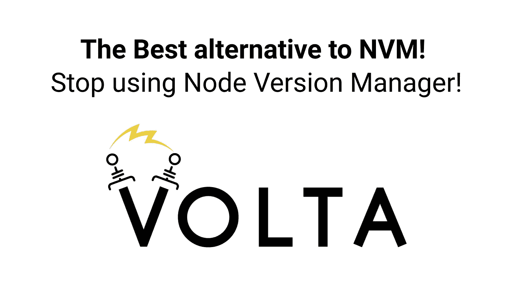

# 2022 年开始使用 NVM 的更好、更优越的替代产品！

> 原文：<https://medium.com/geekculture/the-better-and-superior-alternative-to-nvm-to-start-using-in-2022-18da846b0d2e?source=collection_archive---------3----------------------->

## 为什么应该停止使用节点版本管理器—开始使用 Volta.sh

[Volta — The Hassle-Free JavaScript Tool Manager](https://volta.sh/)

你终于可以忘记运行“nvm 使用”或 NVM。

## Volta 将解决您所有的 NVM 问题！

# 入门指南