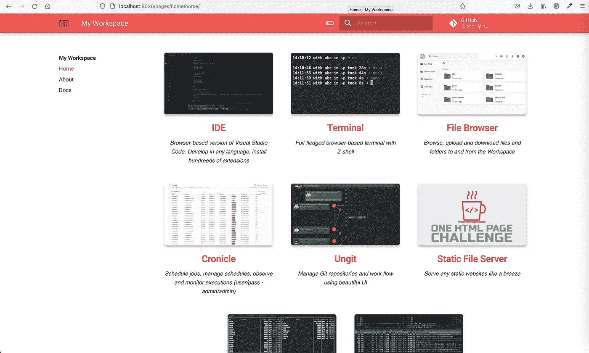
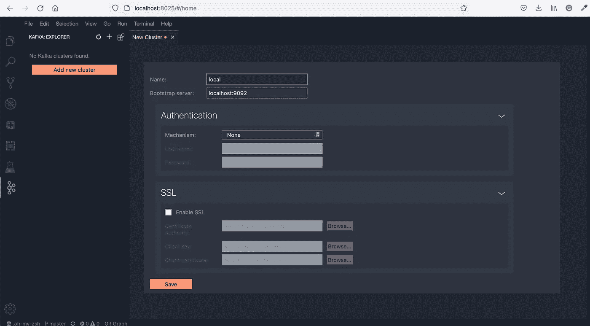
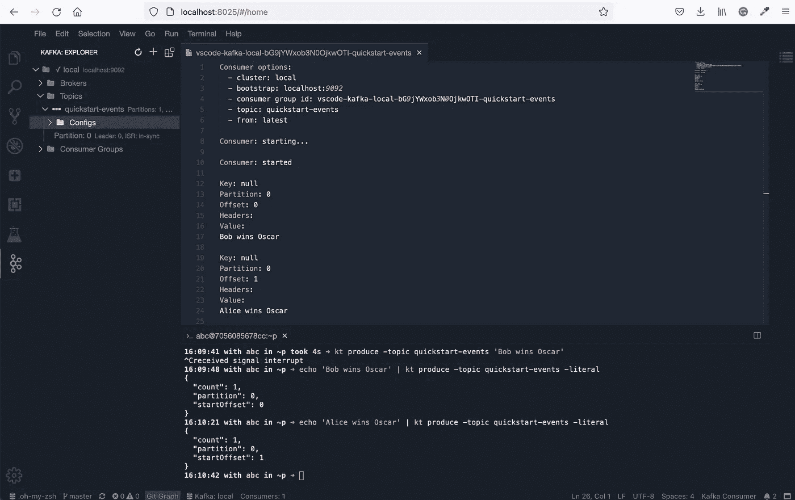

# Kafka 带来的更好的开发体验

> 原文：<https://medium.com/geekculture/the-better-development-experience-with-kafka-54f15705a8ee?source=collection_archive---------10----------------------->

Apache Kafka 事实上成为最受欢迎的开源分布式流媒体平台。它成为服务网格、数据平台、流分析和数百个其他用例的中心。

几乎每个软件工程师都必须了解卡夫卡。同时，它也不是最简单的技术。甚至在当地时间第一次设置它可能会感到沮丧。在大多数情况下，docker-compose 是必需的，如下所示

```
version: "3"
services:
zookeeper:
  image: 'wurstmeister/zookeeper:latest'
  ports:
    - '2181:2181'
  environment:
    - ALLOW_ANONYMOUS_LOGIN=yes
kafka:
  image: 'wurstmeister/kafka:latest'
  ports:
    - '9092:9092'
  environment:
    - KAFKA_BROKER_ID=1
    - KAFKA_LISTENERS=PLAINTEXT://:9092
    - KAFKA_ADVERTISED_LISTENERS=PLAINTEXT://127.0.0.1:9092
    - KAFKA_ZOOKEEPER_CONNECT=zookeeper:2181
    - ALLOW_PLAINTEXT_LISTENER=yes
  depends_on:
    - zookeeper
```

配置环境变量和单独的 zookeeper 服务。然后，要使用 Kafka，您通常会使用 docker exec 来创建主题、发送和接收消息

```
# Create topic
docker exec -it kafka_kafka_1 kafka-topics.sh --create --bootstrap-server kafka:9092 --topic my-topic
# Create events
docker exec -it kafka_kafka_1 kafka-console-producer.sh --bootstrap-server kafka:9092 --topic my-topic
# Read events
docker exec -it kafka_kafka_1 kafka-console-consumer.sh --bootstrap-server kafka:9092 --topic my-topic --from-beginning
```

这对于新开发者入门卡夫卡来说，并不是极其友好的！

> **为了更容易上手卡夫卡，我创建了** [**卡夫卡工作空间**](https://github.com/bluxmit/alnoda-workspaces/tree/main/workspaces/kafka-workspace) **。**

这只是一个 docker 图像，不需要使用 docker-compose。它包括基于浏览器的终端、基于浏览器的 VS-code 版本和一些其他 CLI 工具，使 Kafka 在本地的工作更加简单和方便。

简单执行

```
docker run --name rwid-1 -d -p 8020-8035:8020-8035 alnoda/kafka-workspace
```

您拥有一个代理 Kafka 集群并在本地运行。

在浏览器中打开 [http://localhost:8020/](http://localhost:8020/) 可以快速访问所有工具



从工作区 UI 打开基于浏览器的 VS-code 编辑器，或者直接进入 [http://localhost:8025/](http://localhost:8025/) ，使用 VS-code Kafka 扩展连接本地 Kafka 集群。您只需要提供集群的名称，可以是任何名称。



现在，您可以创建主题，并使用 Kafka 扩展直接在 VS-code 中使用该主题的事件



在 [http://localhost:8026/](http://localhost:8026/) 上打开 workspace terminal，使用多个 CLI 工具中的任何一个来管理主题、浏览集群、生成和使用消息。

例如，使用 [kcat](https://github.com/edenhill/kcat) 生成主题为“快速启动-事件”的事件

```
kafkacat -b localhost -t quickstart-events
```

并从该主题消费事件

```
kafkacat -b localhost -t quickstart-events
```

> Workspace 有许多 CLI 工具，允许轻松地探索这些高级 Kafka 功能，如偏移、分区、使用者组。此外，workspace 还安装了 python。这一切使得卡夫卡入门变得非常容易！

***disclomer:****我是* [*卡夫卡-工作空间*](https://github.com/bluxmit/alnoda-workspaces/tree/main/workspaces/kafka-workspace) *形象(以及那个回购里的其他工作空间)的创作者。我将它们用于自己的开发，并乐于与社区分享*