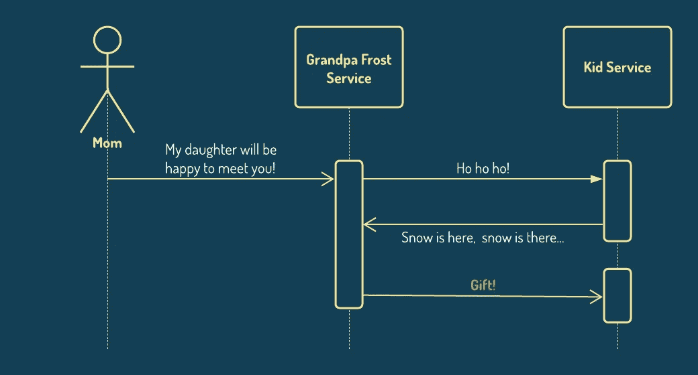
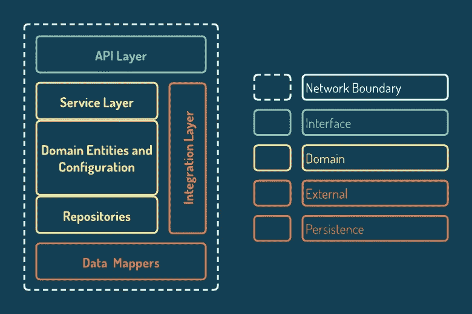
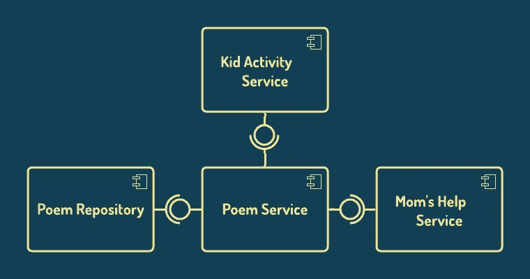
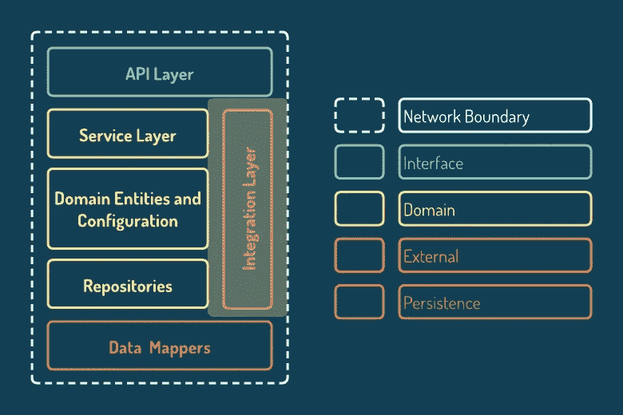

# 测试的最大挑战是知道何时停止

> 原文：<https://medium.com/geekculture/the-biggest-challenge-of-testing-is-knowing-when-to-stop-f26d772435f1?source=collection_archive---------24----------------------->

## 过度测试的副作用以及如何管理它们

Photo by [freestocks](https://unsplash.com/@freestocks?utm_source=unsplash&utm_medium=referral&utm_content=creditCopyText) on [Unsplash](https://unsplash.com/s/photos/new-year%E2%80%99s-eve?utm_source=unsplash&utm_medium=referral&utm_content=creditCopyText)

*懒得看书？* [*在 YouTube 上看*](https://www.youtube.com/watch?v=2PILhiAGKvI) *。*

我出生在苏联，在那里我度过了美好的童年。我最美好的记忆与一个新神(字面意思是新年)有关。新年前夜的庆祝活动。这个节日的主角是 Ded Moroz(字面意思是弗罗斯特爷爷)——俄罗斯版的圣诞老人。

Image by [Free-Photos](https://pixabay.com/photos/?utm_source=link-attribution&utm_medium=referral&utm_campaign=image&utm_content=1149928) from [Pixabay](https://pixabay.com/?utm_source=link-attribution&utm_medium=referral&utm_campaign=image&utm_content=1149928)

根据传统，每年 12 月，由我妈妈预付费用的弗罗斯特爷爷都会到我家的公寓来看我。我所需要做的就是告诉他一些关于冬天、雪或感冒的短诗，就能收到新年礼物。于是，我爬上凳子，脱口而出我所知道的关于冬天的一切。我总是因为我的努力而得到一份礼物。

现在，把这个送礼模式想象成一个软件应用程序。假设这个应用是基于微服务的。在我工作的公司，我们从整体架构过渡到了微服务。所以这是一座从过去到现实的桥梁。

Gift-giving microservices-based application

我们这里有一个孩子和一个爷爷弗罗斯特服务。妈妈是一个用户，她使用公共 API——一部电话——与爷爷 Frost 交流。

为了确保这个应用程序能够工作并准备好投入残酷的生产世界，必须对它进行测试。测试良好。我们真的不想让妈妈难过，因为她的孩子没有收到新年礼物。

嗯，有点我的高科技载体。我是从一名 QA 工程师开始我的道路的。所以，我有一个长期的爱情故事与测试。足够长的时间来体验过度测试的副作用。长到足以理解，测试的最大挑战是知道什么时候停止。

基于我的实践和知识，我创建了一些指导方针，帮助我覆盖特性功能而不过度测试它。

在潜入试水之前，我们先来看看微服结构。

# 微服务结构

大多数微服务都有类似的结构。它通常包括某种形式的接口、域和持久层。

Microservice structure

当进行测试时，我们应该努力覆盖特定微服务的每一层和层间。我们应该涵盖整个应用程序中微服务之间的通信。

# 单元测试

单元测试在最小的独立可测试软件上运行。理想情况下，这些测试基于一个单一的依赖项(一个被测试的类)，这使得它们在编写、维护和运行费用方面的成本很低。

单元测试的低成本诱使我们陷入过度使用的陷阱。例如，假设我们的孩子微服务包括一个孩子活动服务。此服务已准备就绪，可以作为一个单元进行测试。其中一个活动是，比如说，“讲诗”。“讲诗”活动调用诗歌服务来检索最近学习的诗歌。

Kid Activity service with dependency

一起测试服务是多么大的诱惑啊…单元测试很便宜。我们可以通过添加一个额外的依赖项来轻松实现更全面的场景覆盖。对吗？然而，诗歌服务有自己的依赖项，一个诗歌库和妈妈的帮助服务。

Kid Activity service with extended dependencies

我们会把它们也包括在测试单元边界中吗？根据我的经验，无论您选择哪种方式，如果单元测试依赖于多个类，您将面临一些副作用。设置将变得更加复杂。很快你就会发现自己在使用单元测试工具编写组件测试。诗歌服务的变化可能会破坏儿童活动单元测试。因此，这将成倍增加测试维护的成本。此外，漏洞检测将变得更加困难——边界越宽，隐藏的地方就越多。

另一方面，过度使用嘲讽会减慢实现过程。

因此，在编写单元测试之前，考虑它的价值和维护成本。或者，只是遵循经验法则。

## 单元测试的经验法则:

1.  只测试执行业务逻辑的类。这将会挤压服务层的单元测试边界。
2.  保持被测单元尽可能小。尝试将您的单元与其他依赖项隔离开来。这将降低测试的复杂性，这对维护和缺陷检测有积极的影响。
3.  现在，当你的单位是孤立的，实现全面的场景覆盖是可能的。最重要的是，单元测试是测试边缘情况、参数组合和边界值的地方。

到目前为止，我们已经很好地覆盖了服务层中的独立类。下一步——测试这些类如何协同工作，并单独测试微服务本身。

# 组件测试

通过组件测试，我们孤立地测试我们的微服务(组件)。微服务级别的隔离是通过模仿实现与外部组件(如第三方)集成的层来实现的。所有其他依赖都是真实的。

使用真实的依赖关系增加了我们对微服务正确性的信心。然而，它大大降低了编译时间。

组件测试的运行时间是可预测的成本。尽管如此，出于某种原因，我们发现很难盯着测试跑步者超过几秒钟。

现在，假设您正在运行一分钟的测试套件。在最初的 5 秒钟内，你预测测试结果。然后你查看你的电话通知。然后你“就一秒钟”查看你的社交媒体反馈。你贴了你朋友最近度假的照片。诸如此类。与此同时，运行已完成，计算机正在等待你。

我想强调一个双重副作用。首先，可预测的测试持续时间乘以计算机等待我们的时间。其次是失去焦点的重要影响。

组件测试对于应用健康至关重要。你不需要也不想跳过它们。不幸的是，你无法避免失去焦点的副作用。但是，您可以通过将组件测试套件压缩到必要的最小值来减少它。

## 必要的最低组件测试

组件测试的目标是从消费者的角度测试 API 消息流。

1.  所以，不要偷工减料。总是通过使用消息来开始测试。
2.  不要重复已经被单元测试场景覆盖的内容，而是关注未测试的层和场景，这将包括请求授权和验证，以及与 API 相关的异常。
3.  这是测试域数据存储的地方。包括数据持久性验证以测试断言。

到目前为止，一切顺利。微服务的唯一部分仍然未经测试——之前被嘲笑的集成层。这一层实现了与第三方组件的交互。

为了测试与第三方的协作，我们有一个称为“集成测试”的组件测试扩展。

集成测试的问题是你不能保证测试结果的一致性。他们失败的原因不止一个——外部组件可能变得不可用或违反合同。我是说，如果书店关门了，孩子就收不到一本冬季诗集了。

由于这个原因，当运行组件测试套件时，我们经常倾向于忽略集成测试。然而，由于忽略了集成测试，您可能会错过合同中断。此外，当您决定忽略被忽略了一段时间的测试时，您会发现它们由于内部重构而被破坏。最后，事后测试修改比持续维护需要更多的资源。

为了减轻结果不可靠的问题，只编写少量的集成测试，涵盖基本的成功和失败场景。

现在，我们非常有信心，我们的微服务会像预期的那样工作。因此，我们可以继续整个应用程序测试。

# 端到端测试

通过端到端的测试，我们验证一个系统满足需求并实现业务目标。妈妈有能力叫弗罗斯特爷爷。弗罗斯特爷爷在约定的时间见了一个孩子。孩子收到了礼物。每个人都很开心。

端到端测试有很大的测试边界。通过这些测试，我们填补了微服务之间的空白。测试界限越宽，置信水平越高。

对安全的渴望经常促使我们用端到端测试覆盖所有东西(或者至少尝试)。不要！大忌:可信度越高，成本越高。

端到端测试的目标是完成未覆盖的应用程序的功能。为实现这一目标:

1.  将端到端测试局限于业务用例。从用户的角度看待应用程序。当妈妈给爷爷打电话时，她想知道她的孩子对新年礼物感到高兴和满意。跳过测试孩子的表现，这已经包括在组件测试中了。
2.  只测试组件和单元测试不能覆盖的内容。

最后，送礼应用行为全面测试！让我们总结一下刚才谈的内容。

# 摘要

我们的目标是在不过度测试的情况下测试应用程序的功能。所以，我们从单元测试开始。由于过度使用的副作用，在编写单元测试之前，我们应该考虑它的价值和维护成本。或者遵循经验法则，将单元测试限制在服务层，此时被测试的单元应该尽可能的小。

当涉及到组件测试时，不要偷工减料，从消息消费开始每个测试，并涵盖单元测试没有涵盖的场景。

通过端到端测试，我们应该覆盖组件测试无法测试的场景。同样，策略是从用户的角度来看待应用程序。

仅此而已。