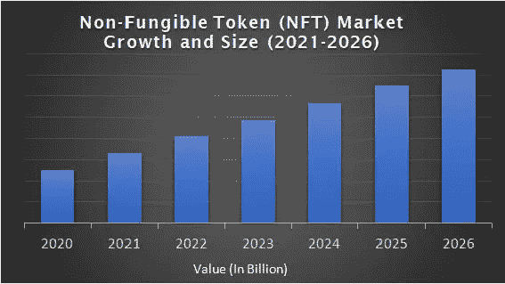

# 未来几代人最大的风险——NFT 市场发展

> 原文：<https://medium.com/geekculture/the-biggest-venture-for-upcoming-generations-nft-marketplace-development-f89e6c1567c9?source=collection_archive---------15----------------------->

目前，NFT 正在转变为数字空间中最受关注的平台之一。现在，每个人都忙于不可替代的代币。很难找到一个没听说过 NFTs 的人。几乎每个人都知道不可替代的令牌，大多数业务平台都在使用 NFT 的概念。从快餐店到体育联盟，所有行业都在使用 NFT。

在数字空间中流传的最普遍的问题是，一件数字收藏品是如何被卖到数百万美元的？完美的解决方案是区块链网络。所有权是人们购买宇宙中任何东西的主要原因。简单的数字资产没有所有权，因此很容易被伪造。因此，失去了资产的独创性。有了区块链网络，所有权就有了保障。

 [## NFT 市场开发|不可替代代币市场|白标 NFT 市场|…

### NFT 市场的发展正在塑造即将到来的创业公司的未来，以在竞争中胜出。构建您自己的…

bit.ly](https://bit.ly/3wZDRIQ) 

因此，确保了唯一性并消除了数字空间中假冒产品的潜在风险。通过不可替代的代币，创造了一个全新的投资空间，并为商业实体使用顶级 NFT 市场开发解决方案和 [***在数字世界***](https://bit.ly/3wZDRIQ) 开发可靠的商业模式铺平了道路。

## **为什么 NFT 市场是一个好的商业理念？**

众所周知，NFT 市场是使用户能够 ***铸造、购买和出售 NFT***的交易平台。世界上每个 NFT 市场都因区块链技术而各不相同。在区块链网络的帮助下，市场可以通过智能合约运作。因此，使市场中的每一笔交易都能够准确执行，而不必依赖第三方，如银行和其他金融监管机构。在数字空间的每个市场，平台上发生的交易的汽油费都是变化的。这是由于所使用的区块链技术的变化。NFT 市场是一个稳固的平台，是 NFTs 的专属。***NFT 市场一般有两种类型；开放式和独家式市场*** 。开放式平台是一个 NFT 市场，用于交易所有类型的非功能性交易，而独家型市场只交易某种类型的 NFT。

这些因素是商业平台获得 NFT 市场发展解决方案和发展自己的 NFT 市场的有力证明。借助这些开发解决方案，业务平台可以在未来体验到广泛的投资和盈利机会。这是一个完美的机会，每个人都可以借助区块链技术在数字空间体验新奇。

## 如何发展 NFT 商业市场？

为了开发 NFT 市场，商业平台必须与 NFT 市场开发公司取得联系。在开发公司的帮助下，商业平台可以开发其自己的具有可定制特征的 NFT 市场。

***以下几个阶段是一般 NFT 开发公司遵循的主要步骤，***

 [## 如何建立一个 NFT 市场？-完整的 NFT 市场解决方案

### 如何创建自己的 NFT 市场？NFTs 市场是创建和交易 NFT 的平台…

www.blockchainappfactory.com](https://www.blockchainappfactory.com/how-to-build-an-nft-marketplace?utm_source=Geekculture&utm_medium=31052022&utm_campaign=Vishnu) 

*   **xBusiness 利基**

第一步是确定市场的商业利基。平台的所有要求将在市场开发的文档中详细说明。这包括 NFT 市场的类型，区块链网络的类型，等等。

*   **用户界面/UX 界面**

用户界面/UX 界面是一个 NFT 市场的发展需要的初始阶段之一。这是市场的前端。因此，向用户展示了 NFT 市场的所有功能。

*   **发展水平**

在此阶段，智能合同和区块链技术在 NFT 市场实施。区块链的效率借助智能合约完成了平台的框架。智能合同编码有交易发生所需的条款和条件。

*   **测试和启动**

一旦发达市场放开。进行了一系列特殊的测试。在测试的帮助下，平台中的所有 bug 都将被移除，一个完美运行的市场就产生了。这个 NFT 市场后来被有效地交付给业务平台。

## **创业的新方式——白标 NFT 市场**

白标 NFT 市场使用户能够立即启动 NFT 市场。更准确的说，是现成的平台。说到从零开始创建一个 NFT 市场*，这要花很多时间，而且很繁琐。此外，需要添加的每个额外功能只会增加企业所有者的成本。因此，一个具有所有功能的高速且经济高效的 NFT 市场就是白标 NFT 市场开发项目。因此，当谈到在数字市场推出一项明星业务时，你不得不接触一家非常知名的 NFT 市场开发公司。*

## ***包装完毕，***

****NFT 市场开发是在数字空间*** 开始稳固业务发展的完美方式。这个平台上的选项非常广泛。因此，借助 NFT 市场发展解决方案，一个完美的 NFT 平台业务可以在任何时候发展！联系 NFT 市场开发者的核心好处是因为向他们提供的特性和定制。区块链技术公司为开发一个完美构建的平台框架提供了广泛的功能。*

*此外，这些并不是 NFT 市场开发商提供的唯一指导，售后服务也是其中之一。为开发 NFT 市场而提供的突出的营销后服务包括内容营销、社交媒体营销、论坛营销、电子邮件营销、AMA 会议、Discord & telegram 营销等。因此，经过对数字市场的深入了解和研究，NFT 开发商被聘为获得 [***最佳 NFT 市场开发服务***](https://bit.ly/3wZDRIQ) 。*