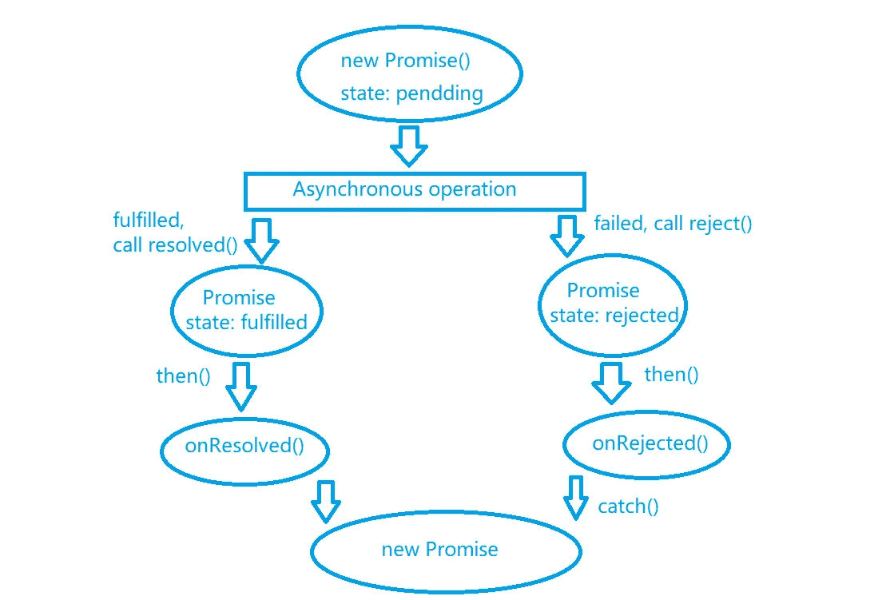

# 回拨地狱的克星，保证。

> 原文：<https://medium.com/geekculture/the-callback-hells-nemesis-promise-539db3e30601?source=collection_archive---------13----------------------->


什么是承诺？在生活中，你可以说那是一种保证。然而，你将如何用 Javascript 描述它呢？

在 Javascript 中，promise 是异步编程的解决方案。从语法上讲，promise 是一个构造函数。promise 对象封装了一个异步操作，并获取其成功或失败的结果。

在承诺出现之前。作为 javascript 开发人员，我们将使用回调来处理异步操作。那么，什么是回调呢？我认为回调是一个需要时间来获得异步操作结果的函数。异步编程通常是 fs 文件操作、数据库操作、AJAX 和 setTimeout。比如我们需要使用 fs 操作读取文件，而读取文件操作中的回调函数也需要调用读取文件操作，那么最新的回调函数也需要调用读取文件操作。因此，会有看起来像

```
require('fs').readFile('./a.html',(err, data)=>{
     require('fs').readFile('./b.html',(err, data)=>{
          require('fs').readFile('./c.html',(err, data)=>{})
     })
})
```

但是，如果超过 10 倍，那看起来如何？100 次怎么样？我们需要考虑到每个回调中的代码可能是不同的，我们可能还需要处理每个回调的错误。如果是这种情况，代码将很难阅读，也很难进行异常处理。在实际开发中，我们可能会遇到多层回调，我们称之为回调地狱。因为不想看到回调地狱，无极应运而生。

承诺如何解决回调地狱？在回答这个问题之前，我想先介绍一下无极的基本工作流程。

在 Promise 中，初始化状态为挂起。Promise 获得结果后，初始化挂起将变为已解决(如果获得成功结果)或已拒绝(如果获得失败结果)。我们将用 ***然后()*** 的方法来揭示最终的结果。承诺只会改变一次自己的状态，不管它失败与否。成功的数据叫价值，失败的数据叫原因。现在，让我们看一个例子，看看承诺的工作流程是怎样的

```
//First, we create a Promise, and the state is pending now.
const promise = new Promise((resolve, reject) => {//Second, asynchronous task is executing
  setTimeout(()=>{
       const n=Math.ceil(Math.random()*10) //Third, there are two possibility, if n >5, we call resolve()
      //to set the value, the Promise change state to resolved. If        
      //n<=5, we call reject() to set the reason, Promise change 
      //state to rejected
      if (n > 5) {
           resolve(n + " is larger than 5 ")
       } else {
           reject(n + " isn't larger than 5 ")
       }
   },1000)
})//Four, then() to handle the result, value is successful result.
//Reason is failure result.
promise.then(
   value => {console.log(value)},
   reason => {console.log(reason)}
)
```

我们已经看到了 Promise 的工作流程，现在我们来介绍一些除了 *then()* 之外的 Promise APIs。

***catch()*** 是返回一个承诺，承诺被拒绝的方法。一个承诺可以使用一系列的 then()调用作为一个链，我们只能在链尾添加一个 catch()来处理拒绝。如果 then()之后的任何步骤在承诺链中被拒绝，catch()将被调用进行拒绝。

```
//If we want to add up the content of a.txt three time//Using callback
//we can see that, we have to hadle the error for each readFile()
fs.readFile('./a.txt', 'utf8', (err, data) => {
   if(err) console.log(err)
   fs.readFile('./a.txt', 'utf8', (err, newData) => {
     if(err) console.log(err)
     fs.readFile('./a.txt', 'utf8',(err, newestData) => {
       if (err) console.log(err)
       console.log(data+newData+newestData)
     })
   })
})//Using Promise
//We only need to add catch once in the chain tail for exception //handing
fs.promises.readFile('./a.txt', 'utf8').then(value1 =>
   fs.promises.readFile('./a.txt', 'utf8').then(value2 => 
      fs.promises.readFile('./a.txt', 'utf8').then(value3 =>
         console.log(value1+value2+value3)
      )
    )
).catch(error => console.error(error)) 
```

在我们学习了 catch()之后，我们可以制作一个 Promise 工作流图如下



***resolve()*** 是一个返回已解决的带有给定值的承诺或已解决/拒绝的承诺的方法。

```
//Returning resolved Promise with a given value
Promise.resolve('resolved Promise with a given value').then(  
  value=>console.log(value)
  ).catch( 
    reason=>consolw.log(reason)
  )//Returning a resolved Promise
Promise.resolve(Promise.resolve('a resolved Promise')).then(
   value=>console.log(value)
  ).catch(
    reason=>consolw.log(reason)
  )//Returning a rejected Promise
Promise.resolve(Promise.reject('a rejected Promise')).then(
   value=>console.log(value)
  ).catch( 
    reason=>console.log(reason) 
  )
```

***reject()*** 是返回被拒绝的承诺的方法。

```
//Returning a reason for rejected
Promise.reject('Reason for rejected').then(
   value=>console.log(value)
).catch(
  reason=>console.log(reason)
)
```

***【all()】***是返回新承诺的方法。如果所有承诺都已解决，则返回一个解决的承诺，否则，返回一个拒绝的承诺。我们可以使用之前使用的关于使用回调的 readFile()的例子来看看我们如何使用 all()来避免回调地狱。

```
const p1 = fs.promises.readFile('./a.txt', 'utf8')
const p2 = fs.promises.readFile('./a.txt', 'utf8')
const p3 = fs.promises.readFile('./a.txt', 'utf8')
//Pushing p1,p2 and p3 to a array as a parameter
//The return value also array 
Promise.all([p1, p2, p3]).then(
   ([value1, value2, value3]) => 
    console.log(value1 + value2 + value3)
).catch(reason => console.error(reason))
```

***race()*** 是一个返回新承诺的方法，第一个兑现承诺的结果状态就是最终结果状态。如果第一个实现的承诺被拒绝，则该承诺被拒绝。

```
const p1 = fs.promises.readFile('./a.txt', 'utf8')
const p2 = fs.promises.readFile('./a.txt', 'utf8')
const p3 = fs.promises.readFile('./a.txt', 'utf8')//Pushing p1,p2 and p3 to a array as a parameter
Promise.race([p1, p2, p3]).then(
    value=> console.log(value)
).catch(reason => console.error(reason))
```

现在，我们大概知道了 Promise 的基本用法和语法。然而，当我们在进行真正的开发时，我们实际上有一种更优雅的方式来使用 Promise。即使用 ***异步函数*** 和 ***await 表达式*** 。

***async*** 是函数的关键字。异步函数的返回值是一个 promise 对象。Promise 对象的结果由异步函数执行的返回值决定。

```
const fn = async () => {
     const p1 = fs.promises.readFile('./a.txt', 'utf8')
     return p1
}fn().then(
    (value) => console.log(value)
).catch(
    (reason)=>console.log(reason)
)
```

从上面的例子中，我们可以看到 ***异步函数*** 返回一个承诺，但是我们仍然需要使用 then()作为返回值来使挂起状态变为履行状态。现在，我来介绍一下如何省略 then()。那就是用 ***恭候*** 。

***await*** 是表达式的关键字。一般用在承诺表达(或其他表达)的左侧。如果表达式是一个承诺，await 返回承诺的解析值。如果表达式是另一个表达式，则返回表达式的值。 ***await*** 里面需要异步功能。但是，如上例所示， ***异步函数*** 内部不一定要有 ***await*** 。另外， ***await*** 只返回承诺的解析值，如果承诺值被拒绝， ***await*** 会抛出异常。因此，对于带有 ***await*** 关键字的表达式，我们最好使用 trt{}catch()。

```
const fn = async () => { 
  try {
      const p1 = await fs.promises.readFile('./a.txt', 'utf8')
      const p2 = await fs.promises.readFile('./a.txt', 'utf8') 
      const p3 = await fs.promises.readFile('./a.txt', 'utf8')
      console.log(p1 + p2 + p3)
  } catch (error) {
     console.log(error)
  }
}fn()
```

# ***结论***

在发展中，我们经常需要使用承诺。比如前端开发，我们经常从后端请求数据，或者后端作为 node.js 从数据库请求数据是异步的。因此，我们将对他们使用诺言。希望这篇文章对正在学习诺言的人有所帮助。如果想更灵活地使用 Promise，可能需要对同步/异步编程和 javascript even loop 有更深入的了解。以后我也会就这些话题发表文章。希望你能喜欢我的文章。