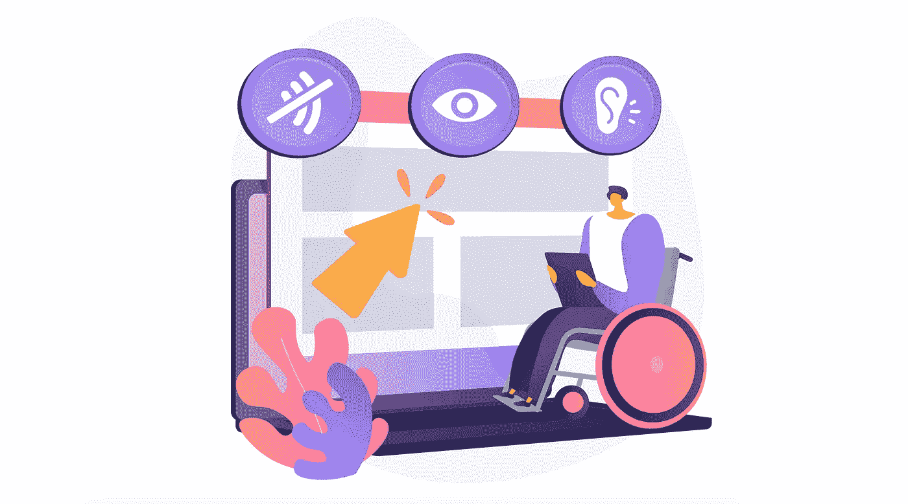

# 网页可访问性的挑战和好处

> 原文：<https://medium.com/geekculture/the-challenges-and-benefits-of-web-accessibility-4251d9013d48?source=collection_archive---------38----------------------->

## 残疾用户可以访问您的网站吗？

Making a website accessible involves solving challenges — code, technical know-how, and implementation compliance. (Photo credit: [Visual Generation](https://www.shutterstock.com/g/InfographicSource) on Shutterstock)

易访问性和包容性是今年网站设计的前沿话题。[美国联邦法律第 508](https://www.section508.gov/) 条要求各机构为残疾人提供与非残疾人同等的访问电子信息和数据的机会。