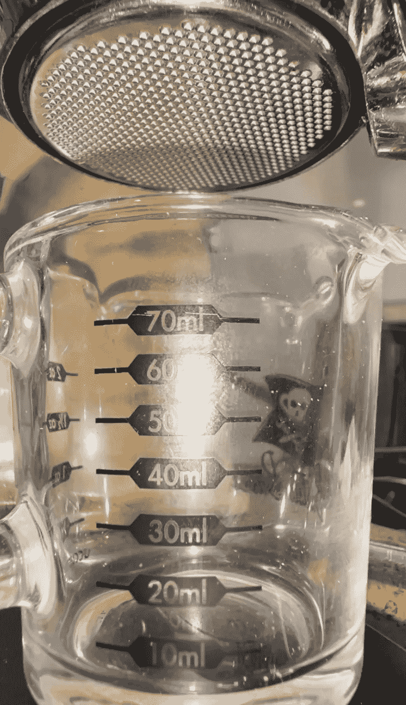
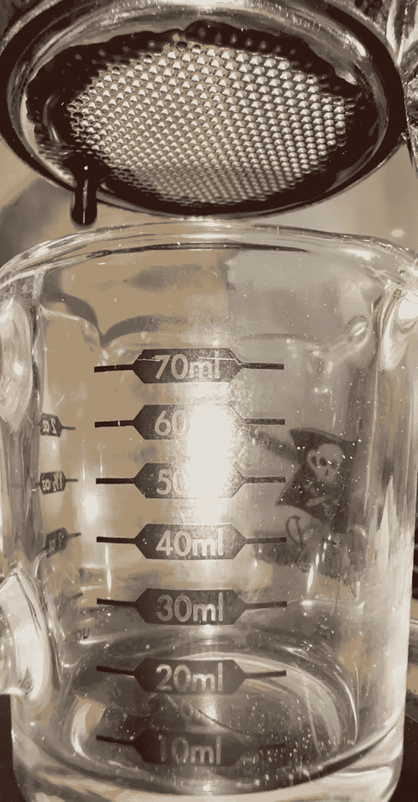
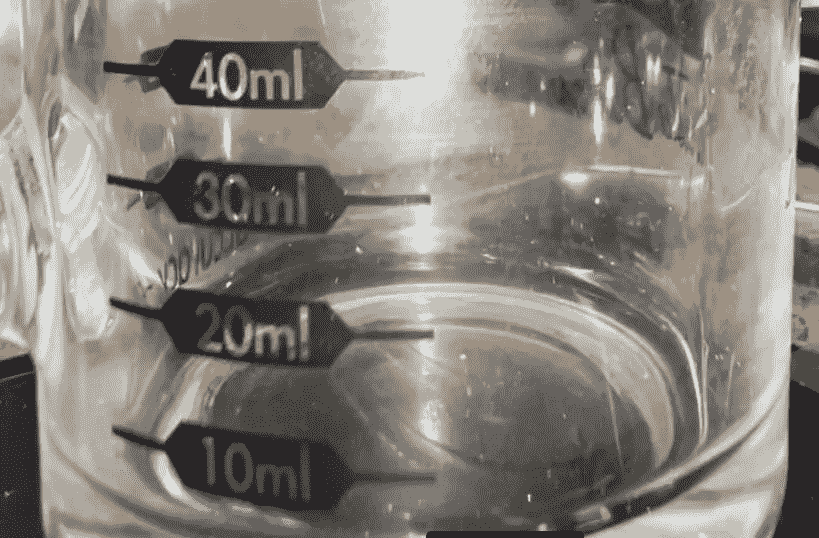
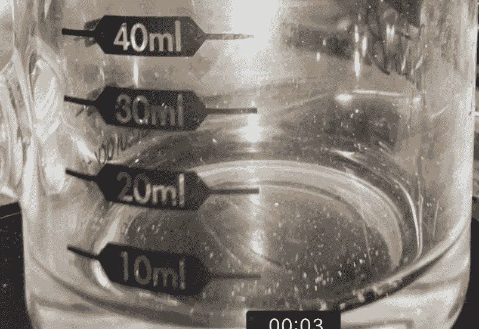
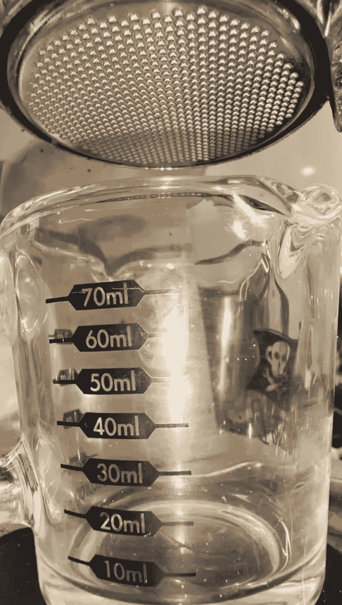
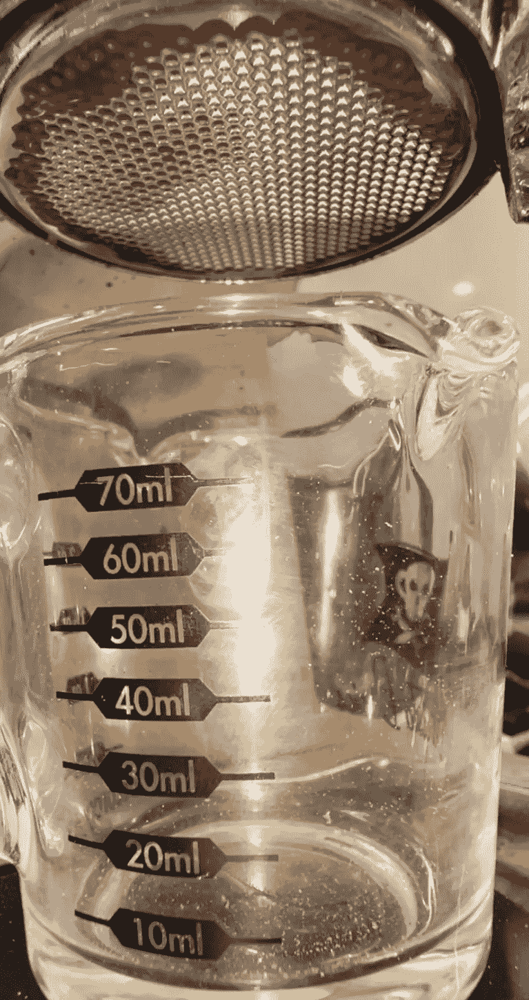
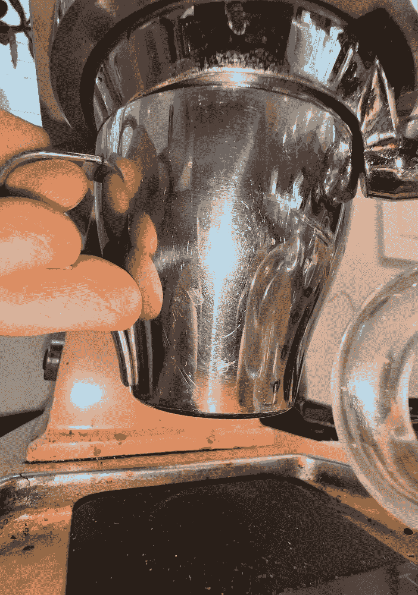
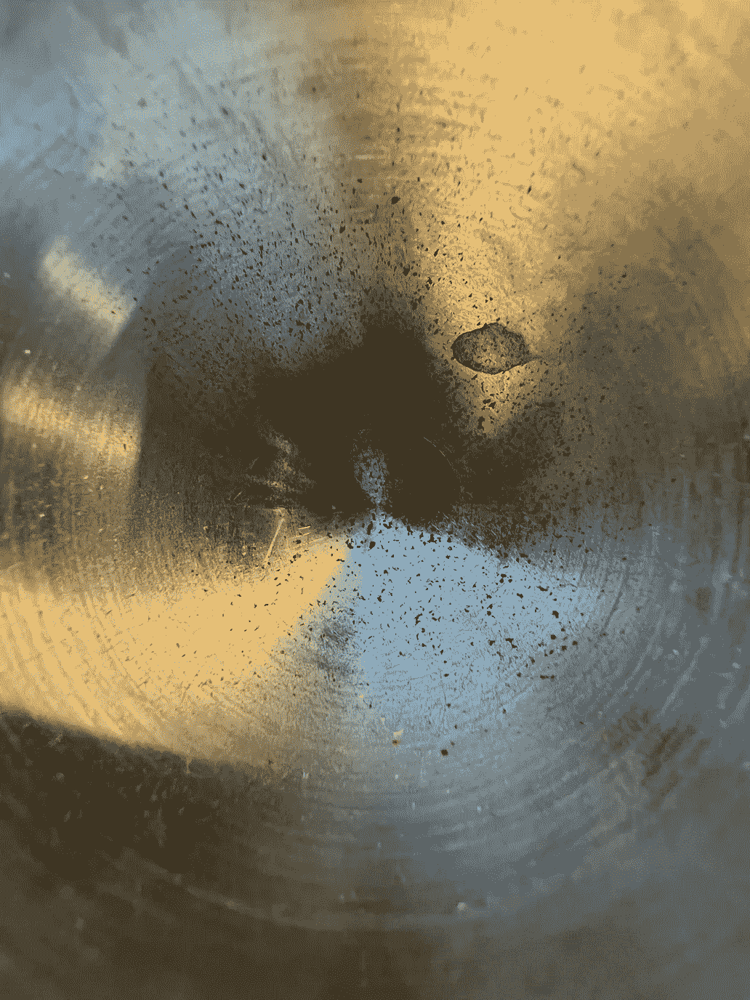

# 浓缩咖啡中的咖啡打喷嚏

> 原文：<https://medium.com/geekculture/the-coffee-sneeze-in-espresso-b759aeb8d825?source=collection_archive---------12----------------------->

## 咖啡数据科学

## 浓缩咖啡开始时的罚款

我最近在我的浓缩咖啡视频中注意到一些东西，因为我一直在拉更多的[断奏](/overthinking-life/staccato-espresso-leveling-up-espresso-70b68144f94)镜头。在拍摄开始的一瞬间，似乎有蒸汽或什么东西在镜头前吹过。我进行了调查，因为我担心我的机器出现泄漏，我发现这不是蒸汽；是咖啡。

当在预浸泡过程中第一次施加压力时，一小股细咖啡吹进了杯子。

Before and after the start of Pre-infusion. All images by author

让我们放大杯子的底部。

这一点点证据表明，从圆盘顶部推出的空气迫使少量咖啡流出。

所以我想通过一个简单的实验来测量总量:

出来的咖啡不到 0.01g。用我的 Acaia Pyxis 量表是检测不到的。

这种咖啡喷嚏经常在断奏时发生，至少在像 Kim Express 这样的杠杆机器上，压力几乎瞬间从零到 2 巴。对于常规镜头(非断奏)，这种情况不会发生得太多，或者更难看到。然而，我很好奇被推过地面的空气如何影响冰球内部的分布。

如果你愿意，可以在[推特](https://mobile.twitter.com/espressofun?source=post_page---------------------------)、 [YouTube](https://m.youtube.com/channel/UClgcmAtBMTmVVGANjtntXTw?source=post_page---------------------------) 和 [Instagram](https://www.instagram.com/espressofun/) 上关注我，我会在那里发布不同机器上的浓缩咖啡照片和浓缩咖啡相关的视频。你也可以在 [LinkedIn](https://www.linkedin.com/in/robert-mckeon-aloe-01581595?source=post_page---------------------------) 上找到我。也可以在[中](https://towardsdatascience.com/@rmckeon/follow)关注我，在[订阅](https://rmckeon.medium.com/subscribe)。

# [我的进一步阅读](https://rmckeon.medium.com/story-collection-splash-page-e15025710347):

[我未来的书](https://www.kickstarter.com/projects/espressofun/engineering-better-espresso-data-driven-coffee)

[浓缩咖啡系列文章](https://rmckeon.medium.com/a-collection-of-espresso-articles-de8a3abf9917?postPublishedType=repub)

[工作和学校故事集](https://rmckeon.medium.com/a-collection-of-work-and-school-stories-6b7ca5a58318?source=your_stories_page-------------------------------------)

[个人故事和关注点](https://rmckeon.medium.com/personal-stories-and-concerns-51bd8b3e63e6?source=your_stories_page-------------------------------------)

[乐高故事首页](https://rmckeon.medium.com/lego-story-splash-page-b91ba4f56bc7?source=your_stories_page-------------------------------------)

[摄影启动页面](https://rmckeon.medium.com/photography-splash-page-fe93297abc06?source=your_stories_page-------------------------------------)

[改进浓缩咖啡](https://rmckeon.medium.com/improving-espresso-splash-page-576c70e64d0d?source=your_stories_page-------------------------------------)

[断奏生活方式概述](https://rmckeon.medium.com/a-summary-of-the-staccato-lifestyle-dd1dc6d4b861?source=your_stories_page-------------------------------------)

[测量咖啡磨粒分布](https://rmckeon.medium.com/measuring-coffee-grind-distribution-d37a39ffc215?source=your_stories_page-------------------------------------)

[浓缩咖啡中的粉末迁移](/nerd-for-tech/rebuking-fines-migration-in-espresso-6790e6c964de)

[咖啡萃取](https://rmckeon.medium.com/coffee-extraction-splash-page-3e568df003ac?source=your_stories_page-------------------------------------)

[咖啡烘焙](https://rmckeon.medium.com/coffee-roasting-splash-page-780b0c3242ea?source=your_stories_page-------------------------------------)

[咖啡豆](https://rmckeon.medium.com/coffee-beans-splash-page-e52e1993274f?source=your_stories_page-------------------------------------)

[浓缩咖啡滤纸](https://rmckeon.medium.com/paper-filters-for-espresso-splash-page-f55fc553e98?source=your_stories_page-------------------------------------)

[浓缩咖啡篮及相关主题](https://rmckeon.medium.com/espresso-baskets-and-related-topics-splash-page-ff10f690a738?source=your_stories_page-------------------------------------)

[意式咖啡观点](https://rmckeon.medium.com/espresso-opinions-splash-page-5a89856d74da?source=your_stories_page-------------------------------------)

[透明 Portafilter 实验](https://rmckeon.medium.com/transparent-portafilter-experiments-splash-page-8fd3ae3a286d?source=your_stories_page-------------------------------------)

[杠杆机维护](https://rmckeon.medium.com/lever-machine-maintenance-splash-page-72c1e3102ff?source=your_stories_page-------------------------------------)

[咖啡评论和想法](https://rmckeon.medium.com/coffee-reviews-and-thoughts-splash-page-ca6840eb04f7?source=your_stories_page-------------------------------------)

[咖啡实验](https://rmckeon.medium.com/coffee-experiments-splash-page-671a77ba4d42?source=your_stories_page-------------------------------------)