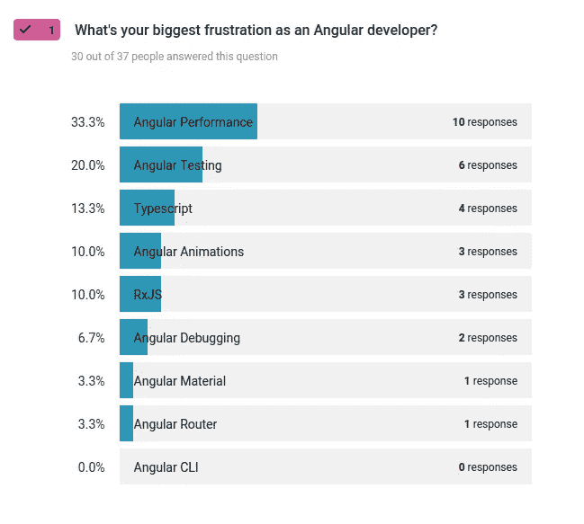
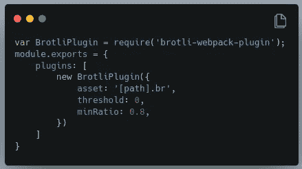
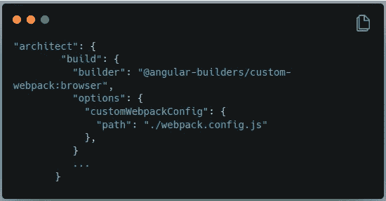

# 2021 年完整的角度性能指南

> 原文：<https://medium.com/geekculture/the-complete-angular-performance-guide-for-2021-c5e55225b4d?source=collection_archive---------2----------------------->

## 对你的慢角度应用程序感到沮丧？以下是如何让你的角度应用速度翻倍甚至三倍的方法。

需要提高 Angular 应用的运行速度吗？然后[点击此处](https://danielk.tech/user/pages/01.home/complete-angular-performance-guide/Angular%20Performance%20Checklist.pdf)查看并下载完整的角度性能清单。

否则，如果你想深潜…


…深入了解我们如何提高 Angular 应用性能的所有机制和逻辑，然后继续阅读。

> 我们有太多的内容要讲，你要开始真正的旅程了！

# 介绍

想象一下，您的 angular 应用程序的性能增加一倍或三倍。

如果您的 Angular 应用程序加载速度提高一倍会怎样？

或者一旦加载，它的运行速度比现在快很多倍？

我们甚至可以更进一步…

如果您确切地知道去哪里寻找 Angular 应用程序中的性能瓶颈，您会有什么感觉？

每当你的老板出现告诉你 Angular 应用程序很慢时，你都知道从哪里开始，以及如何让你的 Angular 应用程序运行得更快。

> 那不是感觉很神奇吗？

所以…

如何提高角度应用的性能？并解决角度性能问题？

除了[雇佣一个角度顾问来帮助你](https://danielk.tech/consulting/)，这里有一个深入的指导来改善和优化你的角度性能，并确保它加载速度极快。每一个。单身。时间。

在这份完整的 Angular 性能指南中，我将向您展示一步一步的过程，让您的 Angular 应用程序加载更快、运行更快、执行更快，同时让您的团队、您的老板和您的用户对其性能感到欢欣鼓舞。

我还会给你一份角度性能清单，你可以免费下载，随时使用。这个角度性能清单是为了帮助你像对付一个足球明星一样处理你的角度应用而创建的。

如果你想下载角度性能清单，那么点击[这个链接](https://danielk.tech/user/pages/01.home/complete-angular-performance-guide/Angular%20Performance%20Checklist.pdf)。否则，继续阅读，我会给你一步一步的公式，使你的角度应用程序执行速度比以往任何时候都快。

[](https://school.danielk.tech/course/unleash-your-angular-testing-skills?utm_source=medium&utm_medium=banner&utm_campaign=unleash_testing_skills)

# 为什么 angular apps 速度慢？

是因为 Angular 是个蹩脚的项目吗？

还是因为它被谷歌的 Angular 团队设计得很差？

我最近调查了一群 angular 开发人员，问他们对 Angular 最大的挫折是什么。

想猜猜哪个答案得票数最多？

棱角表现。



许多 Angular 开发者对 Angular 感到沮丧，因为他们说它很慢。

有人认为很难构建一个快速的角度应用程序。特别是考虑到它最大的竞争对手 React & Vue.js 的包大小通常只有它的一半，并且需要一半的时间来解析和运行 JavaScript。

那么这是不是意味着你的角度应用注定只能像海龟一样工作呢？


没有。如果你应用我将在这篇文章中向你展示的东西，按照步骤并投入工作，就不会了。

是的，伙计，你必须学会如何让你的 Angular 应用程序加载得更快，运行得更快，执行得更快。

那么你从哪里开始呢？

# 切割角性能问题

在深入研究您的角度应用程序代码之前，我们需要定义一些东西。

首先，您的 Angular 应用程序可能会遇到两个性能瓶颈。

*   **角负载性能**
*   **角度运行时性能**

角度负载性能是指浏览器下载应用程序、将其加载到浏览器中、解析 JavaScript 并显示给用户所需的时间。

加载后，下一种性能是运行时性能。当用户与你的 Angular 应用程序交互时，它的速度快吗？还是有时会慢下来？是记忆猪吗？或者它很轻，即使在小型移动设备上运行也更快？

您可能已经猜到，最常见的角度性能问题是第一个选项——角度负载性能。

但是，没有一个 Angular 应用程序不受运行时性能的影响。运行时性能通常是由于没有正确地取消订阅 RxJS 可观察对象，在没有使用 trackbyFn 的情况下将数千个元素绑定到一个列表，以及改变检测周期过载造成的。

本角度性能指南分为两个部分——角度负载性能部分和角度运行时间性能部分。

我们将首先深入探讨让您的 Angular 应用程序加载更快的机制。然后，最后，我们将讨论如何确保它在加载后快速执行。

# 入门:如何测量和分析角度应用的性能

提高 Angular 应用程序性能的第一步是**测量**在浏览器中加载和引导需要多长时间。

为什么？

一些开发者知道他们需要优化他们的 Angular 应用程序，但是他们不知道要优化多少或者从哪里开始。因此，他们对代码或构建配置进行这些疯狂的尝试，然后刷新应用程序，看看它是否比以前加载得更快。这种优化方法只不过是一场小丑表演，应该受到各种各样的批评。这就像在没有必要的量杯的情况下试着烤一个蛋糕。或者在泰坦尼克号沉没前重新摆放甲板上的椅子。

那么更聪明的方法是什么呢？

测量。测量。测量。

不知何故，我们作为开发人员并不总是注意到会打扰用户的额外的一两秒钟。至少这是我的经历。

例如，我的一个开发伙伴是 Django 开发人员。他一直坚持说他的 Django 应用比我的 Angular 应用快。

当我们在一起时，他会拿出一个浏览器向我展示它有多快…

和他的 Django 的东西相比，我的角度应用是一只乌龟…

等等，等等，直到…

我们开始使用浏览器的开发工具来计算毫秒数。在对我的 Angular 应用程序和他的 Django 应用程序的性能进行分析后，我们发现它们的平均加载时间差不多。

哪个更快？我不记得了。😁

显然，我朋友的内部计时器没有正确计数，这证明了为什么开发人员必须仔细分析他的 Angular 应用程序的性能，并准确知道加载它需要多少毫秒。通过计算加载 Angular 应用程序所需的毫秒数，您将能够准确地知道在尝试优化时，加载速度和性能提高了多少。是的，数一数毫秒。

# 如何让你的 Angular app 加载更快⚡️

# 1.将您的应用程序拆分成延迟加载的模块。

几年前，当我还是个新手，对 angular 几乎一无所知的时候，我创建了一个大型的 Angular 应用程序，并将整个程序打包到一个模块中——`app.module.ts`文件。

这是一个让我付出了很多性能问题代价的错误。如果你不熟悉角度模块，那么看看由角度喜剧演员沙伊·雷兹尼克做的这个演讲。

默认情况下，NgModules 会被急切地加载，这意味着您的 Angular 应用程序会加载单个 NgModules，即使它们不是立即需要的。所以，为了让你的 Angular 应用程序加载得更快，你需要先把这个庞然大物分割成更小的部分。

Angular 文档很好地解释了如何设置延迟加载模块。你可以在这里找到所有的例子和最佳实践[。](https://angular.io/guide/lazy-loading-ngmodules)

# 2.确保使用并正确配置预加载策略

一旦我们将我们的应用程序分割成延迟加载的模块，我们就需要优化这些模块的加载方式。Angular 框架给了我们两个基本的预加载策略。

那么应该用哪一个呢？


嗯…

这完全取决于谁使用你的角度应用。

如果你的用户是使用高速光纤连接的员工，那么使用全部预加载策略，立即加载整个 Angular 应用程序。

但是，如果你的 Angular 应用程序有移动用户使用慢速 3G 连接，那么保守的方法会更明智。还有其他预加载策略可供您安装和配置，如果您想了解更多信息，请阅读本文，其中我深入解释了角度预加载策略。

# 3.不要过度关注 app.module.ts 文件

最近，我在审查一个用 Angular 构建的商业应用程序的代码。我对这个项目了如指掌。或者至少我认为我做到了，因为我是主要的开发者，并且为这个项目写了 95%的代码。

打开 app.module.ts 文件…来个巅峰…我惊呆了！😲

它被项目已经超越的导入和库破坏了。

那我做了什么？我把那些进口的东西拉出来，然后把这个项目修整得干净整洁，就像一只时髦的小狗一样。


是的，伙计，如果你的 Angular 应用包太大，我首先会去 app.module.ts。

这是一个快速优化角度应用的好方法。谁知道呢——你可能会吓出一些奇怪的东西。🙈

# 4.使用应用程序外壳

什么是 app shell？

应用程序外壳是一种快速渲染 Angular 应用程序一部分的方式。它旨在通过创建一个静态呈现的页面(或一个所有页面通用的框架)发送给客户端，从而提高 Angular 应用程序的速度。然后，浏览器加载 Angular 应用程序的其余部分，并在完成后自动切换到该应用程序。

一个应用程序外壳被设计来显示一个有意义的[首画](https://web.dev/first-contentful-paint/)，允许你的应用程序在加载和解析剩下的 JavaScript 文件之前快速出现。

Angular docs 有一个关于应用外壳以及如何使用它们的很好的指南[在这里](https://angular.io/guide/app-shell)。

# 5.用 Brotli。

Brotli 是提高任何角度应用加载时间的最快方法。

如果您从未听说过 Brotli，这是一种压缩构建文件并将其作为较小文件提供给用户的方法。它最初是由谷歌在 2013 年开发的，此后获得了很大的吸引力。也许你听说过广为人知的 Gzip 标准？Brotli 是作为 Gzip 的后继者引入的，最近获得了更多的欢迎。平均而言，用 Brotli 压缩的 JavaScript 文件大约小 15%，HTML 文件小 20%，CSS 文件小 16%。

需要明确的是，Angular 和 Brotli 之间并没有什么特殊的关系。你可以用 Brotli 压缩任何东西。它与其他前端库和框架(如 React 或 Vue.js 等)配合得很好。

但是由于你我都是有棱角的人，下面介绍如何创建一个定制的构建步骤，用 Brotli 自动压缩生产文件。

第一步是安装[定制网络包](https://www.npmjs.com/package/@angular-builders/custom-webpack)包。安装与您的 Angular 应用程序版本相匹配的版本是至关重要的，因此请访问软件包页面，获取针对您的特定 Angular 版本的安装说明。

你需要安装的第二个包是 [brotli-webpack-plugin](https://www.npmjs.com/package/brotli-webpack-plugin) 。下面是命令。

```
npm i brotli-webpack-plugin --save-dev
```

现在我们已经安装了依赖项，我们需要在 Angular 应用程序的根目录下创建一个`webpack.config.json`。它看起来会像这样。



我们最后的更改将是 angular.json 文件。我们将配置 Angular 来使用我们的自定义 webpack 构建器和 webpack 配置文件。



这就是 Brotli 和 Angular 的用法。下次创建产品构建时，Angular 应用程序的构建文件将自动使用 Brotli 算法进行压缩，该算法允许您为用户的浏览器提供较小的文件。

如果你想了解更多，我有一整篇文章解释 Brotli 和 Angular。这里可以找到[。](https://danielk.tech/home/how-to-use-brotli-to-make-your-angular-app-perform-faster)

# 如何让你的 Angular app 执行得更快

# 1.使用 trackBy 函数来提高 ngFor 性能。

Angular 框架由一个名为 Zone.js 的库提供支持，该库在 DOM 事件发生时触发变化检测。

Angular 还有另一个漂亮的功能，叫做 [ngFor](https://angular.io/guide/built-in-directives#listing-items-with-ngfor) 。只需交给它一组信息进行渲染，然后看着它呼啸而过…

> …直到它啪的一声，砰的一声，在你面前爆炸！🤯

因为 Zone.js 在每次 DOM 事件发生时触发一个新的渲染，这意味着当一个按钮被点击时你的列表被重新渲染，等等…当然你永远看不到它，因为列表的数据没有改变。

如果你的列表没有增长，这可能没问题。但是小列表往往会变成大列表，大列表会产生性能问题，除非你是一个明智的开发人员。伙计，这就是我想让你成为的——一个精明睿智的 Angular 开发者，知道如何让你的 Angular 应用程序运行起来！

那么我们如何解决这个问题呢？

我们使用 trackBy 函数。

简单描述一下 Angular trackBy 函数，它是一个可选函数，可以与 Angular 的 ngFor 一起使用。Angular trackBy 用于定义如何跟踪列表中某个项目的更改。不如我们深入研究一些代码。创建我们自己的 trackBy 函数需要什么？并且避免昂贵的重新渲染操作？

下面是角度跟踪功能的一个基本示例。第一步是将 trackBy 函数添加到我们的 components Typescript 文件中，如下所示。

```
trackByItems(index: number, item: Item): number { return item.id; }
```

然后，我们将修改我们的 NGF 来使用新的 trackBy 函数。

```
<ul>
    <li *ngFor="let item of items; index as i; trackBy: trackByFn">
        {{ item.value }}
    </li>
</ul>
```

这就是如何使用 trackBy 函数让你的列表执行得更快。

# 2.调整 Angular 的变化检测设置，以避免不必要的变化检测周期。

正如我已经说过的，Angular 使用 Zone.js 来检测鼠标点击、键盘按压等事件。当 Zone.js 检测到一个事件时，它会检查数据绑定并更新任何过时的数据绑定，这样向用户显示的数据总是新鲜的、新的和正确的。简而言之，这就是变化检测。这可能是一个很酷的功能，但它有局限性…而且…如果你滥用角度变化检测，它会变得暴躁。

那么，我们如何跟踪变更检测性能问题呢？

# 启用 Angular 的调试工具

打开`main.ts`文件(用于引导您的 Angular 应用程序)并编辑这些代码行...

```
platformBrowserDynamic().bootstrapModule(AppModule) .catch(err => console.error(err));
```

…看起来像这样。

```
platformBrowserDynamic().bootstrapModule(AppModule).then(module => enableDebugTools(module.injector.get(ApplicationRef).components[0])) .catch(err => console.error(err));
```

# 分析更改检测时间

现在我们已经启用了调试工具，我们可以使用它们来发现变更检测需要多长时间。

我们将使用`ng serve --open`运行我们的角度应用程序。

一旦它在您的浏览器中启动，就在开发人员工具中打开控制台，并键入以下命令来测量上一个变更检测周期持续了多长时间。

```
ng.profiler.timeChangeDetection()
```

对于非常基本的角度应用，变化检测周期预计为 0.01–0.05 毫秒。尽管意见不一，我还是建议你永远不要让你的变更检测周期超过 10ms。

# 那么，如何修复糟糕的变更检测性能呢？

假设我们有一个显示 5000 个随机数的角度组件。

```
import { Component, OnInit } from '@angular/core';

@Component({
  selector: 'app-number-list',
  template: `
    <ul>
        <li *ngFor="let number of numbers">{{ number }}</li>
    </ul>
  `,
  styleUrls: ['./number-list.component.css']
})
export class NumberListComponent implements OnInit {

  numbers: number[] = [];

  constructor() { }

  ngOnInit(): void {
    this.generateNumbers();
  }

  generateNumbers(): void {
    for(let i = 0; i < 5000; i++) {
      let number = Math.random();
      this.numbers.push(number);
    }
  }
}
```

你认为它的性能会有多好？

当我检查变更检测周期时，至少需要 12-14 毫秒。😯

这是一个性能不佳组件的简单示例。列表是长变化检测周期的罪魁祸首，修复长列表的好方法是使用虚拟滚动策略。棱角分明的材质 CDK 有一个很棒的[虚拟滚动包](https://material.angular.io/cdk/scrolling/overview)值得一探究竟。

# 3.监控 HTTP 调用的速度。

也许缓慢的 API 服务器使你的 Angular 应用程序变慢了？如果是，你怎么知道？

嗯，您可以使用 HTTP 拦截器来监控任何缓慢的 HTTP 调用。一旦创建了 HTTP 拦截器，就可以用它来监控出站 HTTP 请求需要多长时间才能完成。

有大量例子的更深入的解释需要它自己的文章，所以如果你想要一个完整的，一步一步的关于如何监控 HTTP 请求的指南，那么点击[这里](https://danielk.tech/home/angular-http-logging-how-to-monitor-the-slowness-of-your-angular-app)。

[](https://school.danielk.tech/course/unleash-your-angular-testing-skills?utm_source=medium&utm_medium=banner&utm_campaign=unleash_testing_skills)

# 结论

我的朋友，这解释了你可以将角度应用的性能提高一倍，甚至三倍或四倍的多种方法。

Angular 是一个快速发展的框架——这是我喜欢 Angular 的原因之一。

它是由一大群想知道 Angular 开发者的挫折的人建立的。Angular 团队已经为改进 Angular 应用程序的性能付出了很多汗水，我们可以期待他们会继续这样做。

当然，Angular 可能有一个性能怪癖，但我仍然喜欢它胜过其他一些库和框架。

**如果你喜欢这篇文章或者觉得它有用，请点击👏按钮，关注我，获取更多类似本文的精彩文章。**

**关注我:** [GitHub](https://github.com/dkreider) ，[中型](https://dkreider.medium.com/)，[个人博客](https://danielk.tech)

[](https://school.danielk.tech/course/unleash-your-angular-testing-skills?utm_source=medium&utm_medium=banner&utm_campaign=unleash_testing_skills)

*最初发布于*[*https://danielk . tech*](https://danielk.tech/home/complete-angular-performance-guide)*。*