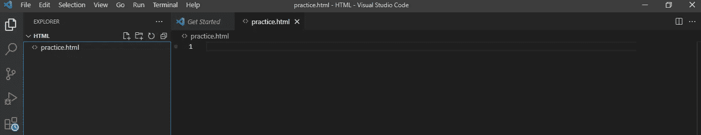
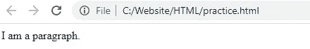
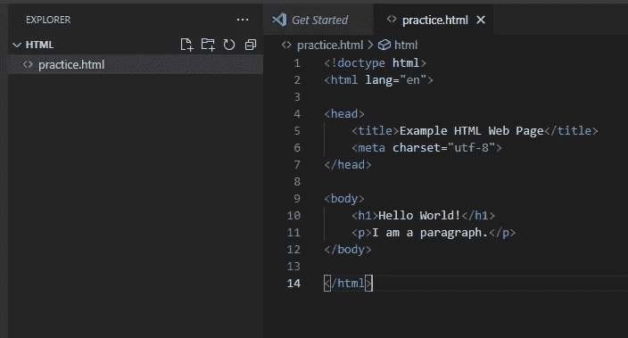
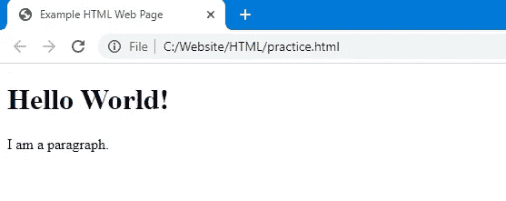
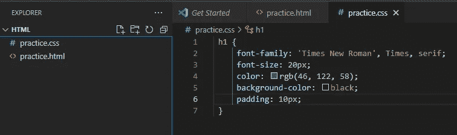
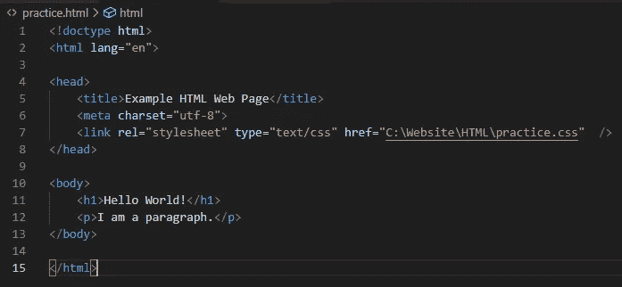
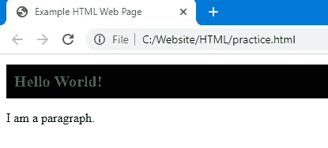

# HTML 和 CSS 初学者指南

> 原文：<https://medium.com/geekculture/the-complete-beginners-guide-to-html-and-css-b8ce816fe2ef?source=collection_archive---------18----------------------->


Photo by [Jackson So](https://unsplash.com/@jacksonsophat?utm_source=medium&utm_medium=referral) on [Unsplash](https://unsplash.com?utm_source=medium&utm_medium=referral)

**经历**:初学者

# 要求:

**不需要事先有编程知识。**

你可以在 windows 上使用像“记事本”这样的标准文本编辑器，但是我强烈推荐下载[微软 Visual Studio 代码](https://code.visualstudio.com/) (VSCode)。这将有助于你在编码时将 HTML 形象化。

## 标签

HTML 代表超文本标记语言，它是网站的基础。HTML 由称为“标签”的元素组成，用于组织网站，并帮助浏览器和搜索引擎知道如何处理网站。例如，页面中的段落可能有这样的段落标记

```
<p>I am a paragraph.</p> 
```

请注意，该段落有一个开头:

```
<p>
```

结尾是:

```
</p>
```

浏览器不会显示标签本身，但是标签会告诉浏览器如何处理标签中的内容，在本例中是文本。

您可以通过转到 VSCode 并创建一个新的 HTML 文档来测试这一点。打开 VSCode 并打开左侧的“explorer”菜单。点击“新建文件”图标，将其命名为“practice.html”。



复制和粘贴:

```
<p>I am a paragraph.</p>
```

然后保存文件，在文件资源管理器中打开这个文件位置，双击文件在浏览器中打开它。



## 标准标签。

HTML 文档通常有一套标准的标签来帮助浏览器和搜索引擎。其中一些标签如下:

```
<!doctype html>
<html lang=”en”> 
<head> 
<title>Example HTML Web Page</title> 
<meta charset=”utf-8"> 
</head> 
<body> 
<h1>Hello World!</h1> 
</body> 
</html>
```

最佳实践是在您创建的每个 html 文档中包含所有这些标签。一个网站的“内容”将存在于标签中，而标签主要用于浏览器和搜索引擎，还包括链接到你的页面中包含的其他文件，如 CSS。让我们尝试将这些元素添加到我们的页面中。



注意，浏览器已经知道标题标签

# 应该比

标签有更大更粗的字体。如果我们想指定 html 标签中某些文本的字体和大小，我们需要添加样式。HTML 样式是用层叠样式表或 CSS 来完成的。

在 VSCode 中，创建一个名为“practice.css”的新文档。

添加以下内容:

```
h1 {}
```

大多数 HTML 标签中都有一些标准元素:

## 字体系列

```
h1 {
     font-family: : 'Times New Roman', Times, serif;}
```

这是标签将使用的字体。最好使用几个系列，用逗号分隔，这样如果浏览器不知道如何显示字体，它将默认使用下一个字体。

## 字体大小

```
h1 {
     font-size: : 20px;}
```

这是文本的大小。声明大小有几个选项，但是对于本教程，我们将坚持基本的“像素”大小。

## 字体颜色

```
h1 {
     color: rgb(46, 122, 58)}
```

这只是字体的颜色。

## 背景

```
h1 {
     background-color: black;}
```

这是背景的颜色。请注意，我只是使用了颜色的名称，而不是颜色值。这是因为浏览器都将显示相同的颜色，如“黑色”和“白色”，但不同浏览器之间的颜色(如“洋红色”)可能略有不同，因此最好使用特定颜色的实际红绿蓝值。

## 填料

```
h1 {
     padding: 10px;}
```

填充是一个重要的元素，因为它指定了元素外部和文本之间的间距。

## 把它们放在一起

尝试将所有这些元素添加到您的 CSS 页面中。



现在，在 HTML 页面的页眉中添加一个到这个 CSS 页面的链接。



在浏览器中打开您的 HTML 页面以查看您的样式。



恭喜你，你已经成功地创建了一个 HTML 页面，并使用 CSS 对其进行了样式化。使用 Python 的 Flask 和谷歌应用引擎，你离[创建一个免费的实时网站只有三个文件之遥。](/geekculture/how-to-make-a-website-for-free-with-pythons-flask-and-google-app-engine-5278a6041762)