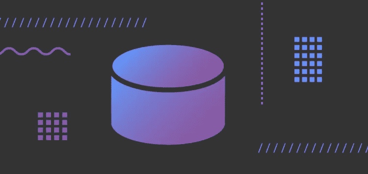
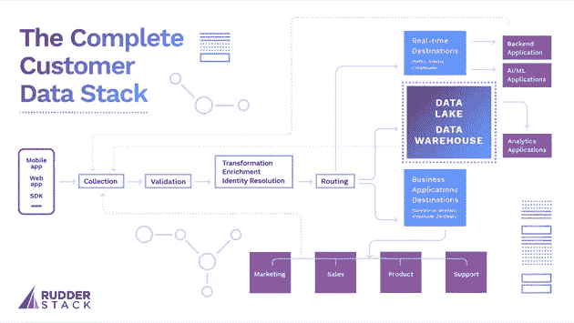

# 完整的客户数据堆栈

> 原文：<https://medium.com/geekculture/the-complete-customer-data-stack-15e6433e6543?source=collection_archive---------29----------------------->

# 概观

在本文中，我们从数据工程师的角度出发，分解了“完整的客户数据堆栈”的理想架构。每天都有新的客户数据软件工具推出，而“客户数据平台”等术语的定义并不明确，因此我们认为这些单独的工具始终是更全面的客户数据堆栈的一部分，应该由 IT 和工程部门来管理。

在商业软件中，“统一的客户数据”和“360 度客户视角”是热门的营销术语。高管们，当然还有销售人员，都说这些新工具是自切片面包以来最好的东西。

当涉及到工程和 it 组织时，大多数开发人员在考虑统一的客户数据时不会想到花哨的营销软件。相反，他们在形成整个客户数据管道的数据流、存储和处理的上下文中考虑统一数据。

这种观点上的差异是供应商向市场和销售部门销售并实施它们的不幸结果。然而，由于没有考虑整个系统，结果往往是更多的孤立数据(与承诺的相反)。

在本文中，我们认为所有供应商销售的客户数据功能*只是客户数据基础设施*的更广泛系统中的一个组件(或“用例”)——收集、管理&激活客户数据的一整套工具和功能。

我们的一位客户在将 RudderStack 解释为其堆栈的一部分时很好地描述了这一点:

> "*这不是 RudderStack 作为一项单独服务的成功，而是让我们的客户数据基础设施走向正确的整个努力的成功，这意味着建立数据驱动的工作流，根据数据做出更明智的决策，并建立保留和参与的预测模型。并非所有的努力都与工具直接相关，但工具是我们正在构建的系统的一个重要部分*。

这些系统是复杂的，涉及内部和外部的多个业务和技术系统，以及跨越组织的用例，从营销到产品到支持(甚至财务)。

我们相信，IT 和工程团队最适合构建这种客户数据堆栈。

# 首先，让我们定义“客户数据”

冒着指出显而易见的风险，在最高级别上，任何与客户相关的数据都是客户数据，这个概念在互联网甚至计算机出现之前就已经存在了。

在计算机出现之前，企业通常会对所有交易进行分类记账，主要是为了会计和计划的目的。随着计算机的出现，分类账被数字化并存储在数据库中，但概念和用例保持不变。

从最初的那些日子起，我们已经走过了漫长的道路。像 Salesforce 这样的客户关系管理工具(CRM)是第一个到达多个组织的“客户数据平台”。然而，随着从每个客户接触点收集数据的能力变得越来越可能，带有 UI 的客户记录存储库的概念不足以满足真正的数据驱动型公司的需求。

客户正以前所未有的方式与企业互动。不仅仅是零售店，还有网站、手机应用、呼叫中心、票务系统等等。业务系统激增，以管理所有数据并从中创造价值。令人惊讶的是，一个典型的中型公司在他们的部门中使用 10-50 种工具来与客户互动。这包括自主开发的系统以及第三方 SaaS 解决方案。

任何数据工程师都知道，现代环境中最常见的挑战是关于客户的信息被孤立在工具中。将所有数据整合在一起以创建一个完整的客户“视图”是一个不小的工程问题。

该解决方案不是单一的工具或功能，而是一个全面的“客户数据堆栈”

基于多年来构建、运行和使用该基础设施各部分输出的经验，我们制定了构建一个全面、可扩展的系统所需的关键组件，以满足整个公司的需求(我们称之为“完整的客户数据堆栈”)。

请注意，没有一个供应商能够解决所有难题。每个公司都使用多种工具。许多公司试图从零开始构建这些系统。相比之下，其他公司则利用 Segment、 [RudderStack](https://rudderstack.com/) 、DBT、Lytics 等工具来管理其数据管道的关键组件(尤其是那些构建和运行起来复杂和/或昂贵的组件)。

此外，请注意，这种架构有点“令人向往”并非每个公司都已经实现或正在实现堆栈的每个组件。对客户数据堆栈的要求因公司的业务模式和阶段而异。然而，在规模上，真正的数据驱动型企业将在某种程度上需要每个组件的功能。

让我们深入分析并分解完整客户数据堆栈的关键构建模块。

# 完整客户数据堆栈的组件

这张图表包括了完整客户数据堆栈的所有关键组件，从数据收集到所有主要使用案例。下面，我们将围绕每个关键组件分解功能和关注点。

**完整的客户数据堆栈——点击打开新标签**

# 数据收集

这是起点。客户数据分布在多个系统中，跨越客户旅程中的多个点，客户数据堆栈的第一项工作就是收集这些数据。客户数据有多种形式，但几种最常见的类型是:

*   web 和移动应用上的用户行为和点击流事件(点击、页面浏览、产品搜索、帐户创建等)。)
*   后端系统中的交易事件(财务等。)
*   来自客户 SaaS 应用程序的交易数据，用于营销、销售和支持(电子邮件、票证、聊天等)。)
*   来自营销、销售和支持的内部应用程序的数据
*   从外部平台(Google Ads、Clearbit 等)结构化数据。)

除此之外，客户数据还可能来自工程堆栈的关键部分:

*   数据仓库:许多公司将 ETL 和 ELT 作业从他们的事务系统运行到一个仓库中，并且通常包括“计算”值。
*   AI/ML 系统:公司越来越多地部署 AI/ML 系统来计算客户分数、个性化产品推荐等。这些系统的输出还会产生“独特的客户数据”

收集组件的目标是从所有这些系统中获取数据。一些数据是通过 API“拉取”的(例如，从 SaaS 源),而其他数据(例如，事件)则更多地基于推送——SDK 部署在所有源上，这些 SDK 通过 API 推送事件。从数据库(如仓库)获取数据会带来额外的工程挑战。最简单的方法是运行一个 SQL 查询，但是当事件量很大时，这种方法不太适用。[变更数据捕获(CDC)技术](https://en.wikipedia.org/wiki/Change_data_capture#:~:text=In%20databases%2C%20change%20data%20capture,taken%20using%20the%20changed%20data.)是解决这一数量问题的备选解决方案。

无论何种使用情形，任何可扩展的客户数据堆栈都需要解决数据收集在复杂性和规模方面的挑战。

# 数据有效性

验证是堆栈的一个关键组成部分，因为一些数据，尤其是来自移动/web 应用程序的事件流，由于人为错误、广告拦截器、浏览器缺陷、开发人员错误、DoS 攻击等原因，通常是肮脏且有问题的。脏数据会严重影响下游功能。因此，需要小心处理或完全阻塞，这取决于用例。

验证通常是基于规则的，但越来越多的公司正在使用 AI/ML 系统从历史数据中“学习”事件模式，并阻止不符合该模式的事件。

验证步骤还可能涉及调用外部 API。一种常见的验证是电子邮件验证——确保客户事件中的电子邮件地址是正确的——这通常涉及调用电子邮件验证 API。

不管是什么用例，数据堆栈的验证组件都是为公司提供干净数据的关键，因此它需要健壮和灵活。

# 转换、丰富和身份解析

一旦收集并验证了原始数据，在发送给下游应用程序之前，通常需要以某种方式对其进行转换。以下是一些常见的使用案例:使用额外的内部数据(例如，完整的用户资料)或外部数据(例如，职位、公司名称、公司规模等)丰富用户记录。).这是营销和销售中的一个大趋势，通常需要利用内部或外部的 API 服务。

*   删除 PII 或其他敏感的客户数据点
*   采样和过滤事件(通常是为了降低使用数据的下游应用程序的成本)
*   为统一仓库表或下游 SaaS 工具之间的通信映射标签或标题

转换组件的另一个重要功能是身份解析—映射用户可能拥有的所有不同身份(匿名 cookies、设备 id、广告 id、电子邮件地址等)。)转换成规范标识符。将所有这些身份联系在一起是将客户的所有数据整合到一个统一的客户档案中的关键步骤。(添加引用)

根据业务的复杂性和需求，转换可能简单到只有几行代码，也可能需要针对每个下游目的地的复杂用例。需要记住的一点是，随着转换规模的扩大和复杂性的增加，将数据传送到下游目的地的潜在延迟也会增加。

# 客户数据堆栈的路由组件

数据路由可能是最简单的解释，但它绝不是简单的实现。收集的客户数据通常被发送到多个下游目的地。这些目的地包括数据仓库和其他外部/内部应用程序(其中许多都有自己的 API)。

路由组件需要可靠地将消息传递到每个目的地，并可靠地处理传递失败。即使有干净的数据(来自验证组件)，失败在客户数据管道中也是常见的。例如，云目的地可能关闭，仓库可能正在进行维护，等等。在这个过程中，数据不应该丢失或重新排序(如果你感兴趣，我们在另一篇文章中写下了我们对这个挑战[的解决方案)。](https://rudderstack.com/blog/building-a-reliable-customer-data-infrastructure/)

路由模块还经常处理某些目的地的批处理数据。例如，很多时候，在将事件加载到数据仓库之前，必须对它们进行批处理。

最好的路由解决方案应该具有可靠的故障处理、管理规模峰值的能力，并尽可能支持实时(或接近实时)加载。

# 仓库

仓库是客户数据堆栈的“中心”。CDI 堆栈的主要目标之一是将数据集中到一个中心位置进行分析、报告，并在整个公司范围内使用。换句话说，无论是源、下游用例还是公司中的最终用户，仓库都应该是所有客户数据的中心和真实来源。

然而，数据仓库的用处远不止是作为事实的来源。它们对于关键的数据工程功能至关重要。一些有趣的用例包括创建用户群组(即，访问过结账页面但没有购买的用户)并对这些群组采取行动(即，向这些用户发送优惠券或折扣代码)。

值得注意的是，这些功能通常是市场驱动的，并导致了我们上面提到的第三方“CDP”工具的显著扩散，不幸的是，这些工具通常与更广泛的 CDI 堆栈隔离开来。

这些仓库用例要求数据在一个地方，并要求在数据之上有一个复杂的查询接口。

整个堆栈的可扩展性和成本也是重要的考虑因素。像 Snowflake、BigQuery 或 Redshift 这样的云原生数据仓库非常适合这个用例。

对于构建客户数据基础设施的数据工程师来说，好消息是今天的现代化仓库非常适合作为堆栈的核心。该技术已经变得更加先进和易于使用，并将继续如此。

# 商业应用

除了将数据转储到仓库中，客户数据流还需要发送到其他应用程序，以便团队可以对其采取行动。

正如我们上面提到的，工程团队管理初始目的地路由。尽管如此，将这些下游应用程序视为系统的一个组件仍然很重要，这在很大程度上是因为它们自己收集和生成的数据通常需要通过收集器路由回系统。在许多情况下，这些系统既是目的地也是来源。作为源，它们需要作为集合组件的一部分进行管理。

管理本地系统的公司(如 Siebel CRM)需要向这些应用程序推送数据，也需要从这些应用程序中提取数据。

虽然工程团队很少管理其他团队使用的第三方 SaaS 应用程序，但它们是客户数据堆栈中非常重要的组成部分。他们经常推动优化产品、营销和销售的洞察力和客户体验。如上所述，许多还“产生”系统需要收集的数据。

下面是几个常见的下游 SaaS 应用:

*   产品分析工具，如 Amplitude 和 Mixpanel
*   营销自动化、分析和测试工具，如 Marketo、Customer.io、Google Analytics 和 VWO
*   像脸书、谷歌广告和 Lotame 这样的广告平台
*   像 Salesforce 和 HubSpot 这样的销售系统
*   像 Intercom 和 Zendesk 这样的支持系统

随着企业各个部门的 SaaS 应用程序呈爆炸式增长，管理这一难题变得越来越具有挑战性。好消息是，围绕第三方应用程序的数据传输的工具正在变得越来越好(这是我们在 RudderStack 积极构建的，以使您作为数据工程师的工作更容易)。

# AI/ML 的实时目的地

公司越来越多地部署复杂的 AI/ML 应用程序，用于线索评分、产品推荐、UI 个性化等。

以 AWS 个性化为例。亚马逊 Personalize 是一款实时个性化和内容推荐产品，使用与 Amazon.com 相同的机器学习推荐系统。

为了训练 AWS 个性化模型，必须发送客户行为事件(例如，他们搜索、点击、添加到购物车等的产品)的提要。).然后，该模型的输出可以通过 API 获得，当提供给用户时，该 API 可以建议用户最可能感兴趣的产品。拥有数据科学专业知识的公司通常会开发像 AWS 这样的内部个性化产品。

客户数据堆栈的一个关键功能是通过将数据放入其中并获取结果来支持这些实时应用程序。“实时”部分至关重要，因为您的用户希望看到基于他们“现在”正在做的事情的推荐和个性化，而不是他们几天甚至几小时前做的事情。

# 结论:为什么 IT 和工程部门需要拥有客户数据堆栈

即使在理想客户数据堆栈的高级分解中，很明显，构建和管理架构、管道和实际数据流是复杂的、多方面的工作，会影响组织的每个部分。当考虑数据安全影响时，风险甚至更高，尤其是在高度监管的行业。

有像 CDP、ML 模型和丰富服务这样的工具可以很好地执行单个功能，并且有时可以由单个团队来管理。将多个高性能部件分开，并不意味着你就有了一个功能齐全的高性能发动机。

最适合迎接挑战并制造引擎的团队是 IT 和工程团队。根据我们的经验，当公司认识到充分利用客户数据的巨大挑战，并让 IT 和工程部门直接参与客户数据堆栈的构建、管理和优化时，孤岛就会被打破，团队会相互协作，组织作为一个整体会移动得更快并取得更好的结果。

# 免费注册并开始发送数据

测试我们的事件流、ELT 和反向 ETL 管道。使用我们的 HTTP 源在不到 5 分钟的时间内发送数据，或者在您的网站或应用程序中安装我们 12 个 SDK 中的一个。[入门](https://app.rudderlabs.com/signup?type=freetrial)。

**本博客原载于**[**https://rudder stack . com/blog/the-complete-customer-data-stack**](https://rudderstack.com/blog/the-complete-customer-data-stack)**。**