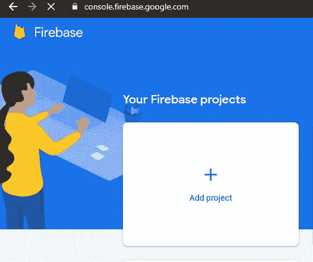
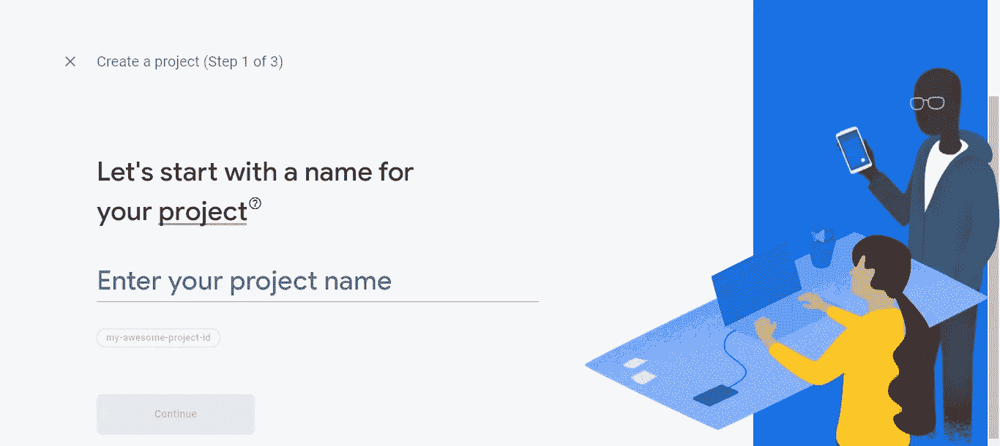
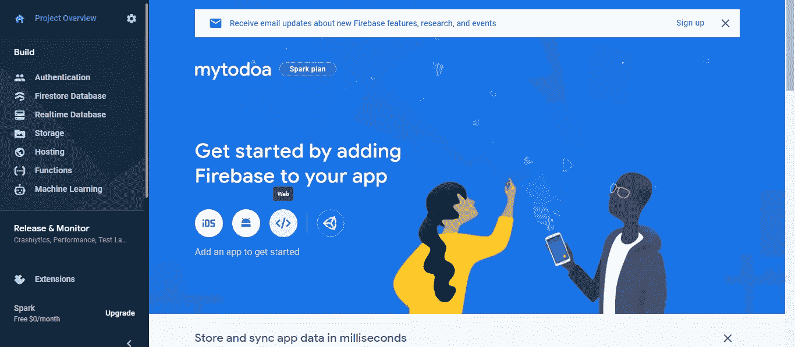
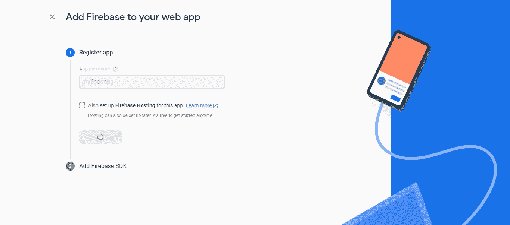
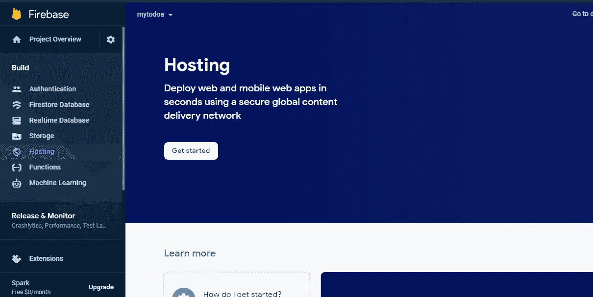
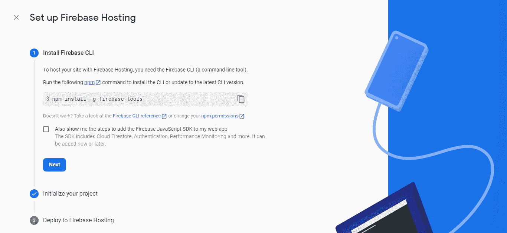
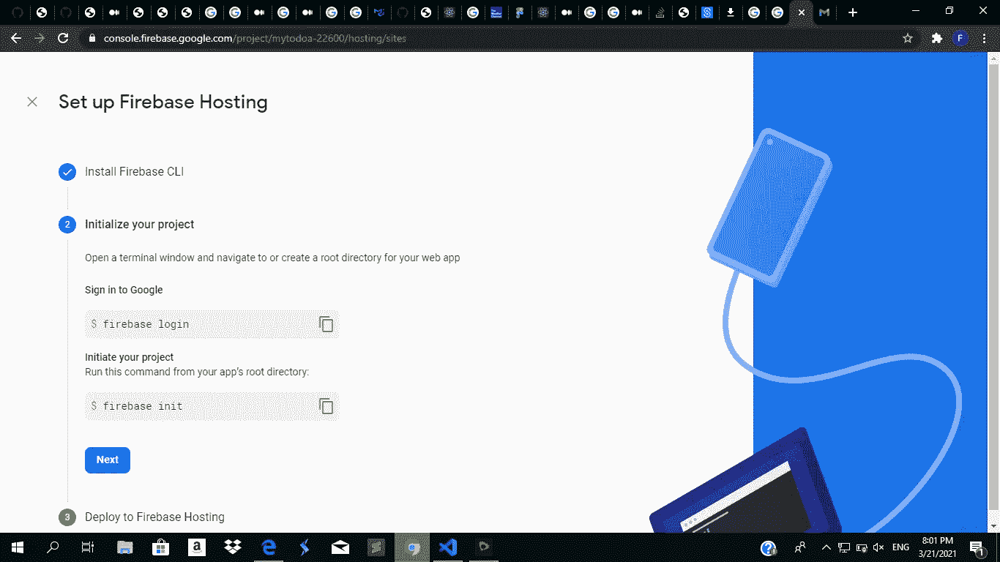
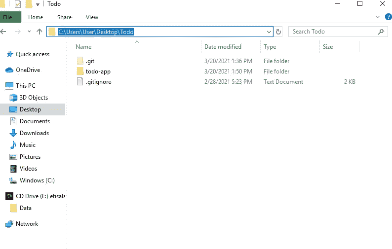
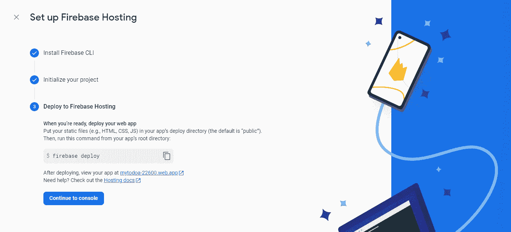

# 将静态网站托管到 Firebase 的完整指南

> 原文：<https://medium.com/geekculture/the-complete-guide-to-hosting-your-static-website-to-firebase-16c3125bc4a4?source=collection_archive---------5----------------------->

## 你的朋友会很高兴，就像你和脸书在一起一样。


Photo by [Ketut Subiyanto](https://www.pexels.com/@ketut-subiyanto?utm_content=attributionCopyText&utm_medium=referral&utm_source=pexels) from [Pexels](https://www.pexels.com/photo/smiling-man-in-turban-using-smartphone-while-relaxing-at-home-4307661/?utm_content=attributionCopyText&utm_medium=referral&utm_source=pexels)

从任何地方毫无压力地访问脸书是什么感觉？

*太对了！*

每一个网站在上线之前都是从生产空间或本地主机中脱颖而出的。

因此，在本教程中，我们将把你的静态网站托管到 firebase，以便随时随地轻松访问。

我们将使用:

*   NodeJS
*   虚拟代码
*   终端或命令行，以及
*   重火力点

所以事不宜迟，我们开始吧！

```
**Table of content****·** [**1\. Website Config on Firebase**](#c0ad) **∘** [**Creating your website on Firebase**](#50b9) **∘** [**Registering your website on the web**](#101c) **·** [**2\. Configuring your Firebase Setup Locally**](#f1a3) **·**[](#7f49)**∘** [**Setting up the Firebase environment**](#5c6d) **∘** [**Logging in to Firebase**](#f53f) **·** [**3\.  The Initialization Process**](#7519) **∘** [**The questionnaire**](#f9e1) **∘** [**Constructing the public folder**](#f980) **∘** [**Back to Questionnaire**](#f201) **·** [**4\. Deployment**](#4f5e) **·** [**5\. Updating Deployment**](#afb6) **∘** [**If changes is not seen**](#1d25) **· 
·** [**In Conclusion**](#4aaa)
```

# 1.Firebase 上的网站配置

现在让我们开始吧！因此，转到 https://firebase.goggle.com 的[然后点击转到控制台。](https://firebase.goggle.com)

现在，您需要登录您的 Google 帐户。登录后，进入下一步。

## 在 Firebase 上创建您的网站

要在 Firebase 上设置网站，请遵循以下指南:

*点击"添加项目"



Screenshot by Author

*   为您的项目命名



Screenshot by Author

*   你可以启用你的谷歌分析。如果你不愿意，也没有问题。但是在这种情况下，我们将只启用它。


Screenshot by Author


Screenshot by Author

*   然后单击继续

下图表明您的项目已成功创建，因此您可以单击继续。


Screenshot by Author

## 在网上注册你的网站

现在让我们在网上注册我们的网站吧！在创建的网站的仪表板上:

*   点击网络图标>



Screenshot by Author

*   注册您的网站并点按“继续”



Screenshot by Author

*   现在，单击继续到控制台

# 2.在本地配置 Firebase 设置

在这个过程中，在本地计算机上使用 Firebase 之前，我们需要解决两个重要的问题。

## 设置 Firebase 环境

现在，我们需要安装它的工具。所以让我们开始吧！

*   在边栏菜单上，单击主机，然后单击开始按钮。



Screenshot by Author

您将被引导至以下页面。



Screenshot by Author

*   现在，如果您使用 windows，请进入命令行；如果您使用 Mac，请进入终端，然后运行该命令。

```
npm install -g firebase-tools
```

如果您做的一切都正确，您将不会看到任何错误，这意味着它已经安装。

## 登录 Firebase

要开始列表中的下一个过程，您需要登录 Firebase。所以，运行`firebase login`



Screenshot by Author

如果它返回登录为“你使用的电子邮件”，你就可以走了。

# 3.初始化过程

现在，我们进入本教程的实质内容。

要开始，您必须 cd 到您的项目目录。

*如果您不知道该文件夹在哪里，请在 PC 上的文件浏览器中找到您保存该文件夹的位置。然后，单击该文件夹顶部的栏，将路径和 cd 复制到终端上的该路径。*

**高亮显示的文本是路径。**



Screenshot by Author

接下来，运行`firebase init`

命令成功运行后，您将不得不处理一份调查问卷。

## 问卷调查

*规则如下:y 代表是，n 代表否*

让我们开始吧！

#你准备好继续了吗？y 型

#使用箭头键导航到“主机”，到达“主机”后使用空格键选择，然后按回车键确认

#选择“使用现有项目”

#选择您刚刚注册的项目

## 正在构建公共文件夹

现在，您将被要求提供一个`public`目录，而您现在很可能没有这个目录。

因此，在 PC 上的文件浏览器中找到项目的文件夹，然后创建一个名为`public`的文件夹。

之后，复制你用来创建网站的所有文件并粘贴到`public`文件夹中。

*现在，回到终端或命令行完成问卷！*

## 返回调查问卷

#对于您的`public`目录，请键入 public。

这意味着 Firebase 将在你的`public`文件夹中获得网站的所有代码。

#允许重写所有指向 index.html 的 URL

#拒绝覆盖

然后，您的初始化过程就完成了。

# 4.部署



Screenshot by Author

一旦每个步骤成功完成，运行`firebase deploy`

一旦它被部署，你将获得访问你的网站的网址。

*祝贺您，您刚刚将自己的网站部署到 Firebase！*

# 5.更新部署

如果你更新了你的代码，并在没有更新你的 public 的情况下重新部署了应用程序，重新部署的站点将保持和以前一样，因为它是从没有更新的 public 文件夹中获取代码的。

若要更新公共文件夹，请复制您更新的文件并将其粘贴到公共文件夹中，并删除更新文件的早期版本。

或者更好的是，删除`public`文件夹中的所有内容，然后再次复制所有文件并粘贴到`public`文件夹中，以防您忘记更新了哪些文件。

## 如果看不到变化

现在，如果你的网站无法显示所需的更改，你可以通过按下 windows 上的`ctrl + shift + r`或 Mac 上的`command + shift + r`来执行硬刷新

# 最后

我们在 Firebase 上托管了您自己的静态网站，在那里我们学习了如何在 Firebase 上建立网站，配置 Firebase 环境，初始化网站并部署它。

这很有趣吗？有帮助吗？

感谢您的宝贵时间！