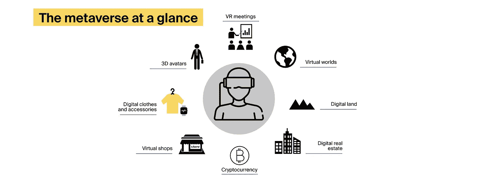

# 商业领袖元宇宙完全指南

> 原文：<https://medium.com/geekculture/the-complete-metaverse-guide-for-business-leaders-a0ada7463e6?source=collection_archive---------14----------------------->

> “元宇宙将允许人们复制或增强他们的身体活动。这可以通过将物理活动转移或扩展到虚拟世界或通过改变物理世界来实现。”

- Marty Resnick，Gartner 副总裁兼分析师

自从脸书更名为 Meta 以来，有远见的企业家们一直在想，他们是否可以利用元宇宙做生意。毫不奇怪，一系列技术供应商现在正在将[元宇宙开发服务](https://itrexgroup.com/services/metaverse-development/)加入他们的投资组合，希望巩固他们在新兴技术市场的地位，并帮助他们的客户驾驭元宇宙炒作的浪潮。

但是元宇宙到底是什么？元宇宙是如何工作的？最重要的是，元宇宙有哪些商机？请继续阅读，找出答案！

# 商业元宇宙:基础

元宇宙是一个与设备和供应商无关的集体虚拟开放空间，它融合了物理世界和数字世界。在这个空间中，用户可以通过 3D 虚拟角色进行互动。此外，他们创建和购买数字资产，通常是以不可替代的令牌(NFT)的形式。

如果您想知道如何连接到元宇宙，这非常简单。你只需要一个扩展现实(XR)设备，如高端虚拟现实(VR)头盔，增强现实(AR)眼镜，或一个廉价的耳机，将你的智能手机变成一个 XR 小工具。然而，沉浸程度将取决于您设备的功能，以及您正在访问的元宇宙应用程序中 3D 内容的数量和质量。

虽然元宇宙这个词在 2021 年秋天开始流行，但是[这个概念实际上是由美国小说家尼尔·汤·斯蒂芬森在 30 年前引入的。一些早期的元宇宙例子包括堡垒之夜和 Roblox 等视频游戏，古驰花园等虚拟展品，以及梅西百货和阿里巴巴在 2016 年光棍节期间实施的虚拟现实购物解决方案](https://www.practicalecommerce.com/12-examples-of-brands-in-the-metaverse)[。](https://qz.com/835171/singles-day-virtual-reality-lets-chinese-customers-shop-macys-famed-new-york-store/)

Meta(以前称为脸书)、微软、NVIDIA 和其他公司致力于在孤立的虚拟环境中进行活动的主要目标是最终将这些领域融合成一个单一的领域，即元宇宙。

目前，该技术仍处于早期阶段，元宇宙对业务的影响尚不清楚。然而，到 2026 年，四分之一的世界人口[可能会在全球元宇宙中每天至少花费](https://www.gartner.com/en/articles/what-is-a-metaverse)一小时用于购物、教育、工作和娱乐。

# 为什么元宇宙会成为下一个商业前沿

到 2020 年，数字内容消费[将增长 30%](https://www.warc.com/newsandopinion/opinion/covid-19-causes-digital-consumption-to-rise-by-over-30-forming-new-and-lasting-consumer-habits/en-gb/4209) 。流媒体服务继续挤走有线电视频道，把人们赶出电影院，导致主要电影制片厂[加倍](https://www.wsj.com/articles/in-a-netflix-world-movie-studios-make-more-movies-than-ever-is-that-a-good-thing-11623864782)制作努力。到今年年底， [Meta 预计将通过新的奖金计划向内容创作者支付超过 10 亿美元。](https://www.accenture.com/_acnmedia/PDF-169/Accenture-Fjord-Trends-2022-Full-Report.pdf)

> *换句话说，媒体和娱乐业正在蓬勃发展，但也开始显示出最初的疲态。随着互联网的大规模扩张达到顶峰，用户开始想知道接下来会发生什么。*

根据安永的调查，41%的消费者现在担心互联网对他们的幸福和心理健康的影响。社交媒体上视频内容的用户关注时长[估计只有两秒](https://www.careerarc.com/blog/attention-span-on-social-media/)。独立内容制造商厌倦了等待社交媒体上的另一次病毒式打击，正在转向 Substack 和 OnlyFans 等平台，直接将他们的文章和视频货币化。

创建一个全球互联的虚拟空间，实现用户之间的真实互动，可以为我们所知的互联网注入第二次生命，推动创造者经济，并增强在家工作、远程教育、在线商务和品牌客户互动。这就是元宇宙的商机所在。

# 在进入元宇宙进行商务活动之前，你应该知道些什么

我们之前给出的元宇宙定义可能会产生误导，因为“元宇宙”是多种多样的事物。

首先，它是一个虚拟领域，可以是真实物理世界的精确副本，也可以是一个全新的沉浸式环境，具有自己的景观和创造性表达形式。

其次，这是一个独立的数字消费者对消费者经济，由数字货币和不可替代的代币实现。

最后，这是一套改变场所概念的技术。当我们访问网站或在移动设备上加载应用程序时，我们并没有真正去任何地方的感觉。在元宇宙内，用户将被传送到一个具有自己的建筑和空间逻辑的虚拟空间。

> 无论你如何定义元宇宙，有一件事是肯定的:它是人们在互联网上互动和做生意的下一次迭代。

# 元宇宙是如何在幕后工作的？

就技术而言，扩展现实是元宇宙应用的基石。其他技术，如人工智能、云计算和物联网，也为虚拟内容创建、内容映射和用户之间逼真的交互提供了基础。

然而，正如 [IT 专家指出的](https://www.itpro.com/business-strategy/collaboration/361832/the-business-of-the-metaverse)，这些基础设施组件中的一些要么还不存在，要么不能得到最大限度的利用，这可能会妨碍企业创建引人注目和真正身临其境的虚拟环境。对于量子计算、稳定的加密货币和成熟的区块链平台来说尤其如此。

最大的挑战是，这些技术可能需要数年才能开花结果；毕竟,《红色死亡救赎 2 》( Red Dead Redemption 2)是一款 AAA 级电脑游戏，可以被归类为元宇宙，它花了 8 年时间进行开发。

# 元宇宙的商业模式和机遇

元宇宙可以推动创造新的商业模式，如从玩耍到赚钱、从创造到赚钱和从学习到赚钱，把娱乐活动变成正当的工作。但是元宇宙的商业机会远不止面向消费者的业务。例如，微软和英伟达等品牌利用元宇宙应用程序来使在线会议更具吸引力，或模拟工业制造等复杂过程。

用户将能够在 metaverses 中执行的一些活动包括:

*   购买数字土地，建造虚拟家园，用数字艺术和收藏品装饰它们
*   为 3D 化身购买装备和配件
*   在员工入职、客户服务、销售和其他业务运营方面与数字人互动
*   参与虚拟社交体验，如在线课程、工作会议和娱乐活动

## 元宇宙经济和非正规金融服务解释

销售数码产品是元宇宙的主要商机之一。为了促进这一活动，内容创作者和购买者需要保护虚拟资产。这里是一般的[区块链解决方案](https://itrexgroup.com/services/blockchain-development/)(特别是不可替代的代币！)进场。

不可替代令牌是一种使用数字媒体创建的资产(如图像、视频、音频剪辑、虚拟房地产或活动门票)。此类资产带有独特性标记，包括创作日期、过程中使用的工具以及艺术家的姓名等。这些特性可以记录在由区块链技术公司开发的 NFT 卡上。通过令牌化，创建者可以保护元宇宙 NFT 不被篡改，并且可以很容易地跟踪它们的未授权使用。

加拿大著名音乐人[格莱姆斯最近通过出售华纳兄弟收藏的十幅数字图像和视频，在短短几分钟内赚了](https://www.theverge.com/2021/3/1/22308075/grimes-nft-6-million-sales-nifty-gateway-warnymph)518 万美元。Nyan Cat 的创作者[将原始的 meme 视频](https://www.businessinsider.com/ethereum-nft-meme-art-nyan-cat-sells-for-300-eth-2021-2?IR=T)变成了独一无二的数字艺术作品，并以相当于 59 万美元的加密货币出售。Twitter 的联合创始人和前首席执行官杰克·多西[以 29 亿美元的价格出售了他的第一条推文](https://www.cnbc.com/2021/03/22/jack-dorsey-sells-his-first-tweet-ever-as-an-nft-for-over-2point9-million.html)，这条推文可以追溯到 2006 年，主要内容是“设置我的 twttr ”!

> *通过在元宇宙使用 NFTs，创作者可以将其内容货币化，解决可能的知识产权纠纷，打击数字盗版，并消除数字贸易中的中介。毫不奇怪，NFT 经济正在加快步伐，成为早期元诗的支柱。*

例如，在 Somnium Space 和分散土地等虚拟空间中，用户使用自定义加密货币购买服装和数字房地产等 NFT。反过来，加密货币可以通过特殊的钱包来管理，如菌丝体和出埃及记。不可替代的代币通常通过专用市场分发；后者包括 Axie、OpenSea 和 ThetaDrop 等。

据《金融时报》报道，元宇宙越来越多的人接受非正规金融服务，这可能是基于社会契约、独立所有权和自由市场的新经济的起点。凭借 270 万个独特的钱包和 249 亿美元的交易量， [2021 年成为了](https://www.fool.com/the-ascent/research/nft-market/)NFT 先驱们出色的一年——而这只是更光明的数字未来的开始。

# 利用元宇宙开展业务的主要原因

与普遍的看法相反，元宇宙的概念并不是围绕着抛弃我们的现实，去支持一个有独角兽居住的世界。相反，这是一个逃离现实世界的界限和增强我们在网上进行的某些活动的机会。

早期采用者已经释放了一些元宇宙的商业机会——尽管他们正在以小本经营的预算尝试沉浸式技术，大多求助于增强现实。

据报道，元宇宙的优势包括:

*   **更吸引人、更真实的网上购物体验**。零售业的一些早期元宇宙例子包括宜家和家得宝的 AR 驱动的室内设计应用程序，欧莱雅和美国柯尔百货公司的虚拟试穿元宇宙应用程序，以及用于订单装配和质量控制的工业[增强现实解决方案](https://itrexgroup.com/services/augmented-reality-development/)。苏富比是一家领先的艺术品和收藏品经纪公司，他们在分散兰的伦敦画廊制作了一个数字复制品。通过用扩展现实功能增强传统购物应用和网站，零售商可能会消除在线购买家用电器等昂贵产品的不确定性，并减少产品退货，这对美国企业来说是一个 5500 亿美元的问题。
*   **未来派数字营销**。就像物理世界一样，metaverses 有专门的空间，如广告牌和液晶显示屏，用于推广产品和服务——但那里的竞争不会那么激烈。品牌还可以在元宇宙开设虚拟的实体店，向精通技术的用户出售 NFT，并向休闲浏览者提供产品试用。运动跟踪、面部识别和触觉反馈等新兴技术将允许营销人员个性化和衡量广告活动的效果，更不用说产品和支付交易的可追溯性了。此外，元宇宙对业务的可能影响在于 MarTech 系统的同步。例如，您的公司不需要为不同的地点和时区启动单独的应用程序、网站和在线活动，这简化了营销分析并节省了大量成本。
*   **增强协作和用户互动**。到 2022 年底，25%的美国工作[将不需要现场人员](https://www.forbes.com/sites/bryanrobinson/2022/02/01/remote-work-is-here-to-stay-and-will-increase-into-2023-experts-say/?sh=583ac8f920a6)，这一趋势将持续到 2023 年。鉴于疫情不会消失，远程工作已成为新常态，元宇宙可以为希望开展员工培训、举办高效会议、组织会议和改进业务发展活动的公司提供巨大的商机。微软，元宇宙驱动力之一，[最近给团队增加了一个新功能](https://vrworldtech.com/2021/11/03/business-metaverse-previewed-with-mesh-for-teams-and-accenture-vr-participation/)。该解决方案由 Mesh 平台提供支持，支持创建 3D 化身，允许团队在虚拟环境中交流、合作和训练。埃森哲已经对该功能进行了测试，该公司为元宇宙的员工订购了 6 万副 Oculus VR 护目镜。
*   **业务流程和运营的无风险建模**。每当公司开发新产品、实施新技术或改造制造和供应链流程时，他们都在承担新解决方案无法成功的风险，并且可能会在公司预算中留下一个明显的漏洞。例如，机器人过程自动化项目[在 50%的情况下会失败](https://itrexgroup.com/blog/robotic-process-automation-cost/)，而物联网设备的硬件组件[可能会在不同的设计和开发阶段花费六个月到两年的时间](https://itrexgroup.com/blog/how-much-iot-cost-factors-challenges/)。数字双胞胎——即由传感器数据、扩展现实技术和人工智能驱动的现实世界物体的复制品——是元宇宙应用的重要组成部分。它们有潜力解决公司面临的大部分创新相关问题。例如，为物联网和智能城市项目提供可视化软件的科技初创公司 Cityzenith，[正在建设一个元宇宙](https://www.einnews.com/pr_news/565289670/urban-digital-twins-set-to-create-the-first-real-world-metaverse-for-the-decarbonization-of-buildings)，存储大量关于单个建筑、城区和整个城市碳排放的数据。该解决方案可以帮助政府确定在哪些方面可以减少和限制碳排放，而无需在复杂的 IT 基础设施上投资数十亿美元。好消息是，digital twin 开发和实施所需的大部分技术已经由领先的云供应商提供，包括亚马逊、微软和谷歌。

# 如何进入元宇宙并更快获得收益？

> 你能做的最好的事情就是盯着它，拿着一桶盐。我认为任何人……说‘会是这样的’都可能被证明是错误的。这将真正由市场因素决定。”

- Tom Ffiscke，沉浸式 Wire XR 时事通讯编辑

在元宇宙系统主导商业技术领域之前，我们可能会经历一段漫长的反复试验。在这一点上，投资回报率的观点可能是模糊的。即使是发起元宇宙运动的 Meta 公司，也不指望他们 100 亿美元的投资在未来 10-15 年内会有大的回报。

在某种程度上，这可以解释为缺乏管理扩展现实负责任使用的技术标准和法规。为了帮助公司打开元宇宙的商机，政府和著名的技术供应商应该解决以下问题:

*   确保由不同公司和个人创建的全球元宇宙的单一入口点，以便能够利用元宇宙开展大规模业务
*   实施一套元宇宙实施和内容创建标准，以提供无缝的用户体验
*   监管元数据以避免在线中毒、未经授权的个人数据使用和网络犯罪
*   最小化元宇宙对环境的影响(据报道，铸造一辆 [NFT 会产生](https://www.nytimes.com/2021/04/13/climate/nft-climate-change.html)超过 200 公斤的温室气体二氧化碳，相当于驾驶一辆标准的美国汽油动力汽车行驶 500 英里)

从好的方面来看，企业不需要大量的 IT 预算来开始试验元宇宙应用程序。例如，Shopify 店主可以使用特殊的插件和开箱即用的平台功能将 AR 功能集成到他们的网站中。像 Unreal Engine 和 Unity 这样的虚拟现实开发工具早已出现在科技领域。那么，你的公司需要什么来开始使用元宇宙进行商业活动呢？

*   密切关注你的竞争对手——特别是，如果他们已经在测试元宇宙水域
*   分析你的产品或服务策略——例如，它是如何被你的客户展示和看到的，它是如何被购买的，以及它最终是如何被使用的
*   考虑一下在元宇宙做生意如何帮助你实现短期和长期目标
*   进行专家和焦点小组调查，以确定您的客户中有多少比例愿意进入 metaverses，以及他们可能会在那里花费多少时间
*   仔细计划你的进入策略——也就是说，你的品牌应该如何在虚拟环境中出现，以及什么时候是采取行动的正确时机
*   确定这种分散式虚拟环境特有的技术、隐私和安全风险
*   从小处着手(例如，将 XR 整合到一个应用程序或流程中)，但要设计一个长期的元宇宙实施计划
*   将游戏化融入你的元宇宙应用
*   收集用户反馈，并在此过程中对您的 IT 系统进行必要的更改
*   抓住元宇宙技术的脉搏，了解市场走向

请记住:即使使用元宇宙开展业务目前看起来过于超前，不太可能为你的公司带来直接价值，你也不应该让这项技术从你的雷达上消失。谁会想到网飞有一天会将百视达从视频租赁市场上驱逐出去，并颠覆整个娱乐业？

> *如果你对隐藏在看似难以捉摸的元宇宙的商机有任何疑问，欢迎随时* [*联系 ITRex 团队*](https://itrexgroup.com/contact-us/) *！我们知道如何进入全球元宇宙，利用其优势，并确保更快的投资回报。*

最初发表于 2022 年 3 月 18 日 https://itrexgroup.com*[。](https://itrexgroup.com/blog/metaverse-for-business-complete-guide-examples-applications/)*