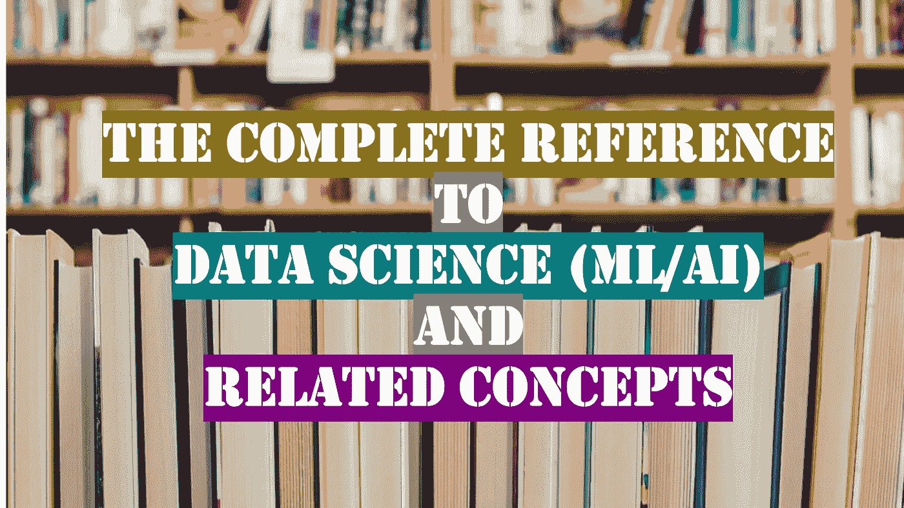

# 数据科学(ML/AI)及相关概念的完整参考

> 原文：<https://medium.com/geekculture/the-complete-reference-to-data-science-ml-ai-and-related-concepts-f21fcf75af2c?source=collection_archive---------16----------------------->

## 精心挑选的关于数据科学及其近邻的媒体文章

数据是新的石油，人工智能是新的电力，数据科学(ML/AI)领域正在快速发展。这个领域本身非常广阔，几乎不可能囊括任何一本书或课程中的每一个主题。

在这篇文章中，我试图做的是，精心挑选关于数据科学的优质文章，以创建一种课程，作为数据科学领域的新手和经验丰富的专业人员的参考指南。

在不久的将来，随着这个领域的发展，我会在这篇文章中不断添加新的主题。所以让我们开始吧:

## 目录

*   介绍
*   编程；编排
*   数学
*   数据分析和可视化
*   机器学习基础
*   机器学习高级版
*   自然语言处理
*   深度学习
*   强化学习
*   数据系统和大数据
*   云计算
*   高级主题

# 介绍

*数据科学的内容、原因和方式|数据科学生态系统|在数据科学中的作用*

数据科学是一个跨学科领域，它使用科学方法、流程、算法和系统从结构化和非结构化数据中提取知识和见解，并将来自数据的知识和可操作的见解应用于广泛的应用领域。

## 什么是数据科学？

 [## 数据科学到底是什么？

### 寻求一个有用的定义

medium.com](/hackernoon/what-on-earth-is-data-science-eb1237d8cb37) 

## 数据科学及其近邻

 [## 数据科学及其近邻

### 我在 2012 年开始了我的数据科学之旅，那时数据科学、机器学习和人工…

rathi-ankit.medium.com](https://rathi-ankit.medium.com/data-science-and-its-nearest-neighbours-8a53c4f89ffb) 

## 为什么数据科学很重要？

 [## 为什么数据科学如此重要

### 随着时间的推移，世界将变得更加由数据驱动，但基于数据的决策将继续具有影响力。

medium.com](/sequoia-capital/why-data-science-matters-ee583f785a55) 

## 如何做数据科学？

 [## 数据科学项目生命周期

### 详细游览并逐步解释[2021]

medium.com](/co-learning-lounge/complete-data-science-project-life-cycle-9eae6e4ed4c9) 

## 数据科学生态系统

 [## 数据科学生态系统:工业版

### 在之前的一篇文章中，我研究了数据科学生态系统及其参与者、激励和在科学领域的挑战…

towardsdatascience.com](https://towardsdatascience.com/the-data-science-ecosystem-industrial-edition-938582427466) 

## 数据科学中的角色

 [## 数据科学中的 12 种不同工作角色和职责是什么？

### 数据科学的 360 度视角

medium.com](/co-learning-lounge/job-roles-in-data-science-10e790ea21b5) 

# 编程；编排

*SQL | Python | tensor flow | Keras*

计算机编程是设计和构建可执行计算机程序以完成特定计算结果或执行特定任务的过程。

## 结构化查询语言

 [## 用于数据科学的 SQL

### 没有数据库，数据科学是没有意义的。数据科学家必须能够检索数据。数据科学家可能会…

medium.com](/analytics-vidhya/sql-for-data-science-259298a10b0d) 

## 计算机编程语言

 [## 数据科学的 Python 基础

### 数据科学入门基础 python 编程精要。

dswharshit.medium.com](https://dswharshit.medium.com/python-fundamentals-for-data-science-6c7f9901e1c8) 

## 张量流

 [## TensorFlow 初学者教程

### 最初发布于 https://www . data camp . com/community/tutorials/tensor flow-tutorial

medium.com](/hackernoon/tensorflow-tutorial-for-beginners-69358e73dee7) 

## 克拉斯

 [## Keras 深度学习教程

### 深度学习是一种机器学习方法，研究具有许多层的网络。在本教程中，您将…

medium.com](/analytics-vidhya/deep-learning-tutorial-with-keras-7a34a1a322cd) 

# 数学

*线性代数|多元微积分|统计与概率*

数学包括对数量(数论)、结构(代数)、空间(几何)和变化(分析)等主题的研究。它没有公认的定义。

## 线性代数

 [## 每个数据科学家都应该了解线性代数的基础知识

### 线性代数是广泛应用于各个学科的数学领域。数据科学领域也…

towardsdatascience.com](https://towardsdatascience.com/basics-of-linear-algebra-for-data-science-9e93ada24e5c) 

## **多元微积分**

 [## 数据科学和机器学习的多元微积分基础

### 多元微积分在机器学习和数据科学生态系统中被广泛使用，所以有一个基本原则…

medium.com](/analytics-vidhya/fundamentals-of-multivariate-calculus-for-datascience-and-machine-learning-b2c7e83445ca) 

## **统计与概率**

统计学是一门关于数据的收集、组织、分析、解释和表达的学科。在将统计学应用于一个科学、工业或社会问题时，通常首先要研究一个统计群体或统计模型。

概率是数学的一个分支，它用数字描述一个事件发生的可能性，或者一个命题为真的可能性。事件发生的概率是一个介于 0 和 1 之间的数字，其中，粗略地说，0 表示事件的不可能性，1 表示确定性。

**统计数据**

 [## 数据科学家必备的统计数据

### 统计学中最重要和最基本的概念

towardsdatascience.com](https://towardsdatascience.com/data-scientist-must-know-statistics-a161fa7c1bca)  [## 推断统计学:数据分析

### 统计学是数据科学中的重要学科之一，它提供了工具和方法来给出更多的数据。

towardsdatascience.com](https://towardsdatascience.com/inferential-statistics-data-analysis-e59adc75c6eb)  [## 理解概率和统计:数据科学家的统计推断

### 构成数据科学家工作基础的一个必须知道的话题

towardsdatascience.com](https://towardsdatascience.com/understanding-probability-and-statistics-statistical-inference-for-data-scientists-fd05bde7d63) 

**概率**

 [## 理解概率和统计:数据科学家的概率基础

### 为统计学家解释概率的关键概念

towardsdatascience.com](https://towardsdatascience.com/understanding-probability-and-statistics-the-essentials-of-probability-for-data-scientists-459d61a8da44) 

# 数据分析和可视化

*数据|探索性数据分析|数据可视化*

数据分析是对数据进行检查、清理、转换和建模的过程，其目标是发现有用的信息、提供结论和支持决策。

数据可视化是一个跨学科领域，处理数据的图形表示。当数据很多时，例如时间序列，这是一种特别有效的通信方式。

## 探索性数据分析

 [## 探索性数据分析(初学者)，单变量、双变量和多变量— Habberman 数据集。

### 那些刚刚接触数据科学和机器学习的人，如果你正在寻找一些指导和资源…

purnasaigudikandula.medium.com](https://purnasaigudikandula.medium.com/exploratory-data-analysis-beginner-univariate-bivariate-and-multivariate-habberman-dataset-2365264b751) 

## 数据可视化

 [## Python 数据可视化完全指南

### 大多数用 Python 实现数据可视化的库都有解释。包括交互式图表、交互式报告和地图

towardsdatascience.com](https://towardsdatascience.com/complete-guide-to-data-visualization-with-python-2dd74df12b5e) 

# 机器学习基础

*简介|线性回归|逻辑回归|聚类|主成分分析|SVM*

机器学习是对通过经验和使用数据自动改进的计算机算法的研究。它被视为人工智能的一部分。

## 介绍

 [## 机器学习很好玩！

### 世界上最简单的机器学习入门

medium.com](/@ageitgey/machine-learning-is-fun-80ea3ec3c471) 

## 线性回归

 [## 线性回归分析完全指南

### 这篇文章是关于用统计术语理解线性回归的。

towardsdatascience.com](https://towardsdatascience.com/the-complete-guide-to-linear-regression-analysis-38a421a89dc2) 

## 逻辑回归

 [## 逻辑回归介绍

### 在这个博客中，我们将讨论逻辑回归的基本概念以及它能帮助我们解决什么样的问题

towardsdatascience.com](https://towardsdatascience.com/introduction-to-logistic-regression-66248243c148)  [## 聚类技术初学者指南

### 这是对三种不同聚类技术及其如何在数据集上使用的适度解释。

towardsdatascience.com](https://towardsdatascience.com/beginners-guide-to-clustering-techniques-164d6ad5dbb)  [## 主成分分析的一站式商店

### 在我用于研究生统计理论课的教科书的开始，作者(乔治·卡塞拉和罗杰…

towardsdatascience.com](https://towardsdatascience.com/a-one-stop-shop-for-principal-component-analysis-5582fb7e0a9c)  [## 支持向量机完全指南(SVM)

### 理解其内部工作原理，并在四种不同的场景中实现支持向量机

towardsdatascience.com](https://towardsdatascience.com/the-complete-guide-to-support-vector-machine-svm-f1a820d8af0b) 

# 机器学习高级版

*模型选择|高级回归|决策树|随机森林|打包和提升|神经网络|时间序列*

 [## 第一部分—选择机器学习模型

### 挑选完美的机器学习模型的部分艺术，部分科学。

towardsdatascience.com](https://towardsdatascience.com/part-i-choosing-a-machine-learning-model-9821eecdc4ce)  [## 你需要知道的 5 种回归算法——理论和实现

### 是的，线性回归不是唯一的

medium.com](/analytics-vidhya/5-regression-algorithms-you-need-to-know-theory-implementation-37993382122d)  [## 决策树完全指南

### 关于机器学习中的顶级算法，你需要知道的一切

towardsdatascience.com](https://towardsdatascience.com/the-complete-guide-to-decision-trees-28a4e3c7be14)  [## 了解随机森林

### 该算法如何工作以及为什么如此有效

towardsdatascience.com](https://towardsdatascience.com/understanding-random-forest-58381e0602d2)  [## 整体方法:装袋、助推和堆叠

### 理解集成学习的关键概念。

towardsdatascience.com](https://towardsdatascience.com/ensemble-methods-bagging-boosting-and-stacking-c9214a10a205)  [## 理解神经网络

### 我们探索神经网络如何运作，以建立对深度学习的直观理解

towardsdatascience.com](https://towardsdatascience.com/understanding-neural-networks-19020b758230)  [## 时间序列分析和预测完全指南

### 理解移动平均线，指数平滑，平稳性，自相关，SARIMA，并应用这些技术在…

towardsdatascience.com](https://towardsdatascience.com/the-complete-guide-to-time-series-analysis-and-forecasting-70d476bfe775) 

# 自然语言处理

*引言|文本处理|词汇处理|句法和语义|*

自然语言处理是语言学、计算机科学和人工智能的一个分支，涉及计算机和人类语言之间的交互，特别是如何对计算机进行编程以处理和分析大量自然语言数据。

 [## 自然语言处理很好玩！

### 计算机如何理解人类语言

medium.com](/@ageitgey/natural-language-processing-is-fun-9a0bff37854e)  [## 面向初学者的 NLP 情感分析。

### 一步一步的方法来理解 TextBlob，NLTK，Scikit-Learn，LSTM 网络。

towardsdatascience.com](https://towardsdatascience.com/nlp-sentiment-analysis-for-beginners-e7897f976897)  [## NLP:使用 LDA 在几分钟内从数据集中提取主要主题

### 用数据做很酷的事情！

towardsdatascience.com](https://towardsdatascience.com/nlp-extracting-the-main-topics-from-your-dataset-using-lda-in-minutes-21486f5aa925)  [## 使用自然语言处理的语义搜索引擎

### 使用搜索查询的语义理解构建智能搜索引擎的入门指南

medium.com](/analytics-vidhya/semantic-search-engine-using-nlp-cec19e8cfa7e) 

# 深度学习

*简介| FFNN | CNN | RNN/LSTM |编码器-解码器|自动编码器|GANs*

深度学习是基于具有表示学习的人工神经网络的更广泛的机器学习方法家族的一部分。学习可以是有监督的、半监督的或无监督的。

 [## 深度学习完全初学者指南

### 新手、新手和新手的神经网络。

towardsdatascience.com](https://towardsdatascience.com/intro-to-deep-learning-c025efd92535)  [## 前馈神经网络

### 深度前馈网络或已知的多层感知器是大多数深度学习模型的基础。CNNs

towardsdatascience.com](https://towardsdatascience.com/feed-forward-neural-networks-c503faa46620)  [## 卷积神经网络综合指南 ELI5 方法

### 人工智能见证了人类能力差距的巨大增长…

towardsdatascience.com](https://towardsdatascience.com/a-comprehensive-guide-to-convolutional-neural-networks-the-eli5-way-3bd2b1164a53)  [## 了解 RNNs(递归神经网络)

### 能够记住过去的神经网络

towardsdatascience.com](https://towardsdatascience.com/understanding-rnns-recurrent-neural-networks-479cd0da9760)  [## LSTM 网络|详细解释

### LSTMs 的全面介绍

towardsdatascience.com](https://towardsdatascience.com/lstm-networks-a-detailed-explanation-8fae6aefc7f9)  [## 自动编码器简介

### 简要概述

towardsdatascience.com](https://towardsdatascience.com/introduction-to-autoencoders-7a47cf4ef14b)  [## 理解生成敌对网络(GANs)

### 一步一步地建立导致 GANs 的推理。

towardsdatascience.com](https://towardsdatascience.com/understanding-generative-adversarial-networks-gans-cd6e4651a29) 

# 强化学习

*简介|马尔可夫决策过程|最优策略搜索|蒙特卡罗学习|时间差学习|TD(λ)和 Q 学习*

强化学习是机器学习的一个领域，涉及智能代理应该如何在环境中采取行动，以最大化累积奖励的概念。强化学习是与监督学习和非监督学习并列的三种基本机器学习范式之一。

 [## 强化学习简介

### 主要强化学习算法的高级结构概述

towardsdatascience.com](https://towardsdatascience.com/introduction-to-reinforcement-learning-c99c8c0720ef) 

# 数据系统和大数据

*数据系统|数据系统的演变|大数据|Hadoop|Spark*

数据系统是一个术语，用来指符号和可用于操作这些符号的过程的有组织的集合。任何有组织的符号和符号操作的集合都可以被认为是一个数据系统。

大数据是一个研究如何分析、系统地提取信息或处理数据集的领域，这些数据集太大或太复杂，传统的数据处理应用软件无法处理。

 [## 数据科学家应该了解的关于数据管理的一切*

### (*但不敢问)

towardsdatascience.com](https://towardsdatascience.com/everything-a-data-scientist-should-know-about-data-management-6877788c6a42)  [## 5 数据系统的设计原则

### 设计数据系统时要考虑的事情。

towardsdatascience.com](https://towardsdatascience.com/5-principles-for-designing-a-data-system-ee8fc6db3320)  [## Apache Hadoop 小结:大数据问题的解决方案和来自 Google 的提示

### 欢迎学习大数据和 Hadoop 简介，我们将在这里讨论 Apache Hadoop 以及如此大的问题…

towardsdatascience.com](https://towardsdatascience.com/a-brief-summary-of-apache-hadoop-a-solution-of-big-data-problem-and-hint-comes-from-google-95fd63b83623)  [## Apache Spark 初学者指南

### Apache Spark 与 Hadoop MapReduce——优势、劣势以及何时使用

towardsdatascience.com](https://towardsdatascience.com/a-beginners-guide-to-apache-spark-ff301cb4cd92) 

# 云计算

*简介|IaaS、PaaS 和 SaaS |公共云、私有云和混合云|AWS、Azure 和 GCP*

云计算是计算机系统资源的按需可用性，特别是数据存储和计算能力，无需用户直接主动管理。该术语通常用于描述许多用户通过互联网使用的数据中心。

 [## 数据科学家的云基础

### 云技术基础及其在数据科学中的应用指南

towardsdatascience.com](https://towardsdatascience.com/cloud-foundations-for-data-scientists-e9d0c14fc98a)  [## 微软 Azure 机器学习工作室如何阐明数据科学

### 简单易用，但仍需要扎实的数据科学知识

towardsdatascience.com](https://towardsdatascience.com/how-microsoft-azure-machine-learning-studio-clarifies-data-science-8e8d3e6ed64e)  [## SageMaker 传奇

towardsdatascience.com](https://towardsdatascience.com/the-sagemaker-saga-e7ea2233388f)  [## 谷歌云人工智能平台统一

### AI 平台 Unified 于 2020 年 11 月 16 日推出，让我们大吃一惊。确切了解什么是“统一”。

towardsdatascience.com](https://towardsdatascience.com/google-cloud-ai-platform-unified-5172e26182ff) 

# 高级主题

*MLOps |可解释的人工智能|人工智能中的伦理|数据驱动的商业*

## 生产中的机器学习

MLOps 是将实验机器学习模型引入生产系统的过程。这个词是“机器学习”和 DevOps 在软件领域的不断开发实践的复合。机器学习模型是在孤立的实验系统中测试和开发的。

 [## ML Ops:作为工程学科的机器学习

### 随着 ML 从研究走向应用商业解决方案的成熟，我们是否需要提高其运营的成熟度…

towardsdatascience.com](https://towardsdatascience.com/ml-ops-machine-learning-as-an-engineering-discipline-b86ca4874a3f)  [## MLOps 入门

### 包含开源工具的综合 MLOps 教程

towardsdatascience.com](https://towardsdatascience.com/get-started-with-mlops-fd7062cab018) 

## ML 可解释性(XAI)

可解释的 AI 是人工智能，其中解决方案的结果可以被人类理解。这与机器学习中的“黑匣子”概念形成了对比，在黑匣子中，即使是其设计者也无法解释为什么人工智能会做出特定的决定。

 [## 跳出“黑”盒子思考

### 玻璃盒模型如何提供 X-AI 而不影响结果

towardsdatascience.com](https://towardsdatascience.com/think-outside-the-black-box-7e6c95bd2234)  [## 可解释的人工智能

### 发现机器学习和人工智能的最大趋势之一

towardsdatascience.com](https://towardsdatascience.com/explainable-artificial-intelligence-14944563cc79) 

## 人工智能中的伦理

人工智能伦理，或人工智能伦理，包括一套价值观，原则和技术，采用广泛接受的对错标准来指导人工智能技术开发和部署中的道德行为。

 [## 人工智能伦理指南

### 探索人工智能伦理问题的 3 集系列

towardsdatascience.com](https://towardsdatascience.com/ethics-of-ai-a-comprehensive-primer-1bfd039124b0)  [## 人工智能伦理指南第 2 部分:人工智能是什么

### 探索人工智能伦理问题的 3 集系列

towardsdatascience.com](https://towardsdatascience.com/the-hitchhikers-guide-to-ai-ethics-part-2-what-ai-is-c047df704a00)  [## 人工智能伦理指南第 3 部分:人工智能做什么及其影响

### 探索人工智能伦理问题的 3 集系列

towardsdatascience.com](https://towardsdatascience.com/the-hitchhikers-guide-to-ai-ethics-part-3-what-ai-does-its-impact-c27b9106427a) 

## 数据驱动的业务

数据驱动型企业将数据和分析置于其业务战略和所有层级的核心位置。它使数据驱动的优化成为日常运营的一部分，从而在竞争中脱颖而出。

创建数据文化是构建数据驱动型组织的关键之一。正确的技术、数据素养和打破现状是开始的方式。

 [## 如何建立一个数据驱动的组织？

### 没有比现在更令人兴奋的时候来谈论数据了。数据无处不在，它被称为新的石油…

rathi-ankit.medium.com](https://rathi-ankit.medium.com/how-to-build-a-data-driven-organization-8c111097a311)  [## 如何引领贵公司的数据驱动文化，以及商业智能的作用

### 走向强大的双动力和数据驱动型公司的路线图:从数据捕捉到自动化决策…

medium.com](/innovation-machine/a-roadmap-for-business-intelligence-607941ddd1c7)  [## 获得授权的数据驱动型组织

### 组织如何释放数据和分析的力量以获得竞争优势。

towardsdatascience.com](https://towardsdatascience.com/the-empowered-data-driven-organization-c9f969fc389e) 

[Ankit Rathi](https://www.ankitrathi.com/) *是首席数据科学家，出版作者&知名演说家。他的兴趣主要在于遵循数据工程和架构的最佳实践来构建端到端的 AI 应用程序/产品。*