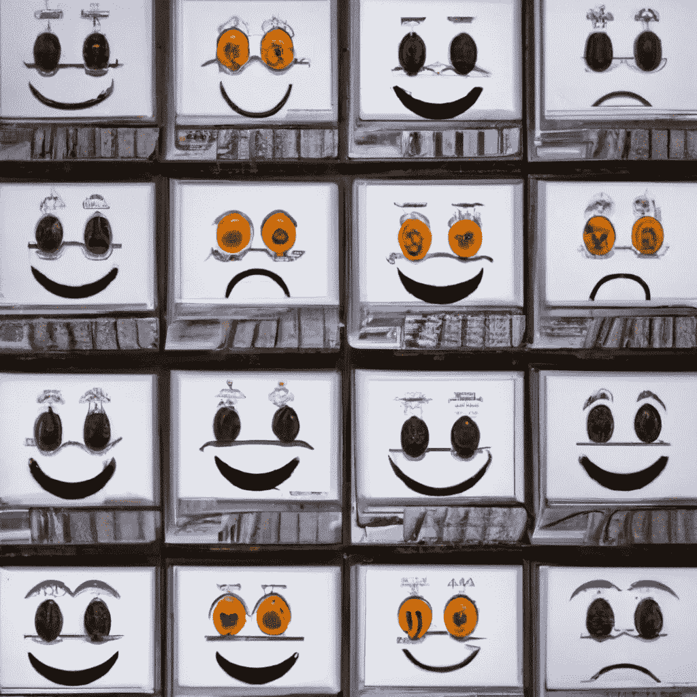

# 疼痛的意识体验:为什么很难开发一个真正的“机器人疼痛体验”

> 原文：<https://medium.com/geekculture/the-conscious-experience-of-pain-why-its-difficult-to-develop-a-true-robot-pain-experience-fdc63847413d?source=collection_archive---------27----------------------->

## 不管技术有多先进，机器人可能永远不会像我们一样感受到疼痛

Image generated by author on Dall-E

“我不是人，我感觉不到疼痛”(珍妮特)。在“The Good Place”中，尽管高级数据库机器人珍妮特强调她无法感觉到疼痛，因为…