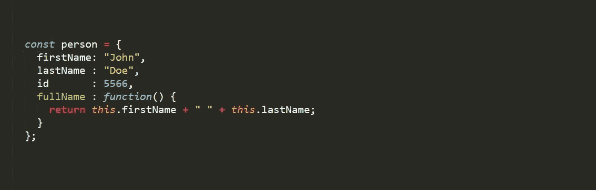
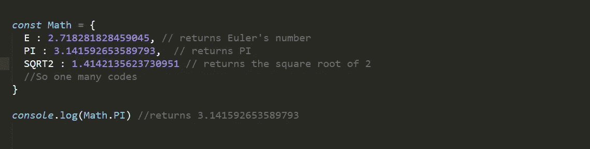
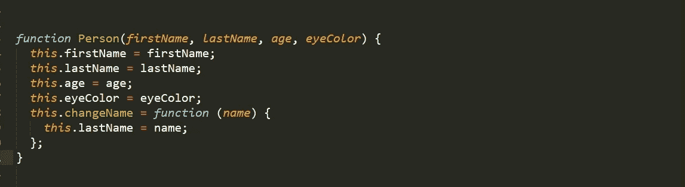
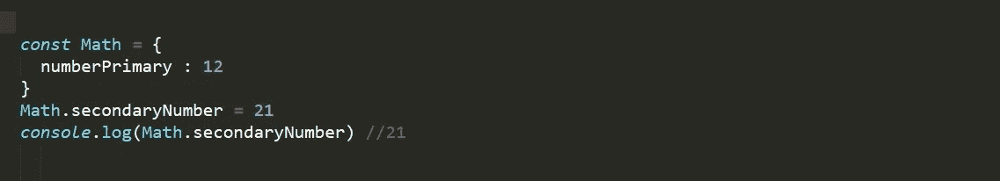
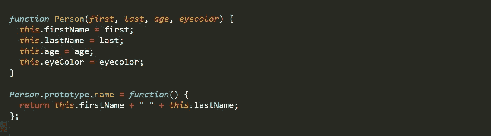
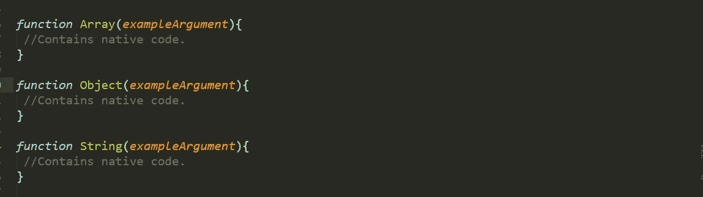
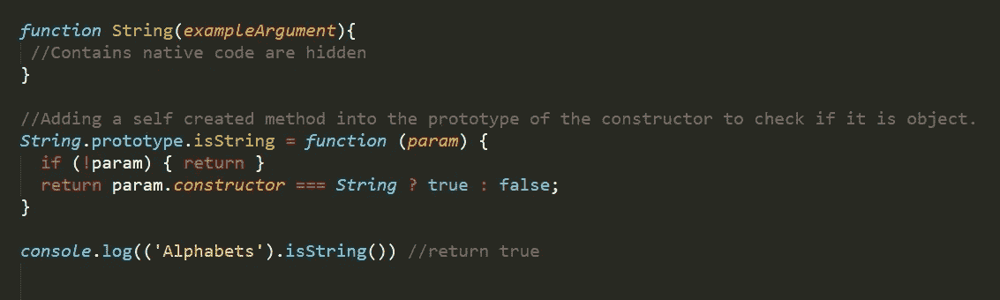

# JavaScript 的核心；原型

> 原文：<https://medium.com/geekculture/the-core-of-javascript-prototypes-afb81f50323?source=collection_archive---------25----------------------->

原型是一个物体的核心。如果你不理解这个对象，不理解 JavaScript 核心的公式和结构，你可能会断断续续地得到一些小问题的反映，这肯定会让你挠头，并在一开始就给编程带来巨大的困难。

## **任何物体的原型是什么-**

[原型](https://developer.mozilla.org/en-US/docs/Learn/JavaScript/Objects/Object_prototypes)是 JavaScript 中第一次出现的对象。它们实际上是您每次在程序中创建和使用的普通对象，程序放在括号 ***{}，*** 中，具有“ [**属性**](https://www.w3schools.com/js/js_object_properties.asp)**”**和“ [**方法**](https://www.w3schools.com/js/js_object_methods.asp)**()’**，然后根据如何调用[方法函数](https://developer.mozilla.org/en-US/docs/Web/JavaScript/Guide/Functions)及其[参数，返回所需的值然而，众所周知，JavaScript 包含的一切都是一个](https://developer.mozilla.org/en-US/docs/Web/JavaScript/Reference/Functions/arguments)[对象，包括日期、数学、字符串、数组和数字。](https://developer.mozilla.org/en-US/docs/Web/JavaScript/Reference/Global_Objects)这些是内置的而不是自创建的对象。

由于[类](https://developer.mozilla.org/en-US/docs/Web/JavaScript/Reference/Classes)和[非构造器对象](https://developer.mozilla.org/en-US/docs/Web/JavaScript/Guide/Working_with_Objects)的应用，[原型](https://developer.mozilla.org/en-US/docs/Learn/JavaScript/Objects/Object_prototypes)因复杂或从不需要而不经常被开发者使用，并制作了任何[构造器对象](https://www.w3schools.com/js/js_object_constructors.asp)。与简单创建的对象不同，原型从构造函数的外部定位，这是修改任何[构造函数](https://developer.mozilla.org/en-US/docs/Web/JavaScript/Reference/Global_Objects/Object/constructor)所必需的。

## 这个博客分为两部分，第一部分是关于对象的基础，第二部分是原型在任何构造函数对象中的使用。

# 第一部分

## **内置对象和自定义对象-**

对象包含属性和方法，属性可以是数字、字符串或数组，而方法严格来说有函数。

***自定义对象*** 确实有内部或外部范围，这取决于它的创建。与内置对象不同，这些对象可能是本地的，在其作用域内很难访问。

A custom created object

***例子=数学*对象*。***

Originally may differ than the actual object(Only for demonstration)

## ***构造函数对象*** (这将是博客的主要话题)

它的形成不是使用正常方法完成的；使用括号{}。它寻求一个跨 JavaScript 平台设计的功能。尽管语法不同，内置对象和自定义对象都对应于构造函数对象；两者使用的方式不同。

与通常的对象不同，构造函数对象需要在作用域内调用' *new'* 关键字。它的调用也依赖于作用域；在该范围之外，不能创建或调用新对象。

Constructor object.

# 第二部分

## **原型的使用**

> 假设我们必须向任何构造函数对象添加一个属性，这将如何完成？

在使用 prototype 修改任何对象之前，我希望您知道如何修改和重新分配现有对象，并添加新属性来填充非构造函数对象。

Adding new key to Built-in Object.

原型除了通过替换、修改和在构造函数对象中添加任何属性来改变构造函数对象。

## 分配原型

我们已经知道如何向非构造函数对象添加属性，但是要向构造函数中添加任何东西，我们不能像上面那样简单地使用相同的东西。构造函数采用不同的语法来使自己多样化。

Adding method using constructor.

JavaScript 中的一切都是对象。我们在 JavaScript 中经常使用的大多数对象都是基于构造函数的。这些构造函数对象在制作 JavaScript 程序时很少使用，尽管它的方法是必不可少的。这些构造函数对象已被隐藏，以操作原始的方法和属性。

Native constructor of JavaScript

上述原生构造函数中包含了许多方法，如***Array.concat()、Array.splice()、Object.values()*** *或****string . replace()****等，这些方法被 JavaScript 开发人员广泛使用。*

*关于这些函数有趣的事实是，您可以将自己的方法添加到相应的对象中。我们知道这些构造函数对象是隐藏的，但这并不意味着你不能修改它们，你仍然可以使用***object . prototype .***来修改它们*

## *例子*

*为了演示 prototype 的深层核心，我只是检查任何字符串是否是字符串。我准备将 ***isString()*** 添加到字符串构造器*的原型中。**

## *记住' ***isString()'*** 不是原生 JavaScript 的方法。新方法中' *valueOf()* '的截距将是调用方法函数的字符串(在我的例子中，它将是字符串' *Alphabet* ')。*

**

*Adding new method to constructor.*

> *注意:原型只在构造函数对象中使用。不要修改内置的对象方法。*

*感谢阅读。*