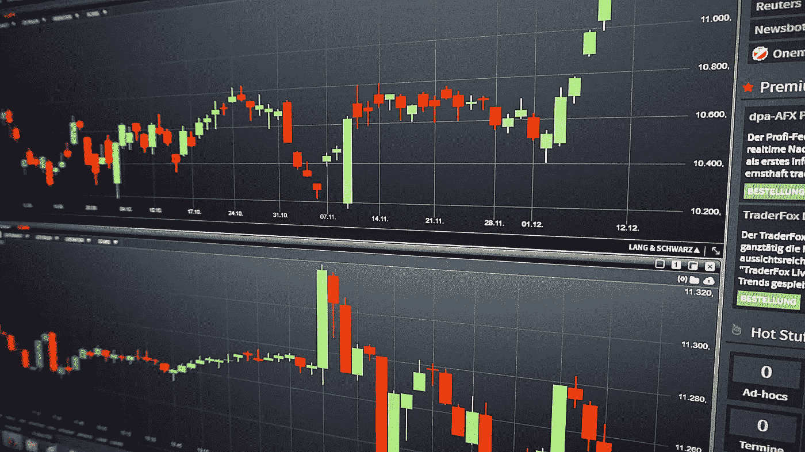

# 相关性调整的反转指示器。Python 中的均值回归交易。

> 原文：<https://medium.com/geekculture/the-correlation-adjusted-reversal-indicator-mean-reversion-trading-in-python-5e308d8b4ebb?source=collection_archive---------6----------------------->

## 在 Python 中创建相关性调整均值回归指标。

将统计指标与技术指标相结合是一个强大的工具，让我们能够利用更多的市场属性。在本文中，我们将尝试通过一个简单的差分组合均值回复…