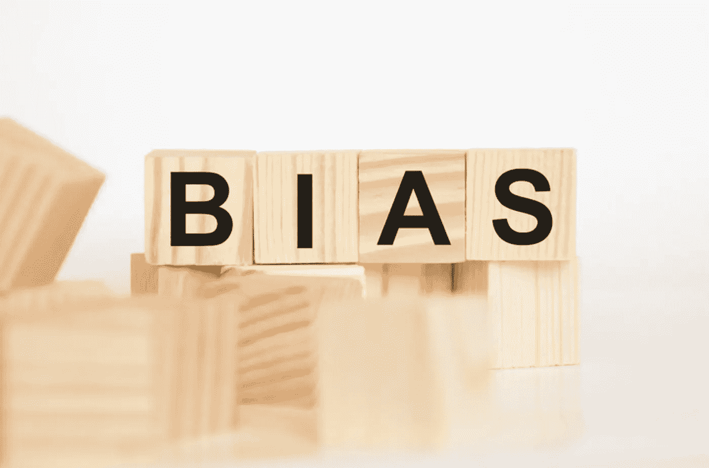

# 成本收益谬误

> 原文：<https://medium.com/geekculture/the-cost-benefit-fallacy-7241089d64d8?source=collection_archive---------14----------------------->

## 成本收益谬误是一种新的行为偏见，它使得成本收益分析变得比无用还要糟糕

作者:Bent Flyvbjerg 和 Dirk W. Bester

本文是三篇系列文章中的第二篇。第一条是 [*这里是*](/geekculture/how-in-accurate-is-cost-benefit-analysis-b240bb4736c6) *，第三条是* [*这里是*](https://bentflyvbjerg.medium.com/four-steps-to-better-cost-benefit-analysis-bd62c9ea55e1) *。每篇文章都可以独立阅读，但按顺序阅读就形成了一个整体。*

Photo by [Ablin Law](https://ablinlaw.com/articles/2020/08/18/implicit-bias-in-investigations/)