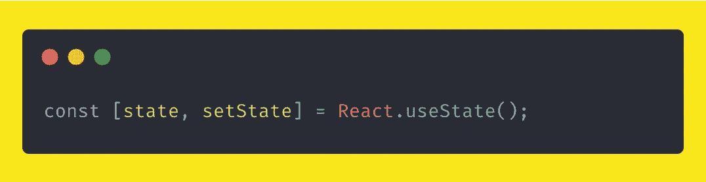
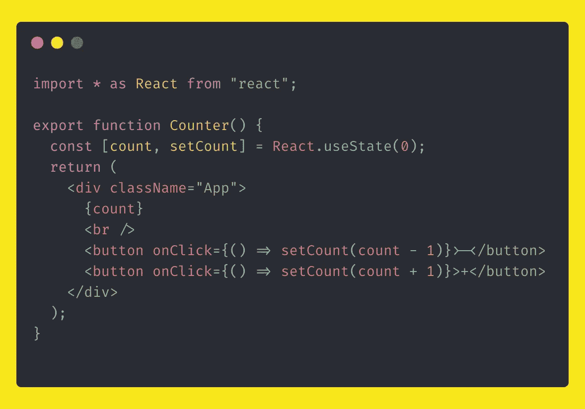
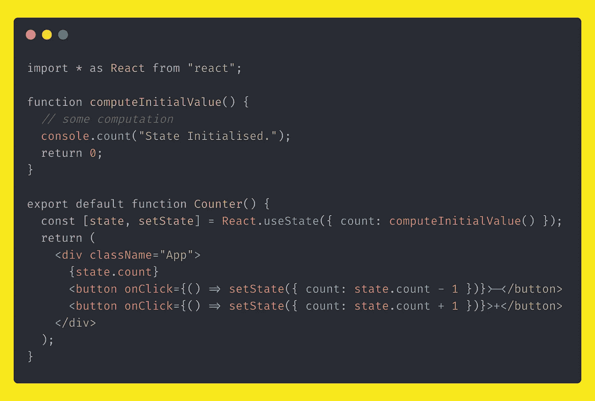
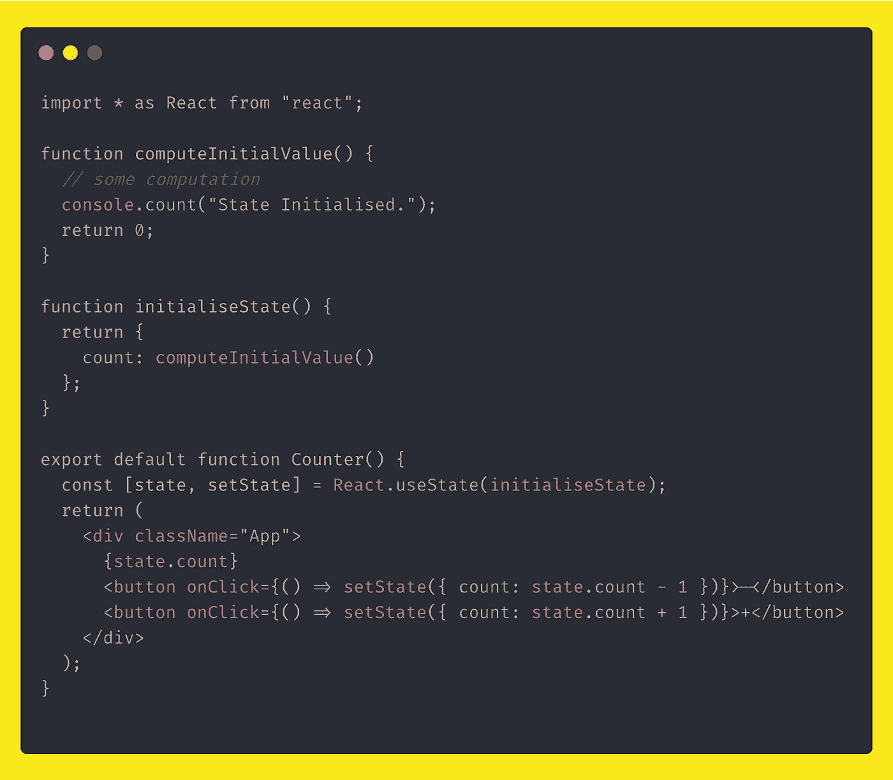

# 使用状态挂钩的成本—反应

> 原文：<https://medium.com/geekculture/the-cost-of-usestate-hook-react-f4139c3d3eda?source=collection_archive---------13----------------------->

我们常常想当然，从不注意细节，在这篇博客中，我们将看到如何正确使用 useState 钩子。

在过去的四年里，我一直使用 React 来谋生。
我一直很好奇 React？和其他框架有什么不同？内部如何处理事情等…

在满足好奇心的同时，我也学到了一些我认为值得分享的东西。

我们开始吧

## 国家

基于类的组件消失了，没有人使用它们，这就是我们通常在功能组件中使用状态的方式。

State usage in a functional component.

其中`state`是初始状态，`setState`是将用于在字母时间点更新`state`的函数。

下面用一个反例来了解一下`useState`钩子的典型用法。

Simple counter example

这就是我们通常如何编写计数器组件

A typical counter component in react.

这里没什么问题，一切都如预期的那样正常。
借助`setCount`方法，我们能够增加和减少计数`state`，一切工作顺利。

当我们的组件需要管理一个以上的状态时，事情就变得棘手了。我们要么结束为组件中的每个`state`编写单独的`useState`,要么将它们放在一个大的`state`对象中。

在我们当前的例子中，count 的初始值是 0，这非常简单，但是让我们假设初始值是一个计算值，并且计算是在一个单独的函数中完成的。

现在我们的计数器组件将如下所示

尽管如此，一切工作顺利，如预期的那样，对不对？这是我们例子的代码沙箱版本。

State as an object example

## 使用状态的问题

大多数人可能认为`state`初始化只会发生一次，即在安装组件时，但事实并非如此。

如你所见，在上面的例子中，我有目的地调用了初始`state`对象`computeInitialValue`中的一个函数。

每次渲染时都会调用`computeInitialValue`，因为每次`re-render`时都会初始化`state`。

只是，`state`变量将保存`state`的最新值

正如你在上面的代码沙盒示例中看到的，每次渲染都会打印出*状态初始化*消息。

> 状态初始化将在每个`re-render`发生，如果我们在状态初始化阶段进行一些昂贵的操作，将会影响性能。

当我意识到`state`初始化发生在每个`re-render`上时，我感到震惊。与你们大多数人不同，我以为它应该只发生一次，但由于`useState`在内部实现的方式，它在每个`re-render`上执行，而`react`分别跟踪每个`state`，在每个`re-render`上，它指向最新版本的`state.`

幸运的是，我们有解决这个问题的方法

> 将功能传递给`useState`

是的，我们可以传递一个函数给`useState`，它将返回初始状态。

counter example

现在，`initialiseState`将被调用，而`rendering`组件，
将不会被调用`re-renders`。

由于我们已经将函数传递给了`useState`，react 将计算出在`re-render`上它不需要调用函数，因为`state`初始化已经发生。

所以在使用`useState`钩子时，请保持`state`同步，避免初始化时的昂贵操作，如果不可避免，将函数传递给`useState`钩子，这样你的组件性能不会受到影响

如果你今天学到了新东西，考虑与你的同事和技术朋友分享。

如果您有任何疑问、反馈或建议，请通过 [Twitter](https://twitter.com/suhas0101) 联系我或在下面留下评论。

在那之前…