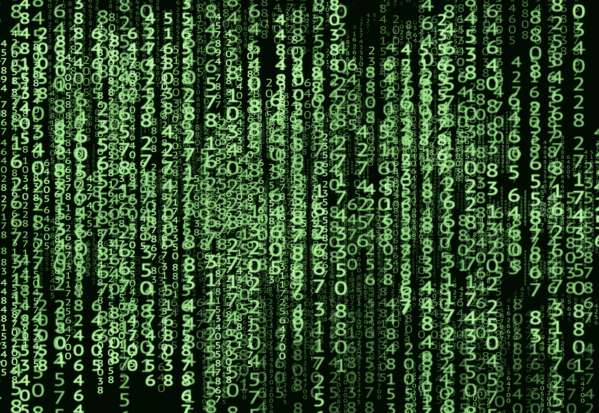

# 倒计时指示器。反向交易的新工具。

> 原文：<https://medium.com/geekculture/the-countdown-indicator-a-new-tool-in-contrarian-trading-3648a5c20d5?source=collection_archive---------5----------------------->

## 用 Python 展示我的顶级专有指标之一。

[www.phys.org](http://www.phys.org)

研究总是有成果的，通过大量的交易工具，我们必须有效地过滤好的和坏的。反向指标以多种形式存在，在这篇文章中，我们将讨论我开发的一个个人指标…