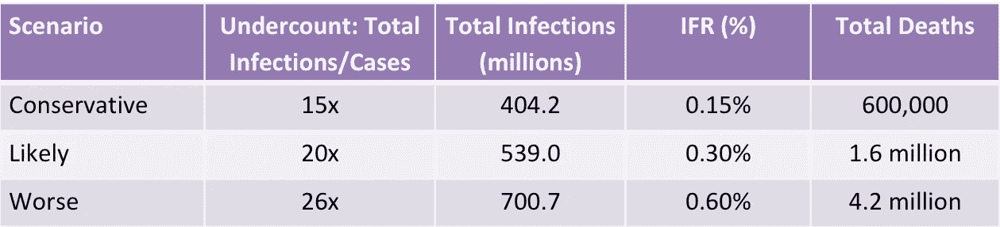

# 印度的 Covid 死亡人数:纽约时报报道中的缺陷

> 原文：<https://medium.com/geekculture/the-covid-toll-in-india-flaws-in-the-new-york-times-report-a0976a432cf?source=collection_archive---------26----------------------->

自第二次浪潮席卷印度以来，许多印度城市从未缺少对史无前例的死亡和住院规模的报道。最近的一篇是《纽约时报》(NYT)5 月 25 日的一篇文章，标题是:“印度的真实死亡人数会有多大？”这篇文章估计，尽管官方统计数据为 2690 万例病例和 307231 例死亡(截至 2021 年 5 月 24 日)，但一个可能的情况是 5.39 亿例感染和 160 万例死亡，而更糟糕的情况是 7.007 亿例感染和 420 万例死亡。这里还提到了一个保守的方案。

考虑到这些都是场景——根据定义，场景是一种“假设”——在探索更广泛的结果方面有一定的余地。然而，支持不同结果的事实应该经得起基本的审查；场景的创造并没有给一个人想象任何不可能的情况的许可。令人震惊的是，支撑这些情景的假设是基于一个专家小组的站不住脚的观察——文章中报道的支持证据很少——它们在第一次遇到已公布和可用的数据时就崩溃了。

这篇文章提供了一个“滑块”，让用户探索总感染人数和总死亡人数的可能范围。这给人的印象是试图掩盖文章缺乏分析的严谨性。这也是低级趣味:疫情给整个人口带来了难以言表的痛苦。将它封装在一个用户交互的噱头中不是这里的故事。

## 文章的基本思路和缺陷

该文章估计了总感染人数(即感染 COVID 的总人口)，然后应用另一个估计的乘数因子——感染致死率(IFR)——来得出死亡人数。这种两步估计必须谨慎进行，否则——正如文章中所发生的那样——由于高估感染和高估死亡，有可能导致预测失控。

Summary of NYT estimates as on May 24, 2021 (reported cases: 26.9 million; reported deaths: 307,231)

IFR 抓住了传染病的致命性。它是总死亡人数除以总感染人数的比率。通常情况下，这个数字是一个估计值，因为在疫情期间，感染和死亡总数很少准确知道，而且通常统计不足。一旦估算出 IFR，就可以用它来估算总死亡人数。

这种 IFR 不会随着感染的传播而改变，除非一种新的菌株使疾病更加致命。死亡人数的增加是感染传播的结果(更多的人患病)，而不是 IFR 的增加(即，不是更多的人死于感染)。例外情况是，人们因缺乏医疗保健而死亡。在这种情况下，IFR 增加。即使在这种情况下，正确的方法也应该是用“IFR-plus”或“IFR*”来表示，因为人们不仅会死于这种病毒，还会因为缺乏适当的护理而死亡。

在 NYT 的文章中，这是主要的分析错误:三种恶化的情况都包括感染和 IFR 的增加。其他问题包括将跨越约 15 个月的整个疫情时期视为统一的——没有认识到过去三个月的第二波与前一时期有很大不同。最后，除了文章末尾列出的专家意见外，没有任何支持这些估计的理由。除了 Paul Novosad 博士的一篇研究印度不同地区 IFRs 的论文外，这些专家的评论没有引用任何事实。所有这些专家都在欧洲和美国工作，不清楚他们是否有在印度工作的经验。

## 估计感染

这篇文章没有清楚地阐明三种感染估计的基本原理。三个全国性血清调查的数据显示在一个表格中，但还不清楚它如何告知任何情景。(此表有一些事实错误，特别是显示感染人数不足的最后一列与公布的数据不符。)前两次调查的结果发表在期刊上。2020 年 5 月至 6 月进行的第一次血清调查强调了 82x-131x 范围内的漏报。8 月至 9 月的第二份报告估计，这一数字在 26 倍至 32 倍之间。大约在 2020 年 12 月进行的第三次调查还没有发表在期刊上，但报告表明少算了大约 27 倍。

鉴于上述事实，保守方案和可能方案分别使用 15 倍和 20 倍乘数(低于公布的约 27 倍乘数)的原因尚不清楚。

此外，文章中的估计没有区分第二波和之前的时间段。据推测，在这一波中，低估的数量会更多，因此将估计值分成两部分似乎更符合逻辑。在国家一级使用这些乘数时要记住的一个方面是，它们在地方一级不起作用，因为在某些地方，这种估计导致总感染人数大于当地总人口。此外，在最糟糕的情况下有 7 亿人感染(几乎占总人口的 45%)这样的高数字意味着正在接近某种群体免疫极限，进一步的感染应该会下降——这一趋势并没有发生。这样的细微差别就不讨论了。

## 估计死亡人数

除了 0.30%作为我们的 IFR 估计值外，没有为三种情况选择 0.15%、0.30%和 0.6%的 IFR 提供依据。

如前所述，当疾病传播较高时，使用较高的 IFR 表明，随着疾病的传播，死亡率也会增加——除非有一些事实的充分支持，否则这种断言是不符合逻辑的。

至少有三个来源的数据可用于创建有意义的 IFR 场景。

血清调查提供 IFR 估计值。第一份报告显示，IFR 在 0.12%-0.15%之间，第二份报告估计 IFR 在 0.09%-0.11%之间。第二次调查的估计值的置信区间要窄得多。现在，这些 IFR 是使用政府报告的死亡数据计算的，而批评的声音是死亡数据被低估了，因此 IFR 被低估了。

另一个来源是各州的 CFR。CFR 是病死率，使用检测到的病例进行计算。由于检出病例总是低于感染病例，CFR 总是高于 IFR。(CFR 可以被认为是 IFR 的上限。)喀拉拉邦在 2020 年通过检测和追踪方法遏制传播的努力得到了认可。这些努力反映在血清调查中——估计喀拉拉邦的漏报率约为 4 倍。因此，病死率较低，为 0.38%，反映出更多的感染被发现并被纳入病例统计。

第三个估计来自基于年龄的 IFRs。这是对许多国家的估计。使用世界平均水平(Novosad 博士在论文中提到)，印度人口平均 IFR 约为 0.23%。

因此，对于印度人口，至少有三个范围从 0.09%到 0.38%的数据集可用，但是上面的 NYT 文章在计算中没有引用任何这样的信息。此外，区域媒体有关于过多死亡的报道，不清楚这是否构成任何情景的基础。

与感染估计类似，文章在整个时间范围内应用了相同的 IFR 估计。有理由假设第二波死亡率更高(不是“基线”IFR，而是由于医疗系统超负荷而导致的 IFR-plus)。一种可能的方法是对第二波之前的时间使用基线 IFR，对第二波使用 IFR-plus 数。上述三个估计值可以为基线 IFR 提供信息。

## 对死亡进行尸检可能吗？现在有必要吗？

这篇文章没有提到一些可用的数据，看起来像是为了满足一个先前的结论而写的——印度严重低估了 COVID 的程度。更重要的一点是:这样的估计需要许多假设才能得出最终的数字——这样的方法会导致对真实死亡人数的合理评估吗？再者，什么叫撕心裂肺得出一个半生不熟的结论？2020 年，疫情开始时，IFR 估计值和潜在增长率对于评估可用基础设施的充足性至关重要。在 2021 年，任何进一步的模糊估计是否有助于这种情况都是值得怀疑的。

我最大的遗憾不是在一篇可能有偏见的文章中对数字的笨拙处理。这是来自地面的官方报告。诚然，在疫情的阵痛期间，在资源有限的情况下，努力报告数字让位于拯救生命的活动。尽管如此，数据收集方法的透明度和对任何差距的承认只会带来危机管理的正面形象。它将避免留下一个真空，这个真空可以被无事实根据的观点所填充——有些伪装成新闻。基于血清调查的总感染报告表明这是可能的——那么为什么不针对死亡人数呢？