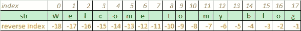

# Python 中奇怪而模糊的字符串切片案例(3)

> 原文：<https://medium.com/geekculture/the-curious-and-ambiguous-case-of-string-slicing-in-python-3-ea61671498eb?source=collection_archive---------16----------------------->



当你深入某些概念时，它们往往会让你困惑很多次，但也会增加你的兴奋感。Python 字符串切片曾经是这样一个概念，就其执行行为而言，它有许多隐藏的秘密，很容易使许多人困惑。

在这篇文章中，我将讨论 python 中字符串切片的多种情况及其所有情况下的执行行为。我会根据需要添加代码片段，并分享我的 Google Colab 笔记本供人们尝试。

# 让我们开始吧 Python 中的字符串

切片的意思是从某物上切下一部分。在 python 中，字符串可以被视为一个数组，其中字符串的每个字符都有一个索引位置。让我们看看下面的代码片段及其表示

```
str  = "Welcome to my blog"
```

让我们看看上面的字符串在 Python 中是如何表示的


Index based representation of a string in Python

上面的图片显示了 python 中有两种类型的索引模式

*   正常索引-从 0 开始，到 17 结束
*   负索引—从-1(从字符串末尾)开始，到字符串开头(-18)结束

现在让我们做一些非常基本的事情，如下图所示

```
str = "Welcome to my blog"
print(str[0]) #prints W
print(str[1]) #prints e 
```

上述代码博客将 str 视为一个列表，并在索引位置 0 和 1 打印字符

# Python 中的字符串切片入门

切片遵循以下示例给出的语法

```
str[start_index : end_index : increment]
```

让我们看看上面的字符串的基本解释


```
str = "Welcome to my blog"
print(str[0:7])
```

程序的输出是 ***Welcome*** ，可以解释如下-

*   起始索引= 0，即“W”
*   结束索引= 7 — 1 = 6(结束索引总是比提到的索引小一)
*   增量= 1(未提及时，默认增量为 1)

现在让我们看一个增量值的例子

```
str = "Welcome to my blog"
print(str[0:10:2])
```

上面截取的代码将以 2 步打印 **Wloet**

# **现在让我们看几个负指数的例子**


```
"""
Start index = -15 ('c')
End index = -9 - (1) = -10
increment with  = 1 default)
"""
print(str[-15:-9])
#Output - come t"""
Start index = -9 ('o')
End index = -15 - 1 = -16 
increment with  = 1 (default)
"""print(str[-9:-15])
#Output - Prints nothing as start index is larger than end index - -9>-15 in mathematics 
```

上面的代码片段不打印任何内容，因为开始索引大于结束索引，解析从左到右进行


现在让我们试着加-1 作为一个增量或步长

```
"""
Start index = -9 ('o')
End index = -15 - 1 = -16 
increment with  = -1 
"""
print(str[-9:-15:-1])#Output = ot emo
```

即使开始索引(-9)大于结束索引(-14)，上面的代码片段仍然有效。原因是-1 现在改变了字符串解析的方向，使 python 从右向左(负方向)解析和读取字符串

是-步长值也指示解析的方向。如果是负数(-1，-2，-5 等等。)，它会强制 python 从右向左开始读取字符串。如果是正的(1，2，5 等。).它将强制 python 从左向右读取字符串，这也是默认行为

让我知道涵盖另一个例子如下

```
"""
Start index = 8 ('t')
End index = - 1 = 'g'
increment with = 1
"""print(str[8:-1:1])#Output - to my blo
```

上面的代码片段如下所示

*   开始索引大于结束索引(8 > -1)
*   通常我们用-1 减去结束索引。在 end-index = -1 的情况下不会发生这种情况，因此结束位置变为-1。总是跳过结束位置值

# 结论

有许多用例需要涵盖，在这篇博文中不可能写出来。我将分享一个工作的 Google Colab 笔记本，让人们看到许多其他有趣的组合和结果，但这里是我对字符串切片行为的结论-

*   **增量值决定解析的方向** —切片中提到的增量运算符，例如 ***`str[4:9:2]`*** 2，如果这个片段有方向。如果是正数，它将从左向右移动解析逻辑；如果是负数， ***`str[4:9:-2]`*** 它将从右向左移动解析逻辑
*   如果起始索引小于结束索引，它将根据字符串内容完美地打印出来—***` str[5:10]`***根据字符串内容也能很好地工作
*   如果开始索引大于结束索引，那么它将依赖于增量运算符***` str[10:5:1]`***将不打印任何内容，因为 1 是强制从左向右解析的增量。如果它是***` str[10:5:-1]`***它工作正常，并将打印为 now -1 增量将强制从右向左解析
*   -1 作为结束索引***` str[8:-1]`***——-1 将始终替换字符串的结束字符索引，因此将正常工作。
*   如果它是作为结束索引的任何其他负数，那么它将作为 end-index-1 工作，例如***` str[8:-9]`*`*` str[8:-9—(1)]`*`**=***` str[8:-10]`***然后将依赖于递增运算符来确定解析方向

# 链接到我的 Google Colab 笔记本

[](https://colab.research.google.com/drive/1sEdXEi5sNxYSjnBMFo_jP_bi2lnRkVP0?usp=sharing) [## 谷歌联合实验室

### Python 字符串切片有一些有趣的行为和组合，这本笔记本肯定会让你深入了解它的行为 colab.research.google.com](https://colab.research.google.com/drive/1sEdXEi5sNxYSjnBMFo_jP_bi2lnRkVP0?usp=sharing)