# 自定义解析器:获得良好数据的关键

> 原文：<https://medium.com/geekculture/the-custom-parser-a-key-to-a-good-data-harvest-10e24d0d8a71?source=collection_archive---------20----------------------->

## IceVision 框架中的 PlantDoc 数据集

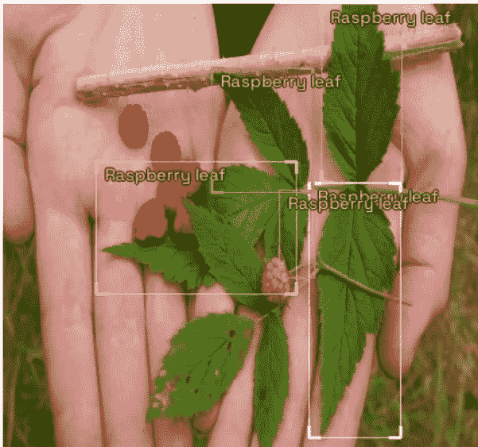

目标检测处理目标和背景(非目标)的分类和定位。为此，数据科学家需要知道要寻找什么样的数据，以及如何正确指导数据识别。在这篇博客中，我们将讨论数据格式、加载和定制解析。这些见解来自于 [IceVision 文档](https://airctic.com/0.8.1/custom_parser/)、 [github 代码](https://github.com/airctic/icedata)和[论坛](https://discord.com/invite/JDBeZYK)的讨论。

有关物体检测的介绍/复习，请[参考此处](/@yrodriguezmd/object-detection-using-a-deep-neural-network-213ec8ac2da8)。

我们将按照这个 ***大纲*** :

A.设置

B.收集数据

B.1 .数据来源和格式

Github

B.1.b. Roboflow

C.数据加载

C.1 本地计算机

C.2\. Git 克隆

D.数据浏览和路由

D.1 .主目录

D.2 .注释

D.3 .类别映射

E.自定义解析

F.形象化

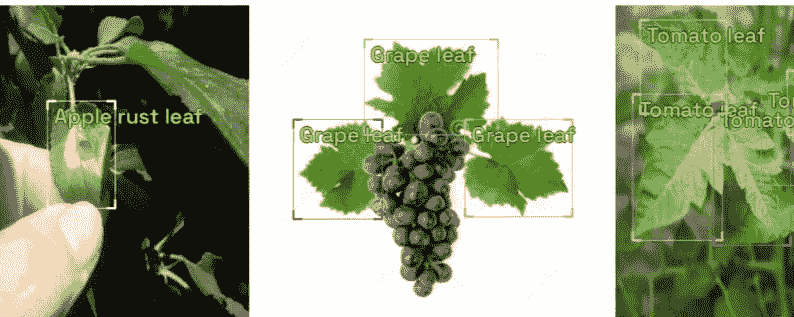

打开笔记本，我们来种点代码吧！

**A .设置**

我在基于 GPU 设置和标准 RAM 的 Colab Pro 上使用了 IceVision 框架。

```
!wget [https://raw.githubusercontent.com/airctic/icevision/master/install_colab.sh](https://raw.githubusercontent.com/airctic/icevision/master/install_colab.sh)
!bash install_colab.sh
```

等待以上安装完成，然后运行下一个。

```
from icevision.all import *
# import icevision
```

**B .收集数据**

***B.1 .数据来源及格式***

我们将使用生成的 PlantDoc 数据集来帮助改进植物疾病的早期检测。这有各种各样的来源。我们将重点关注两个源选项:Github 和 Roboflow。

*b . 1 . a Github 来源*

在 [Github 存储库](https://github.com/pratikkayal/PlantDoc-Object-Detection-Dataset)中，TRAIN 文件夹包含 jpg 格式的图像，以及 xml 格式的单独注释文件。还有一个单独的 train_labels.csv 文件，其中包含已编译的注释(包含有关文件名、图像大小、类和边界框坐标的信息)。出于我们的目的，我们将处理 CSV 文件中的注释，而不是 XML 文件。

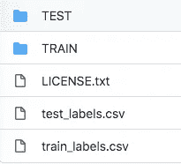

如果您更喜欢使用该来源，请转到 C.2 节。

*B.1.b. Roboflow 来源*

[Roboflow](https://public.roboflow.com/object-detection/plantdoc/1) 网站为同一数据集提供不同的下载格式，导致文件排列和文件类型多种多样。

我们将利用张量流对象检测 CSV 格式。它有一个 train 和一个 test 文件夹，每个文件夹中的注释都是一个 CSV 文件。

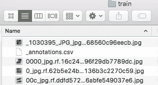

最好了解文件位置和格式，因为这将有助于定义 D 和 e 部分中的路由和解析。

**C .数据加载**

***C.1 .本地计算机加载数据的步骤***

*   进入 Roboflow 网站，
*   选择 PlantDoc 数据集，
*   点击下载尺寸为-416x416，
*   选择 Tensorflow 对象检测 CSV 格式，
*   通过下载 zip 文件导出到计算机，

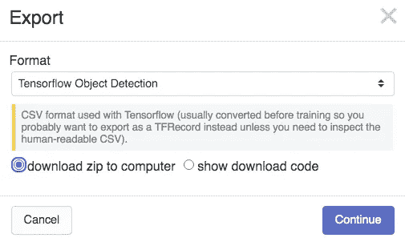

* This will download the zip file to your local computer.

*   把压缩文件上传到 Colab。

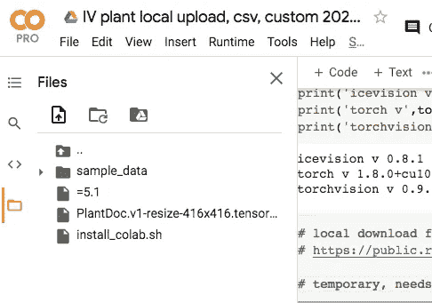

zip 文件的 Colab 存储是临时的，但是如果您遵循这段代码，通常不需要重新加载。

如果您对这种手动方式满意，请继续 D 节，否则，请参见 C.2。了解另一种装载方式。

***C.2 .使用 Git 克隆方法加载数据***

使用 git 克隆加载数据与上面描述的手动加载有一些不同。优点是直接路由到源，没有中间的下载和上传。使用 Github PlantDoc repo 和通过 [Git Clone 加载数据的步骤在这里](https://github.com/yrodriguezmd/IceVision_miniprojects/blob/main/IV_plant_git%2C_csv%2C_custom_2021_8_30_11am.ipynb)详述。

**D .数据浏览和路由**

***D.1 .建立主目录***

使用 Colab 单元，我们可以检查我们的目录，以便跟踪数据路径。

```
%pwd  # present working directory, output: '/content'  
!ls
```

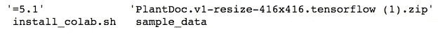

```
!unzip \*.zip  && rm *.zip
```

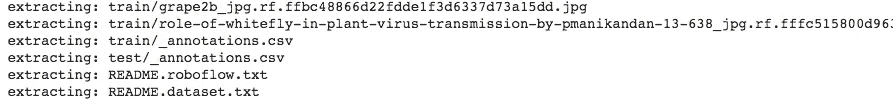

```
!ls
```

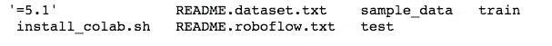

解压文件后，主目录现在显示包含我们的数据的 train 文件夹。

```
data_dir = Path('./train') 
```

*   这将是我们的信息高速公路，并且是为后面的解析步骤识别的重要路径。

***D.2 .注解***

```
import pandas as pd
train_labels = pd.read_csv('/content/train/_annotations.csv', sep = ',', error_bad_lines=False)
```

在查看了目录和文件的位置之后，我们现在可以给出如何找到注释数据的指导:

*   主目录的/content/train
*   /_annotations.csv 在 train 文件夹中
*   一些注释偏离了正常的数据输入，导致了标记化的错误。error_bad_lines=False 参数将跳过这些偏差，以便您可以使用其余的数据。

```
train_labels.rename(columns={'class':'label'}, inplace=True)
```

*   列名“class”被重命名为“label ”,以避免与“class”方法混淆。

```
train_labels.sample(3)
```

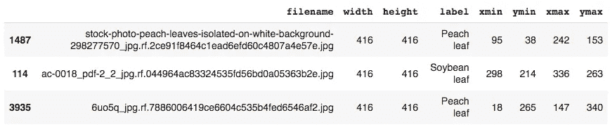

CSV 文件包含对象检测的所有相关信息:

*   图像文件名
*   图像宽度和高度(此处为 416，由 Roboflow 调整大小)
*   标签或“类别”
*   坐标:xmin 属于边界框的 x 轴的最小值，即在左下角。

```
train_labels.info()             # 8,329 observations, no null values
train_labels.filename.nunique() # 2,315 unique filenames
train_labels.label.nunique()    # 30 labels (13 species, 17diseases)
```

*   在 2000 多张图片中发现了 30 种不同种类的植物叶子。有超过 8000 个边界框被分类。

***D.3 .类映射***

```
_CLASSES = train_labels.label.unique().tolist()
class_map = ClassMap(_CLASSES)
class_map.get_by_name('Apple leaf') # 25; code to be used in parser
```

*   标签的例子有“蓝莓叶”、“玉米锈叶”和“番茄双斑叶螨叶”。
*   类别映射创建与特定标签相关的编号 id。这有助于模型的数字标注。

**E .自定义解析**

```
template_record = ObjectDetectionRecord()
```

*   [ObjectDetectionRecord](https://github.com/airctic/icevision/blob/b6c750f2ca5acfafd0e46e172a817af7a6892f18/icevision/core/record_defaults.py) 收集路径、边界框和标签的信息。
*   该功能的一个重要特点是[自动修复](https://github.com/airctic/icevision/blob/b6c750f2ca5acfafd0e46e172a817af7a6892f18/icevision/core/bbox.py#L54)，不合逻辑的坐标被修复为更符合逻辑的值。例如，如果 ymax 指示高于图像高度的位置，则该值改为对应于图像高度。

```
class PlantParser(Parser):
  def __init__(self, template_record, data_dir):
    super().__init__(template_record = template_record) self.data_dir = data_dir # Path('./train')
    self.df = train_labels # pd.read_csv('./train/_annotations.csv')
    self.class_map = class_map # ClassMap(_CLASSES)
```

*   [解析器](https://github.com/airctic/icevision/blob/b6c750f2ca5acfafd0e46e172a817af7a6892f18/icevision/parsers/parser.py)类给出了安排数据的方向。
*   我们已经在 D1–3 部分建立了数据高速公路、注释路径和课堂作业。

```
 def __iter__(self) -> Any:
    for o in self.df.itertuples():
      yield o def __len__(self) -> int:
    return len(self.df)
```

*   对于整个数据集，数据按行进行处理。

```
 def record_id(self, o) -> Hashable:
    return o.filename
```

*   具有相同文件名的观察结果被收集到一个记录中。

```
def parse_fields(self, o, record, is_new):
    if is_new:
      record.set_filepath(self.data_dir / o.filename)
      record.set_img_size(ImgSize(width= o.width, height= o.height))
      record.detection.set_class_map(self.class_map) record.detection.add_bboxes(
                [BBox.from_xyxy(o.xmin, o.ymin, o.xmax, o.ymax)])
    record.detection.add_labels([o.label])
```

*   由 __iter__ 确定的每一行都被传递给 parse_fields。记录是在这一步收集的。
*   图像大小是根据每行的宽度和高度值确定的。
*   边界框是基于给定的每行坐标构建的。
*   相应的标签被附加到记录内的每个边界框。

将自定义解析器放在一起:

```
class PlantParser(Parser):
  def __init__(self, template_record, data_dir):
    super().__init__(template_record = template_record) self.data_dir = data_dir 
    self.df = train_labels 
    self.class_map = class_map  def __iter__(self) -> Any:
    for o in self.df.itertuples():
      yield o def __len__(self) -> int:
    return len(self.df) def record_id(self, o) -> Hashable:
    return o.filename def parse_fields(self, o, record, is_new):
    if is_new:
      record.set_filepath(self.data_dir / o.filename)#
      record.set_img_size(ImgSize(width= o.width, height= o.height))
      record.detection.set_class_map(self.class_map) record.detection.add_bboxes(
                   [BBox.from_xyxy(o.xmin, o.ymin, o.xmax, o.ymax)])
    record.detection.add_labels([o.label])
```

我们将使用自定义解析器来排列数据集中的信息，以构建可用于建模的记录。

```
parser = PlantParser(template_record, data_dir)train_records, valid_records = parser.parse()
```

默认情况下， [parse](https://github.com/airctic/icevision/blob/master/icevision/parsers/parser.py) 函数以 80/20 的比率随机分割数据。

**F .可视化**

```
show_record(train_records[0], class_map= class_map, font_size= 25,
            label_color= '#ffff00')
train_records[0]
```

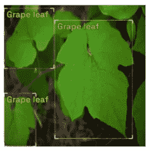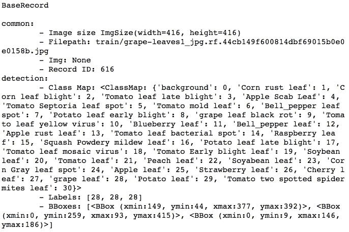

每条记录都包含一个带有图像路径的文件名、每个框的坐标以及框内对象的标签。我们有一个可视化的输出，显示了叶子的身份和边界框。

**总结:**

识别并上传了包含图像和聚合注释信息的外部数据集。自定义解析使我们能够排列数据以创建可用于建模的记录。

**未来玩法:**

对解析的数据建模！

我希望你喜欢种植代码:)

*玛丽亚*

领英:[https://www.linkedin.com/in/rodriguez-maria/](https://www.linkedin.com/in/rodriguez-maria/)

github:[https://github . com/yrodriguezmd/ice vision _ mini projects/blob/main/IV _ plant _ local _ upload % 2C _ CSV % 2C _ custom _ parser _ 2021 _ 8 _ 31 . ipynb](https://github.com/yrodriguezmd/IceVision_miniprojects/blob/main/IV_plant_local_upload%2C_csv%2C_custom_parser_2021_8_31.ipynb)

推特:【https://twitter.com/Maria_Rod_Data 

