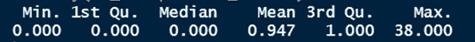
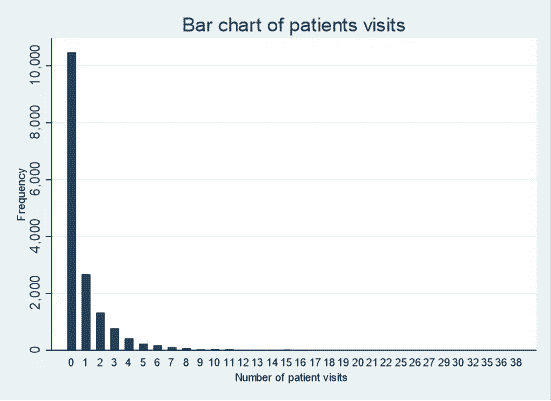
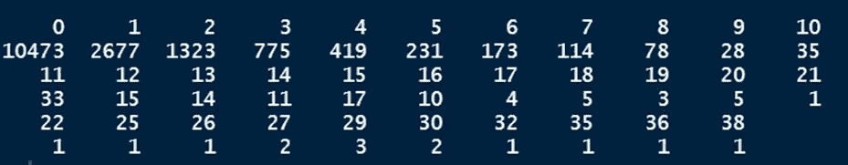
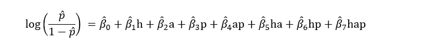
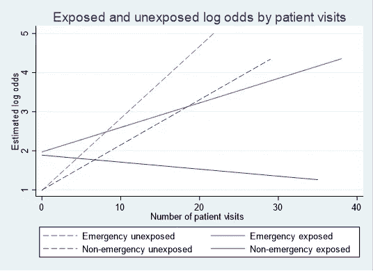
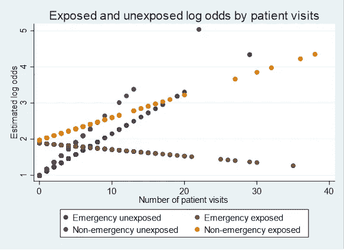
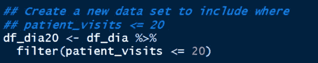

# 建模中外推的危险

> 原文：<https://medium.com/geekculture/the-dangers-of-extrapolation-in-modelling-dd3758b4ae44?source=collection_archive---------16----------------------->

欢迎阅读讨论混淆和修改的 3 系列文章的最后一篇。在第一篇文章中，我解释了修改和混淆的含义，并讨论了它在建模中的含义。在第二篇文章中，我们花了很多时间在 R 和 STATA 中使用逻辑回归模型评估建模中的修改和混杂。在第二篇文章中，我们探讨了 HbA1c 水平(暴露)和糖尿病药物治疗变化(结果)之间的关系，同时评估了入院来源和患者就诊次数作为潜在的混杂因素和/或修正因素。

你可以在这里阅读[第一篇文章，在这里](https://arimoroolayinka.medium.com/confounding-and-modification-in-modelling-explained-c37dbe7b40ff)阅读[第二篇文章。](https://arimoroolayinka.medium.com/a-case-study-assessing-confounding-and-modification-using-logistic-regression-in-r-and-stata-2be659cbb813)

阅读这些文章对于更好地理解我们今天要讨论的内容是至关重要的。这篇文章将会尽可能的简短，但是我认为在介绍这些概念的时候不强调建模中外推的**危险是不合适的。**

本文中的探索探索问题是在我看到患者就诊的汇总统计数据时提出的，这是一个数字协变量，在第二篇文章[中用作协变量之一。](https://arimoroolayinka.medium.com/a-case-study-assessing-confounding-and-modification-using-logistic-regression-in-r-and-stata-2be659cbb813)

**下面我们再来看看结果:**

**Figure 1:** Summary statistics including the five-number summary and the mean of the number of patients visits

我们可以从上面给出的结果中推断出一些有趣的观察结果。看起来大多数病人的就诊次数为零，因为中位数是 0。此外，看起来在较高值的某个地方有一个异常值或一些稀疏值。但是，对于汇总统计值，这种趋势并不明显。可视化或图表将更有助于了解正在发生的事情。

**让我们创建一个患者就诊人数的条形图来检查这一趋势。**

**Figure 2:** Bar plot of the number of patient visits

**惊艳！这张图以一种更好的形式展示了我之前所做的断言。从图 2 中我们可以看出，大多数患者的就诊次数为零，大多数患者的就诊次数范围在 0 到 16 次之间。**

我决定为这个变量创建频率表，以查看有多少病人和他们去医院的次数。

> **注意:通常，使用频率表来研究数值变量是不合适的。**

我相信在这次讨论中，您已经了解了这样做的目的。

**现在，我们来看看患者的频率和就诊次数**

结果如下所示。虽然它的格式不太好，但我们可以从这个结果中快速获得一些见解。

**Figure 3:** Frequency table of the number of patients visits

> **破冰者:**快速浏览上面的表格，你能观察到什么？

从图 3 中，我们可以看到大多数患者就诊次数在 0-20 次之间。尽管如此，在第 16 次就诊(10 名患者)后，就诊次数变少；但是，我们可以看到一些患者直到第 20 次就诊。但在第 20 次就诊后，我们可以看到大多数患者来医院就诊。这解释了为什么图 1 中的最大值是 38。我们只有一个病人去了医院 38 次。

**现在，这就为我们为什么应该讨论外推奠定了基础。**

## **那么，什么是外推？**

字典定义称之为“通过从已知数据的趋势中推断未知值来延伸图表、曲线或数值范围。”

注意重点在 ***推断未知值*** *。*维基百科[1]将其定义为基于一个变量与另一个变量的关系，对一个变量的值的一种估计，**超出原始观察范围**。

从这些定义中我们可以推断出什么？

简而言之，在建模过程中，我们可能会犯一个巨大的错误，因为我们对整个观察结果做出了结论，而某一组患者在数据中的代表性不足。

例如，在我们对 HbA1c 水平(暴露)和糖尿病药物治疗变化(结果)之间关系的分析中，我们是否正在对暴露变量组进行“幻想”比较？与 HbA1c 升高组相比，HbA1c 正常组的患者就诊次数可能不具有可比性。

**那么，我们如何检查数据中是否存在外推法，尤其是在比较 HbA1c 正常和 HbA1c 升高组的患者就诊次数时？**

通过可视化可以有多种方式来实现这一点。不过，我想把你的注意力拉回到 [**第二篇**](https://arimoroolayinka.medium.com/a-case-study-assessing-confounding-and-modification-using-logistic-regression-in-r-and-stata-2be659cbb813) **以及我们是如何开始建模的。**

回想一下，完整/饱和模型 1 给出为:

拟合模型后，我们发现入院来源和患者就诊并不能共同改变 HbA1c 水平(暴露)和糖尿病药物治疗变化(结果)之间的关系。

还记得在[的第二篇文章](https://arimoroolayinka.medium.com/a-case-study-assessing-confounding-and-modification-using-logistic-regression-in-r-and-stata-2be659cbb813)中，在我们得出这个结论后，我们继续通过这些协变量和后来的混杂来评估边际或个体修改。然而，我们可以在完整模型和下一个模型之间插入一个步骤，用于评估协变量的个体修改。

这里，我们将在 y 轴上快速投影一个估计的对数优势图，以查看对数优势如何比较(查看我们是否可以从数据中得出结论)。这可以称为[敏感性分析](https://en.wikipedia.org/wiki/Applications_of_sensitivity_analysis_in_epidemiology)以探索外推法的影响，即确定在考虑患者就诊时，HbA1c 水平正常和 HbA1c 水平升高的患者之间是否存在不切实际的比较。

**下面我们来看看剧情是什么样子的:**

**Figure 4:** Line plot of estimated log-odds for exposed (elevated HbA1c) and unexposed (normal HbA1c) patients by admission source and number of patients visits for the saturated model to check for extrapolation

**注意:**生成图形的 STATA 代码(包括本文将使用的代码)可以在[这里](https://github.com/Predicare1/Confounding-and-Modification-iin-Modelling)找到。

从图 4 中可以看出，暴露组和未暴露组的数据重叠良好。然而，看看红线(非急诊患者)，我们看到在 20 次左右的就诊后，我们可能会进行“幻想”比较。此外，对于蓝线(急诊患者)，在大约 30 次就诊后，我们可能会进行“幻想”比较。

**从上面生成的线图来看，似乎隐藏了一些信息。让我们在散点图上看到这一点，以检查发生了什么。**

**Figure 5:** Scatter plot of estimated log-odds for exposed (elevated HbA1c) and unexposed (normal HbA1c) patients by admission source and number of patients visits for the saturated model to check for extrapolation

**啊！这清楚地向我们展示了正在发生的事情。**

从图 5 中，我们可以看到，对于未暴露的非急诊患者，在大约第 14 次就诊后，患者就诊的稀少性。在大约第 20 次就诊后，我们可以在未暴露的急诊患者中看到同样的消瘦趋势。总的来说，上图清楚地显示了这种推断的原因是因为 20 次就诊后患者数量较少。

因此，报告我们在第二篇文章中对所有患者得出的结论可能会产生误导，因为上面的图表显示，无论入院来源如何，未暴露患者(即 HbA1c 水平正常的患者)到医院就诊的次数没有暴露患者多。

为了看看这是否会以任何方式影响我们的结果，我们将建立另一个逻辑回归模型，其中患者就诊次数少于或等于 20。然后，我们将经历与第 2 篇文章相同的过程来评估混淆和修改。

如果存在差异，那么我们可能会说我们的结果和结论是外推的(这没有意义)，因为它告诉我们，我们正在比较有数据的患者和没有数据的患者。

> **免责声明:**回想一下，我们希望这篇文章尽可能简短，所以我们不会重复第二篇文章中的过程。在本文中，我将展示新分析的结果。

请注意，我们在评估修改和混淆时采用的相同过程也适用于此。**唯一的区别是我们将过滤数据，仅包括就诊次数少于或等于 20 次的患者。**

**创建过滤数据的代码如下:**

**注意:**如果您运行这个代码，**只有 15 个观察值将被删除。**

所以，唯一改变的是使用的数据。在第二篇文章中，我们使用了 **df_dia** 。为了执行相同的分析，我们在上一篇文章中做了，您只需将 **df_dia** 更改为 **df_dia20。**虽然我不会在本文中包括建模步骤的代码和结果，但我已经在 R 脚本[中提供了代码来执行这个分析，这里是](https://github.com/Predicare1/Confounding-and-Modification-iin-Modelling)。

## **结果**

在运行该模型的敏感性分析后，为了查看 20 次之后的患者就诊次数是否过度影响我们的结论，因此，我们排除了 20 次之后的每一次患者就诊，因为我们看到了 20 次之后患者就诊的稀疏性，并重新运行模型(从完整模型到最终模型)。当我们剔除了超过 20 次就诊的患者后，我们对最终模型得出了与第二篇文章中的模型相同的结论。

这可能意味着，在这种情况下，外推并不重要。这可能是因为在我们筛选数据时，有少量患者(15)被删除。如果我们把病人就诊的临界值降低到 10，我们可能会得到不同的结果。选择哪一个临界值取决于研究者的好奇心，但在大多数情况下，它应该由像本例中的数据提供信息。

## **结论**

可能出现的问题是:“当我们使用整个数据集得出相同的结论时，为什么我们必须经历这个过程？”。

答案将是，如果我们没有得出同样的结论会怎样？你认为像第二篇文章那样报道我们的结论合适吗？

当然不是！强调模型外推的危险背后的整个想法是为了减少我们这些天在研究论文中看到的错误结果和报告的数量。在这种情况下，如果我们得到了与第二篇文章不同的结果，那么将我们的结论、报告和讨论基于我们在这里得到的结果会更合适。但是既然结果是一样的，通常选择是留给作者来决定报道哪一个；然而，作者应该强调，他们进行了敏感性分析，以检查外推的影响，但没有发现任何影响。

迄今为止，这是多么漫长的学习时间啊！如果您阅读了本系列的所有三篇文章，那么我非常感谢您花时间阅读它们。我相信花时间学习这些概念是值得的。请在下面的评论区留下您的评论，并与他人分享这篇文章。如果你喜欢这篇文章，如果你能点击“鼓掌”图标(最多允许 50 次鼓掌)，这将对我意义重大。

作为 Coursera Guided Project Network 的一名基于项目的课程讲师，我教授了几门关于使用 r 的课程。你可以点击[这里](https://www.coursera.org/instructor/arimoro-olayinka)查看这些课程。谢谢大家！下次见！

## **参考文献**

1.  外推(维基百科):[https://en.wikipedia.org/wiki/Extrapolation](https://en.wikipedia.org/wiki/Extrapolation)。