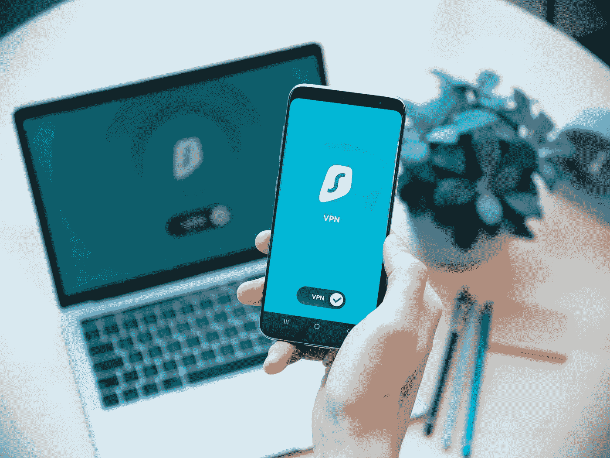

# VPN 的黑暗真相

> 原文：<https://medium.com/geekculture/the-dark-truth-about-vpn-cb2d8d9735ad?source=collection_archive---------0----------------------->

## 使用 Tor 而不是 VPN 来保护隐私

Photo by [Dan Nelson](https://unsplash.com/@danny144?utm_source=medium&utm_medium=referral) on [Unsplash](https://unsplash.com?utm_source=medium&utm_medium=referral)

在互联网上保护你的在线隐私的最常见的建议是使用 VPN。原因是通过使用 VPN，你的 IP 地址将对所有在线服务隐藏。然而，如果我告诉你，这一切都是为了利用你害怕在网上被跟踪而设计的营销呢？

正如皮尤研究中心所说的那样

> ****81%****的美国人觉得他们对从企业收集的数据几乎没有控制权。对于政府数据收集来说，这一数字增加到 84%***。***

**你看 VPN 技术从来就不是为了隐私。有趣的是，通过大规模营销，企业用来远程连接到办公室的东西已经变成了一种工具，据称这种工具将使互联网上的人们变得隐私。所有这些保证都让你觉得你在发挥作用。事实上，隐私的持有者已经从在线服务转移到了 VPN 提供商。思考一下还有什么其他的大众营销技术(，咳咳 [Crypto 和 NFT](/@dretechtips/cryptocurrency-the-digital-gold-rush-46ad4f565aea) )是很有趣的，这些技术是为了利用[技术文盲大众的无知](/geekculture/the-state-of-digital-peasantry-2f6326da88f7)。**

**以下是 VPN 技术的黑暗真相。**

## **VPN 技术的起源**

****

**Photo by [Charles Forerunner](https://unsplash.com/@charles_forerunner?utm_source=medium&utm_medium=referral) on [Unsplash](https://unsplash.com?utm_source=medium&utm_medium=referral)**

**你看，VPN 技术从来就不是为了使连接私有而设计的。或者让我换一种说法，VPN 技术从来没有被设计成在 3 个不同的点之间建立私有连接。这三个不同的点是您的计算机、VPN 提供商和您正在连接的 web 服务。虚拟专用网络的目的实际上就是虚拟专用网络这个名字。它旨在创建一个直接从一个网络到另一个网络的隧道，而不会被恶意的参与者窥探。VPN 技术是为远程工作而创造的。**

**新冠肺炎疫情引起了远程工作的普及。然而，在新冠肺炎疫情出现之前，很多促进远程工作的基础设施就已经存在了。VPN 的历史可以追溯到 1995 年，当时点对点隧道协议技术允许人们从计算机远程连接。这项技术是革命性的，因为它[允许人们安全地连接到不同网络上的远程机器](/geekculture/ssh-securely-connect-to-your-servers-8895faab7083)。然而，加密很快被国家安全局破解。随着时间的推移，VPN 技术出现了多次迭代，以解决以前的协议所面临的问题。**

**今天你会看到大量的网站和人们提供 VPN 服务。你可以在手上列出几个 VPN 服务。你可以看到这些网站正在利用人们对在线隐私的意识。然而，意识是没有用的，你要理解手头的潜在问题。并且大众不理解基于这些 VPN 服务的受欢迎程度的基本问题。这就把我们带到了下一点。**

## **VPN 技术无用的解释**

**以下是 VPN 提供商不会告诉你的。当您连接到一个网站时，该网站有多种方式收集您的信息。他们收集您信息的第一种方式是通过您的 IP 地址。然而，VPN 提供商不会告诉你的是，这不是在线服务收集你的信息的唯一方式。还有[浏览器指纹识别，可用于根据您的浏览器和硬件属性创建唯一标识符](/geekculture/the-javagate-scandal-fead695c4830)。这些比 IP 地址更准确，因为对于大多数住宅来说，IP 地址会根据 ISP 提供商的不同而频繁变化。如您所见，VPN 提供的缓解措施被这样一个事实所缓解，即在线服务有大量方法可以收集您的信息。**

**不仅如此，你还在你的连接链中增加了另一个折衷点。是什么阻止了 VPN 提供商出售你的数据。你会发现有很多 VPN 提供商通过出售用户数据来赚钱。这对于免费 VPN 提供商来说尤其成问题。当然，也有只靠提供付费 VPN 赚钱的例外。但是它排除了单一妥协点论点的情况。是什么阻止了恶意参与者破坏单点故障。没什么。**

**正如你所看到的，要使 VPN 技术有用，它必须同时做这么多事情。提供者必须创建一个服务，在创建日志的时候删除日志。服务必须由知道如何保护服务器安全的有能力的人来运行。用户必须采取预防措施安装扩展和修改浏览器设置。如果你在任何一点上失败了，那么所付出的利益就被否定了。但是有一种技术可以免费做到以上所有的事情。这项技术被称为 Tor。**

## **为什么你应该使用 Tor？**

**Tor 节点和 Tor 浏览器使用上面列出的所有预防措施来保护您在互联网上的连接。**

**在服务器端，它通过三个不同的节点路由您的连接。通过多个节点的路由移除了诸如 IP 地址之类的元数据，因为只有先前的节点会知道 IP 地址。然而，节点的不断移动意味着没有一个节点具有真正的 IP 地址。这是除了入口节点，但是，这个问题将被涵盖下来。**

**在客户端，浏览器将运行一些硬安全优化。他们会欺骗你的屏幕分辨率。并禁用 WebRTC 以防止 IP 地址泄露。这些只是 Tor 浏览器保护你的几种方式。**

**使用 Tor 仍然有一些问题。这就把我们带到了下一点。**

## **使用 Tor 的缺点？**

**使用 Tor 最大的缺点就是速度慢。数据必须经过的节点数量是 Tor 非常慢的原因。随着大多数应用程序从客户端转移到服务器端处理，通过 Tor 连接运行软件可能会很困难。**

**不仅如此，许多网站还屏蔽 Tor 网络连接。有时，他们会将连接标记为 bot 连接，并要求您通过大量的验证。他们会直接阻止你访问网站。**

**Tor 节点也可能受到危害。曾经有过字母表男孩建立 Tor 节点来抓罪犯的例子。如果这些网络中的一大部分遭到破坏，它们就可能被毁掉。所以当你通过 Tor 路由数据包时，确保你的数据包是加密的，否则你会以防止自己被欺骗的名义间接欺骗自己。**

**Tor 不能防止人为错误造成的安全漏洞。技术有多聪明，使用技术的人就有多愚蠢。没有什么可以阻止你把你的信息输入到一个[喂养的蜜罐](https://www.uscybersecurity.net/honeypot/)中，并进入某种监视名单。就像没有什么可以阻止你把你的信息放到某个钓猫网站上，向你承诺你当地的拉丁辣妹。当你输入你的电话号码时，你会接到一个粗略的印度技术支持人员的电话，告诉你你的电脑有恶意软件。**

## **VPN 有使用案例吗？**

**是的，VPN 仍然有一个用例。尽管使用 Tor 有很多缺点，但就可靠性和安全性而言，VPN 似乎是最好的选择。VPN 连接比 Tor 连接快。而且大多数网站不会屏蔽 VPN 连接，除非你正在使用像网飞或[计划屏蔽 VPN](https://www.technewstoday.com/netflix-blocking-vpn/) 的[服务。字母男孩不会坐在外面试图抓住 Tor 网络上的恋童癖者和毒品贩子，并监视你的连接作为一个错误的标志。](/@dretechtips/how-to-build-your-own-illegal-streaming-service-ff353ef70cd0)**

## **应该用什么 VPN？**

**我推荐的 VPN 提供商是 MullvadVPN。我不是马尔瓦德赞助的。然而，这里有一些重要的原因。**

*   **通过加密货币支付**
*   **一个[隐私政策](https://mullvad.net/en/help/privacy-policy/)读起来不像法律学位论文**
*   **拥有不依赖于网络技术的本机桌面和移动客户端**
*   **30 天退款保证**

**Mullvad 太好了，连 Firefox 都用 MullvadVPN 作为第三方发行商。但是，您仍然必须信任这些提供商。归根结底，互联网应该是一种缺乏信任的交流方式，而不是值得信任的。试图识别和集中互联网上的人是一个愚蠢的努力。你不必相信我的话，因为这些大型科技公司的前首席执行官同意这一立场。**

## **最后**

**在线隐私是 21 世纪面临的最紧迫的问题之一。[订阅免费电子邮件列表，获取更多关于在线隐私的内容。](/subscribe/@dretechtips)遵循以下指南，前往[保护您的电子邮件隐私](/geekculture/protect-yourself-with-email-alias-f10ce787cae)。**

****加入我们，成为 100 多位想要改善在线隐私的人。****

**达到这一点可能意味着你同意大部分已经写了。留下大量的掌声和分享，以获得向大众推广不受欢迎的在线隐私信息的算法。**

****相关内容:****

*   **[信号将被破坏](/geekculture/signal-will-be-compromised-eb18a91fd51f)**
*   **[完全去谷歌化指南](/@dretechtips/how-to-dismantle-the-google-empire-e652bff6d2)**
*   **[抖音:该应用致力于建立一个不断变化的世界秩序](/geekculture/tiktok-the-app-bent-on-asserting-a-changing-world-order-d09b3077ddc8)**