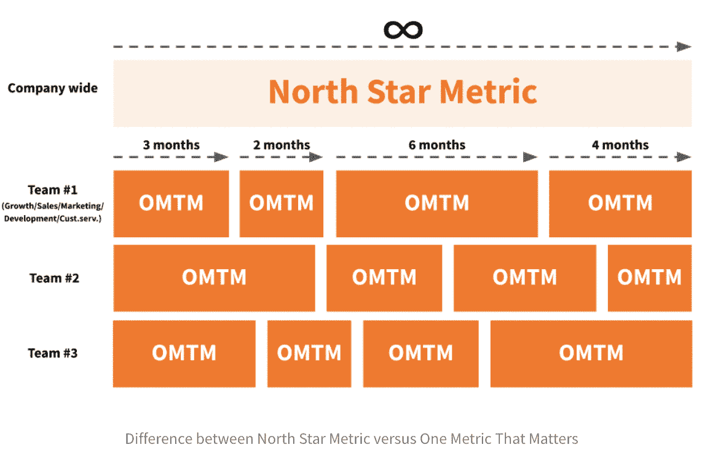
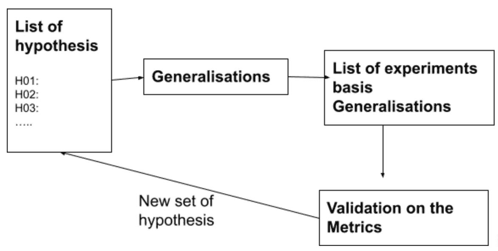

# 数据之旅:从数据通知到数据驱动

> 原文：<https://medium.com/geekculture/the-data-journey-data-informed-to-data-driven-dc0f5367b142?source=collection_archive---------22----------------------->

**“我们有数据，但似乎无法很好地把握业务增长下降的原因”**

这是许多企业在扩大规模时都会遇到的情况。我们构建产品功能，开展广告活动，增加客户接触点，发展销售渠道等等，尽管所有这些努力都面临着增长放缓。这就像踩着刹车加速一样！事实上，我们可能不知道刹车已经踩下，也不知道还有其他减速因素在起作用。出现这种情况有各种各样的原因。在本文中，我将介绍其中的几个——1。数据无知，和 2。数据偏差。解决这些偏见有助于公司从数据导向型转向数据驱动型。

*数据无知*可能感觉像是一个自我创造的问题，有些人可能会因为没有勤奋工作而感到内疚，这可能会激励一些人遵守纪律等。所有这些感觉都很好，主要是因为许多与数据无知相关的挑战源于经验、专业知识、直觉和紧迫性。这些都是真实的，并且在很大程度上是正当的理由，我们在经营企业时会处理这些理由。

*数据偏差*，尤其是与业务决策相关的数据偏差，可能来自“我们非常了解行业和客户”的自满/推诿。我们现在所做的是基于经验，并且在过去对我们起了作用”。还有许多其他因素影响决策，包括认知、统计、个人、组织偏见。每一个都有大量的研究和出版物，所以为了简单起见，我们将把重点放在过程上，而不是概念上。

从我的经验来看，我们的现实稍微倾向于数据健全、数据分析、洞察力生成、基于假设的决策。有条不紊地应用统计学大有裨益。这里有一些开始解决这个问题的建议。

1.  **数据驱动是一种思维模式**因此，首先要做的是获得领导层和关键利益相关方的认可，采用基于直觉和经验的方法，收集、衡量、分析和证实基于数据的决策。
2.  **记录当前正在捕获的数据**，并仔细确定还可以捕获什么以及如何捕获。数据工程技能(很可能是一个角色&的职责)对于开始和确保持续的数据健全性是至关重要的。询问以下问题:

*   我们获取信息的所有数据源是什么？
*   我们有完整、准确、最新的数据源吗？
*   在其当前状态下，我可以使用我们捕获的数据来回答我的业务问题吗？
*   我是否需要分析来自外部来源的数据，这些数据位于我组织的数据存储之外？
*   …

3.建立一个专注于数据分析的小团队，或者如果有这样的团队，确保你拥有数据/统计分析和领域专业知识的**正确组合**。通常这是两种不同的角色。正如谷歌数据智能主管 Cassie Kozyrkov 在她的文章“分析不是讲故事”中解释的那样，分析师的角色不是操纵公司得出结论，而是作为眼睛，为决策者(通常是具有领域专业知识和业务背景的人)提供尽可能多的灵感。思考一下:

*   我们是否拥有构建报告、仪表盘和有效可视化数据所需的软件和报告工具？
*   我们有要求吗(问题、顾虑、目标、报告等)。)来自关键决策者？
*   我们是否能够从现有数据中生成探索性数据分析，以开始解决业务需求？
*   我们是否有能力确定相关性、原因、长期趋势、群组等。？

4.**衡量你看重的东西**。在组织层面，有一个“北极星指标(NSM)”是有帮助的，并为每个关键计划/项目定义输入指标，也称为“重要的一件事(OTTM)”。

*   ***北极星度量(NSM)*** 是一个最能反映贵公司为客户带来的价值金额的数字。请注意，这个指标是从客户(而不是公司)的角度来看的。假设是，如果你的客户获得了很多价值，他们会停留更长时间，购买更多，并向你的公司推荐更多的朋友。例子包括 Spotify:每周花在听上的时间，电子商务:客户终身价值(LTV)，LinkedIn:每月活跃用户(MAU)，优步:每周乘车次数等。
*   ***一个重要的指标(OMTM)*** 是一个团队在规定的时间内关注的数字，通常是 2 到 6 个月。OMTMs 有助于实现 NSM。它有点类似于目标和关键结果(OKRs)。我喜欢下图中的直观解释(作者沃德·范·加斯特伦，《快乐成长的客户》的作者)。实际上，它正在建立一个度量体系，北极星度量位于金字塔的顶端。OTTM 的示例包括网站流量、平均点击率、客户获取成本(CAC)、注册/登记、调查表提交百分比等。

image credit: Ward van Gasteran— [https://growwithward.com/ghc-book/](https://growwithward.com/ghc-book/)

5.对于大多数人来说，关键的困境是我们一直在分析数据，但仍然无法找到问题的症结所在。根据我的经验，虽然大多数努力都在正确的轨道上，但在集中注意力之前先自律是很重要的。我建议从列出或添加到现有的**列表中开始，列出你希望得到回答的问题**。在进行这项活动时，保持好奇，暂停“如果和但是”以及当前的限制。这里有几个示例问题(请注意，这并不全面，可能会根据您的行业和业务需求而有很大差异)。请注意，定义 NSM、OTTMs 和提问是一种迭代方法。

*   我们有哪些不同的方法来细分用户？
*   推动高收入、降低成本的客户比例是多少，反之亦然
*   哪些社交媒体是我们最活跃的？哪个(些)对我们最有效？
*   我们的推荐率如何？与我们的同行相比如何？
*   哪些营销活动和信息对我们很有效，为什么？
*   高利润客户想要什么？
*   …

6.现在是得到答案和提出进一步问题的过程。当你解决问题时，验证当前的假设。将你今天所做的视为无效的**假设**即。默认的行动/活动是正确的，除非有证据表明并非如此。基于最初的分析&见解，对有帮助的活动提出一个或多个备选假设。

让我们用一个例子来详细说明上面的步骤:

*   一个重要的指标(OMTM)是“重复率”
*   目标是确定企业应该采取的一项行动，以吸引更多的回头客。

这里有一个例子，列出了回答这个更广泛问题的假设:

*   *H01:如果自上次活动*后 90 天内我们没有联系客户，我的客户会大量流失
*   *H02:顾客不想再次购买相同的类别，她对新的东西感兴趣*
*   *H03:客户非常看重折扣，所以如果我们索要全价，他们不会重复购买*
*   *H04:如果我为她提供添加到购物车但被放弃的产品的折扣，她回来的可能性更高*
*   *H05:如果我们在该月的第一周(工资周期)主动出击，回来的可能性会更高*
*   *H06:超过 LTV 阈值的客户如果获得个性化的沟通，会更频繁地重复购买*
*   *H07:构建一个更宽的漏斗顶部比关注漏斗中部更有帮助*

7.对假设进行优先排序，并选择一个或多个进行**实验**。接下来是设计和执行实验。目的是证明/否定所选择的假设，并根据从结果中获得的经验做出改变。这是一项大工程，需要与产品路线图、营销战略、营销日历等其他计划保持一致。

Insight generation process

8.重要的是有一个系统的方法来**监控&测量结果**。需要向关键利益相关方提供清楚显示进度的报告和仪表板。

9.既然一个迭代已经完成，那么这个活动需要被**重复**——确保人员、过程和技术是一致的，以使它成为一个连续的过程。

10.接下来是**在数据平台中构建多层智能**。其次是应用数据科学。这里可以做很多事情，所以在另一篇文章中会有更多的介绍。

# 资源

*   分析不是讲故事—[https://towards data science . com/analytics-is-not-storyling-a 1 Fe 61 B1 ab 6c](https://towardsdatascience.com/analytics-is-not-storytelling-a1fe61b1ab6c)
*   选择您的北极星指标—[https://future.a16z.com/north-star-metrics/](https://future.a16z.com/north-star-metrics/)
*   一个重要的指标——https://leananalyticsbook.com/one-metric-that-matters/
*   OKRs—[https://www.whatmatters.com/resources/google-okr-playbook/](https://www.whatmatters.com/resources/google-okr-playbook/)
*   成长快乐的客户—[https://growwithward.com/ghc-book/](https://growwithward.com/ghc-book/)