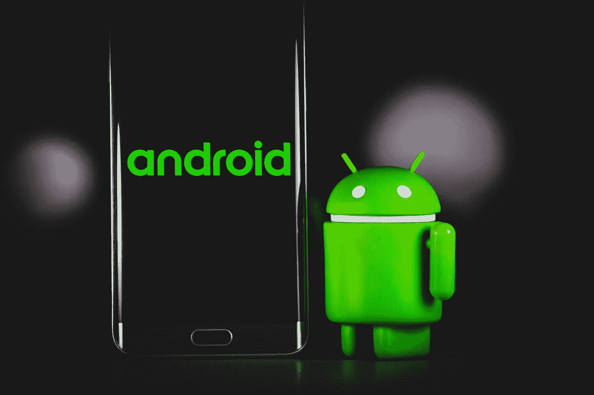
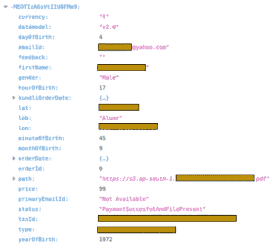
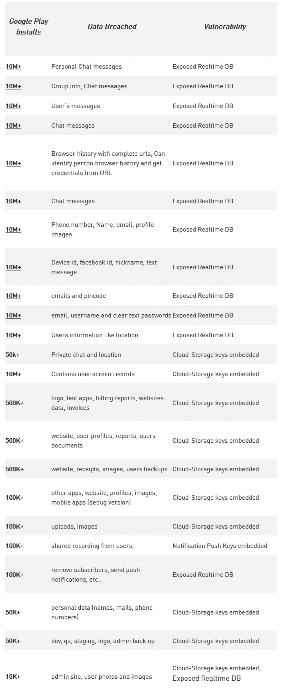

# 超过 1 亿安卓用户的数据被泄露！

> 原文：<https://medium.com/geekculture/the-data-of-more-than-100-million-android-users-has-been-leaked-7652d6c9f080?source=collection_archive---------39----------------------->

应用软件泄露用户数据早已是老生常谈的话题，但每次被提起，我还是要感受到难以防范的危险，尤其是影响范围过大，你可能就是“受害者”的时候。

2021 年 5 月 20 日，网络安全公司 Check Point Research(以下简称 CPR)发布报告:由于开发者没有正确配置第三方云服务，一些流行的 Android 应用泄露了超过 1 亿用户的个人数据。

Photo by [Denny Müller](https://unsplash.com/@redaquamedia?utm_source=unsplash&utm_medium=referral&utm_content=creditCopyText) on [Unsplash](https://unsplash.com/s/photos/android?utm_source=unsplash&utm_medium=referral&utm_content=creditCopyText)

## 多重错误配置

CPR 团队表示，通过测试 23 个应用程序，他们发现可以从各种错误配置的云服务入手，获取用户个人数据和开发者的内部资源。

**实时数据库**

实时数据库允许应用程序开发人员将数据存储在云中，以确保数据实时同步到每个连接的客户端。一般来说，为了保护数据隐私，开发者会涉及一个基本功能——实时数据库，只能通过认证来配置。

但这是普遍情况，很多流行的应用都做不到。

经过尝试，CPR 发现它可以从应用的公共数据库中恢复许多用户的隐私信息，包括电子邮件、密码、聊天记录、设备位置等。因此，CPR 推测，一旦恶意攻击者访问这些数据，很可能被用于欺诈和账户盗窃。

CPR 引用了两个应用程序:下载量超过 1000 万次的占卜应用程序、星座应用程序 Astro Guru 和安装在 5 万多辆出租车上的叫车软件 T'Leva。

从 Astro Guru，CPR 可以获得用户的姓名、出生日期、性别、位置、电子邮件和支付细节；从 T'Leva，它可以获得用户的全名、电话号码、位置(目的地和出发地)，以及司机之间的聊天记录。

(User information obtained by CPR from Astro Guru)

**推送通知**

推送通知想必大家都不陌生。开发者通过发送推送通知与用户进行交互。这也是应用程序中使用最广泛的服务之一。通常，推送通知服务需要至少一个密钥来标识开发人员。

但是，这种一般情况在某些应用程序中并没有实现。CPR 发现，一些开发者只是简单地将密钥嵌入到应用文件本身，即密钥已经失去了识别的意义。

虽然推送通知的配置不当，与实时数据库泄露的数据相比，并不会直接损害用户信息，但是如果有恶意的人通过冒充开发者的身份，向用户推送一个看起来是官网的恶意网址，用户上当就要遭殃。

**云存储**

云存储，在线存储的一种模式，即在通常由第三方托管的多个虚拟服务器中存储数据。目前，许多应用程序都采用这种方法。本来这是一个方便的功能，但是有些开发者把云存储密钥直接嵌入到应用的代码中。

通过对一些应用文件的快速分析，CPR 团队发现了它的云存储密钥。以录屏应用 Screen Recorder 和传真应用 iFax 为例:key 可以获得所有录屏应用用户的录屏视频的访问权限；iFax 中 50 多万用户发送的所有文件也可以访问和下载。

**明知故犯的 App 开发者**

这些问题虽然不是新奇的应用漏洞，但归根结底是应用开发者的疏漏。此外，在分析了几十个案例后，CPR 发现许多开发人员是故意犯罪，即知道在应用程序代码中嵌入云服务密钥是不可取的，但仍然这样做了。

在报告中，CPR 还分享了 23 个用户数据因云服务配置不当而面临风险的应用。其中一半以上下载量超过 1000 万。问题是实时数据库占了半壁江山:

出于安全考虑，除了在分析中明确指出的 5 个应用程序外，CPR 团队没有公开这 23 个应用程序的所有名称。在这 5 款 app 正式写入报告之前，CPR 也与它们的 app 厂商进行了沟通。其中一些已更新，相关问题已修复:“一些应用程序已更改其配置。”

不过 CPR 也补充道，虽然已经将漏洞与这些应用进行了同步，但是很多应用并没有得到改进。此外，这 23 个应用对于拥有数百万应用的 Google Play 来说，只不过是看不见的角落。由此可见，由于云服务配置不当导致用户数据泄露的 app 比想象中的还要普遍。

**参考链接**

[https://research . check point . com/2021/mobile-app-developers-misconfiguration-of-third-party-services-leave-personal-data-of-over-a-billion-exposed](https://research.checkpoint.com/2021/mobile-app-developers-misconfiguration-of-third-party-services-leave-personal-data-of-over-100-million-exposed/)/

[https://www . zdnet . com/article/cloud-services-used-by-Android-apps-exposed-data-of-million-user](https://www.zdnet.com/article/cloud-services-used-by-android-apps-exposed-data-of-millions-of-users/)/