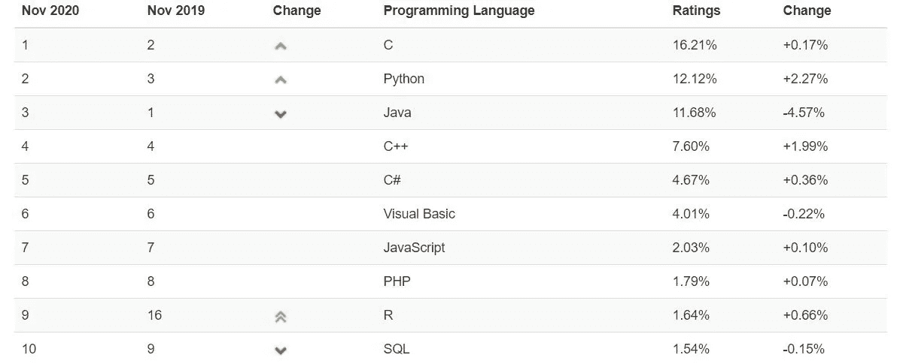

# 编程语言的死亡…

> 原文：<https://medium.com/geekculture/the-death-of-a-programming-language-18f81e109b8c?source=collection_archive---------1----------------------->

最近，在访问 TIOBE 索引获取一些数据后，我看到了一个最意想不到的景象。自 2001 年 TIOBE 开始整理和发布数据以来，C++和 Java 第一次与 C 一起不再是前三名的霸主，一个名副其实的王朝已经崩溃。但更有趣的是篡位者，这个默默无闻的挑战者如此安静地占据了第二的位置。事实上，python 也有自己的反对者，但是不，真正令人惊讶的是这一小撮人宣布 C++是时候消亡了。像微软和谷歌这样的行业领导者已经不得不修补其 C++系统中的漏洞，这一声明不是基于松散的事实。但是一种语言真正消亡的原因是什么呢？或者说，一种语言真的会消亡吗？有趣的想法，不是吗……

[index | TIOBE — The Software Quality Company](https://www.tiobe.com/tiobe-index/)

# “祖先指引着道路……”

首先，让我们来看看 *Plankalkül* 。与*提花机*和 *ENIAC 编码系统*一起，这个康拉德·楚泽的发明经常被认为是有史以来第一个独特的编程语言。现在跳到 2020 年。没有人会使用它，除了作为个人爱好。那我们是不是说 *Plankalkül 死了*？但一开始它就从未大规模实施过。那么，语言死亡的标准是什么呢？在社区中失宠？让专业人士停止使用它？很长一段时间没有更新和发展了？如果你仔细想想，答案很简单。*没有标准。一种语言不能消亡*。至少不是我们通常理解的“死亡”的含义。

# LISP 的例子…或者德尔福

LISP 是目前使用的第二古老的高级编程语言，仅次于 FORTRAN。目前只有 0.40%的社区使用，毫无疑问，它已经看到了更好的日子。但是请注意，我强调的是*“使用中”。尽管它在过去十年中没有成为任何头条新闻，但它仍在继续发展。尽管它的用例可能非常小众，但它并非不存在。朱莉娅也是如此。尽管它大部分已经被 R 和 Python 取代，但它仍然是一台老派的机器，在少数选择使用它的人手中神奇地强大。*

现在谈谈 Delphi 和 Object-Pascal。如果这种东西真的存在，那么赞美它升入天堂的号角已经吹了很多年了。但它仍然存在。当然，许多忠诚者已经转向。但忠实的少数人仍然存在。就工作而言，它可能不是最高效的，但它完成了工作。只要能这么说，它就有它的用户。

# “死亡”，但从一个新的角度

语言不是几天前的幻想。在被大众接受之前，它需要时间来成熟、形成自己。这些年来，甚至在某些情况下几十年来，每种语言都发展了自己丰富的遗产。这种遗产通常以项目、未完成的想法甚至是完全开发和实现的系统及其支持基础设施的形式存在。现在，假设一种语言确实消亡了。突然之间，有 0 个开发人员在使用它。那么它的遗产会怎么样呢？它浪费了吗？报废了吗？所有的东西都是用新语言重组的吗？简单地说，不。那将是有史以来最不切实际的想法。

那么死亡意味着什么呢？我认为，一种语言的死亡只不过是它逐渐被新的、更有效的语言所取代。这是一个没有未来发展和改进的场景，一个它的用户群不会再次暴涨的场景。即使在这一点上，用户基数可能很大，非常庞大，但这并不重要。它将不会以曾经的速度增长。

# C++的例子

让我用引发这一切的例子来说明我的观点。如果有一天，通常基于 C++的所有项目或大部分项目都使用其他东西开发，比如说 Rust，那就是 C++正在“死亡”的那一天。这并不意味着人们已经停止使用 C++。事实上，考虑到 C++的使用规模，我很难相信它的大规模使用会在不久的将来停止，考虑到目前实现的系统的很大一部分需要支持。所以，不，C++或 Java 不会去任何地方。他们将继续存在，就像他们一直存在的那样…

# 我想说什么？？？

简而言之，总之，语言不会消亡。它可能会过时，但语言消亡的概念简直是荒谬的。

不相信我？看看这些排名和指数，自己看吧。

[1。PYPL 编程语言流行指数](https://pypl.github.io/PYPL.html)

[2。RedMonk 编程语言排名:2020 年 6 月— tecosystems](https://redmonk.com/sogrady/2020/07/27/language-rankings-6-20/)

[3.index | TIOBE —软件质量公司](https://www.tiobe.com/tiobe-index/)

简单看一眼就会发现，Object-Pascal 这种“濒临死亡”的语言仍然比 Kotlin 这种大肆宣传的新潮流引领者更受欢迎。结果不言自明。

想知道为什么人们认为 C++不再是最好的吗？这些资源应该有助于澄清你的疑问…

 [## 记住这一点:Chrome 的安全缺陷让 Rust 成为热门

### 还记得黑客不针对网络浏览器的时候吗？还记得联网的客户端代码不需要…

bit.ly](https://bit.ly/35VTbsE)  [## Chromium 分析发现，C/C++错误是 70%严重安全错误的原因——

### Chromium 安全团队最近发布了对 912 个高严重性或严重严重性错误的分析结果…

bit.ly](https://bit.ly/373O1Ka) 

那么再见，下次见。