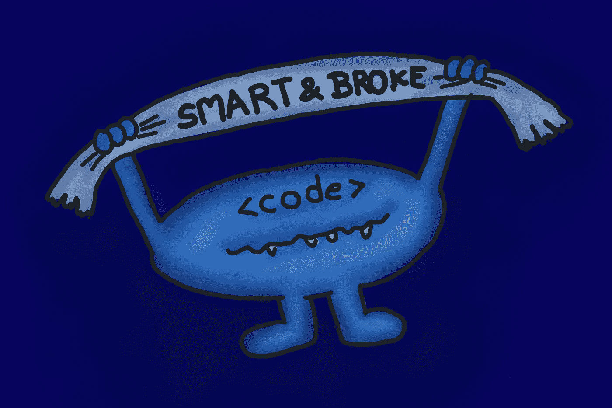

# 编程在我们身上的死亡。还是不是？

> 原文：<https://medium.com/geekculture/the-death-of-programming-upon-us-or-isnt-it-2443221cc457?source=collection_archive---------7----------------------->

## 能够编码不再是一份好工作的黄金门票

Knowing how to code isn’t a guarantee for a good job anymore.

  It 将一个随意的想法转化为一个软件项目并与全世界分享，变得比以往任何时候都更加容易。放在 GitHub 个人资料上，这可以提升你的简历，让你得到一份好工作。传说是这样的。