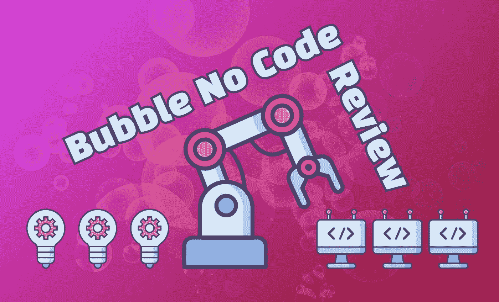
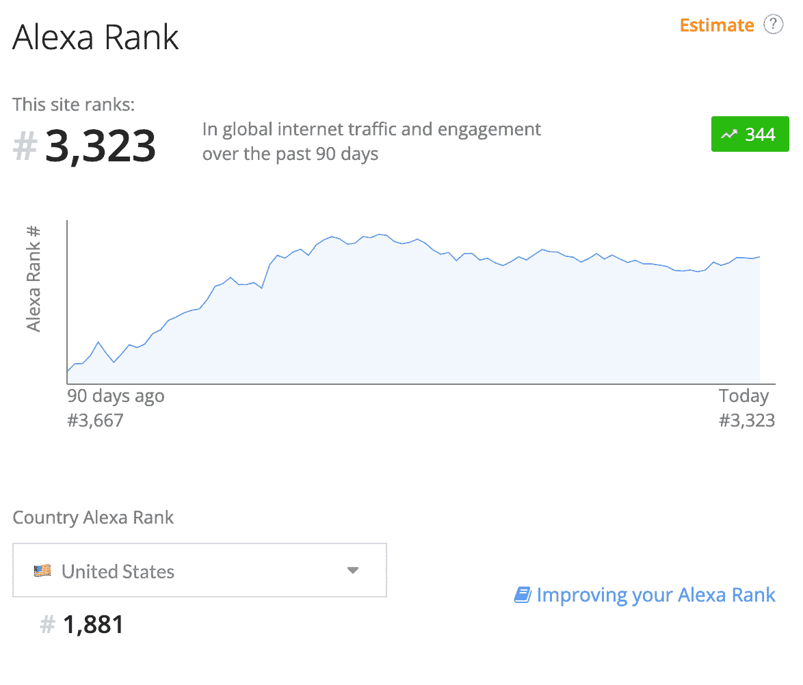
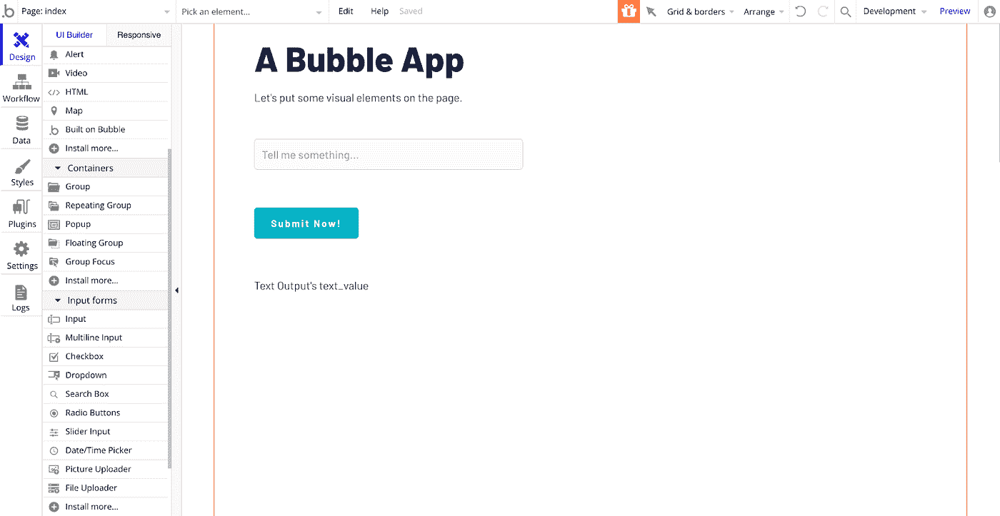
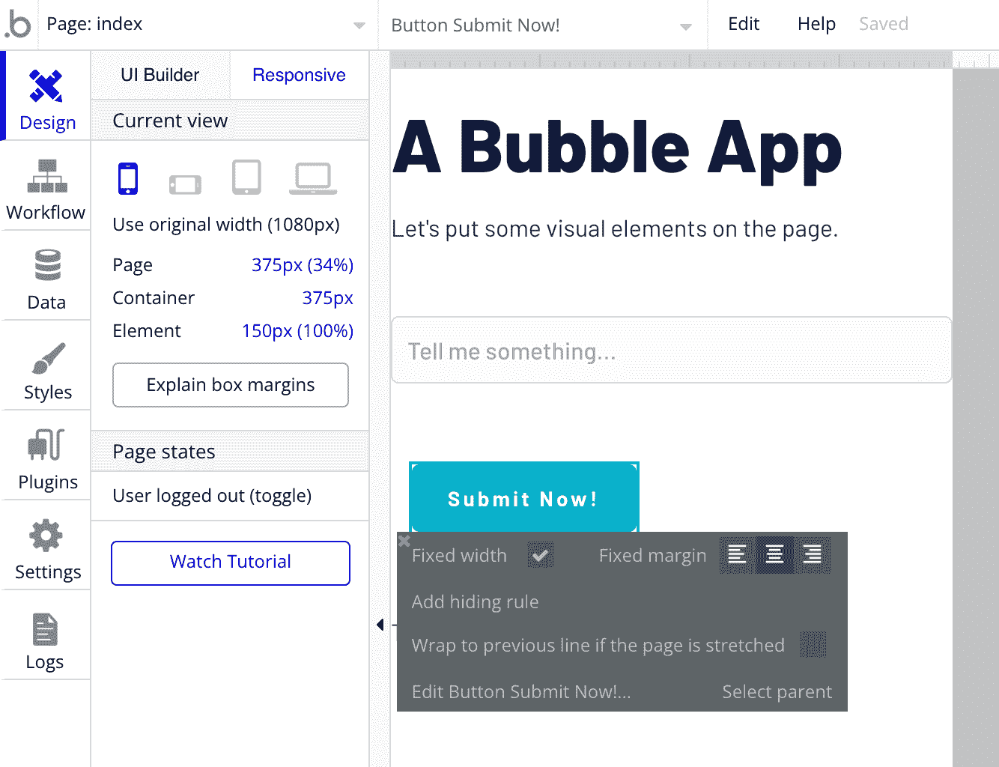
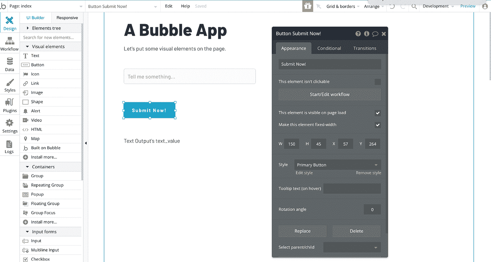
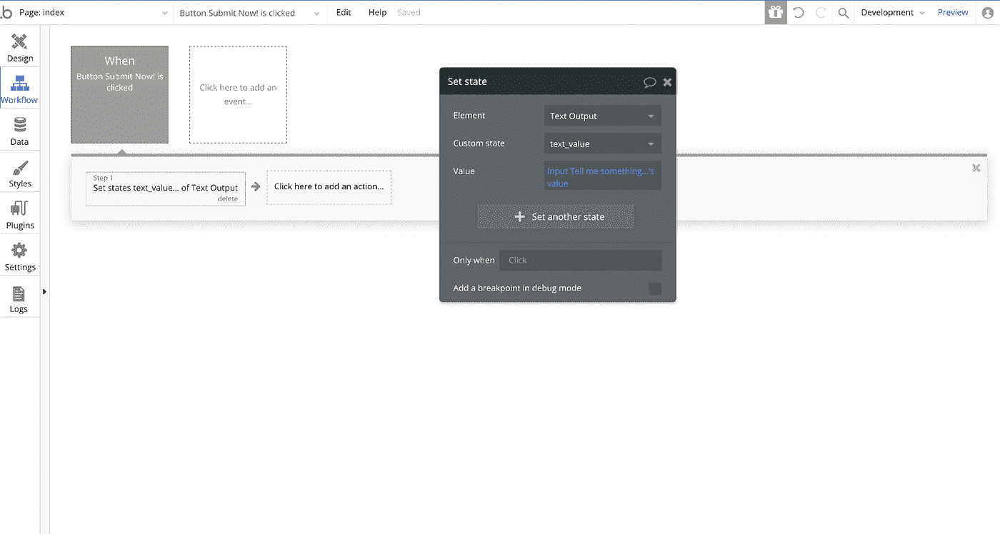
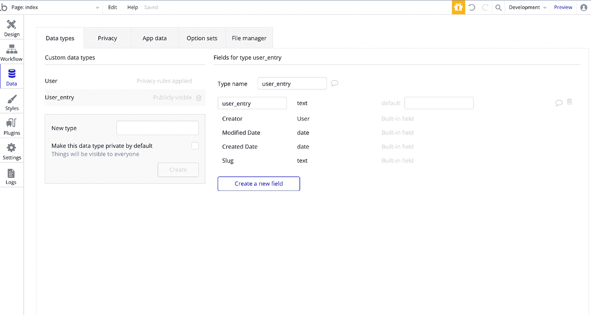
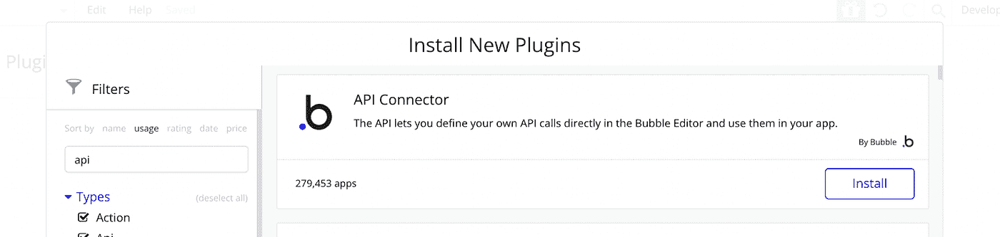
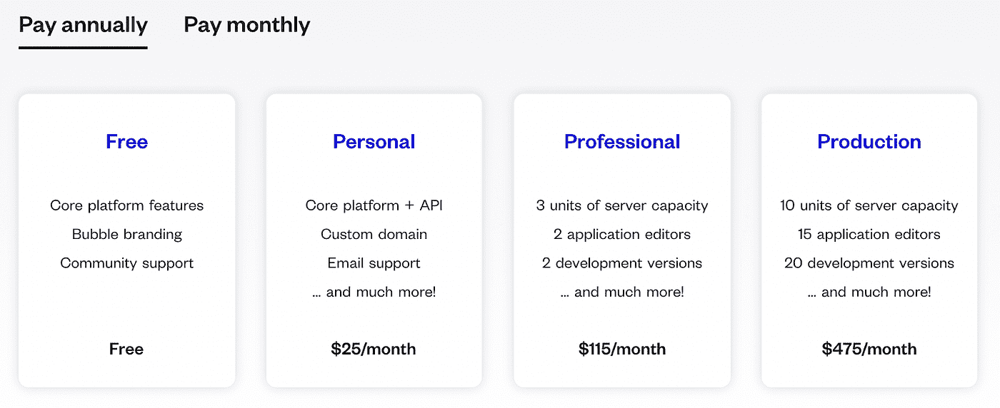
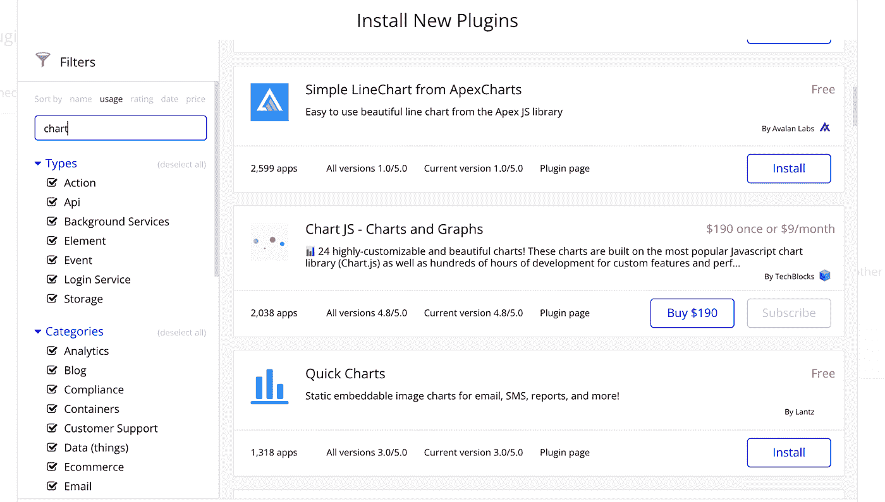

# 权威 Bubble.io 评论:一个灵活的无代码应用构建器增长超过 50%

> 原文：<https://medium.com/geekculture/the-definitive-bubble-io-review-a-flexible-no-code-app-builder-growing-over-50-ba6b5a706081?source=collection_archive---------8----------------------->

via ayrshare.com

[无代码应用构建者](https://en.wikipedia.org/wiki/No-code_development_platform)在应用开发中风靡一时，并在市场上获得了巨大的吸引力。这些强大的工具允许您快速构建应用程序、web 应用程序或移动应用程序，只需很少或不需要编码技能。这篇评论深入概述了我们最喜欢的无代码应用构建器之一:Bubble.io。

# 没有代码的世界

无代码的世界是[广阔](https://userguiding.com/blog/no-code-tools/)；从用于电子邮件自动化的 Mailchimp，到 Zapier 连接器，再到 Airtable 表，无所不包。

应用开发是一种特殊类型的无代码，我们已经花了相当多的时间来测试和审查 [Adalo](https://www.adalo.com/) 、 [Thunkable](https://thunkable.com/#/) 、 [AppGyver](https://www.ayrshare.com/build-a-social-media-posting-mobile-app-with-no-code/) 和许多其他无代码应用构建者的应用开发能力。当我们需要快速启动一个新应用程序时，我们经常会用到 Bubble——通常被称为 [Bubble.io](https://www.bubble.io) 或 Bubble IO，以前被称为 Bubble.is。它是一个灵活的无代码应用程序生成器，增长率超过 50%。

# 泡沫的历史

泡泡成立于[2012 年](https://bubble.io/blog/about-bubble/)。该公司在 2017 年突破了 25 万用户和 100 万美元的收入。他们在 2019 年从种子投资者那里筹集了 625 万美元，并在 2021 年另外筹集了 1 亿美元的风险资金。

根据 Similarweb 的数据，从 2021 年 6 月到 8 月，Bubble.io 每月的访问量约为 210 万次。截至 2021 年 10 月中旬，Alexa 将 bubble.io 列为全球互联网上第 3323 个最受欢迎的网站。

根据我们使用谷歌趋势数据进行的分析，自 2021 年以来，Bubble.io 的流量比 2017 年同期增长了 430%以上。过去四年的复合增长率超过了 50%。

Bubble 是无代码应用构建器市场的早期进入者之一，它显示了该系统的先进程度。Bubble 有一个完整的前端构建器，结合了数据库、插件市场、用于连接第三方和来电的高级 API 集成，以及对大型开发团队的支持。所有这些都不需要编写代码。

# 泡泡值得学吗？

我们有许多泡沫客户，所以我们可以看到真正的企业是如何建立在泡沫之上的。虽然市场上有许多其他的无代码工具可以让你建立有吸引力的以内容为中心的网站，如目录、博客和登录页面，但 Bubble 是少数几个在自定义用户工作流构建方面表现出色的工具之一。

工作流构建是构建功能丰富且富有创意的应用程序的关键部分。因此，当将 Bubble 与其他工具进行比较时，请考虑您需要什么样的应用程序或网站，以及使用该工具构建软件的难易程度。

如果你的目标是研究和收集信息，并把它放在一个有吸引力的在线存储库中，有更简单的选择，如 Airtable 或 Glide。如果你想建立一个博客，那么像 Wordpress 或 Webflow 这样的无代码内容管理系统是很好的选择。所有这些工具都有免费计划，可以让你很快将一个想法变成一个功能齐全的应用程序。

如果您希望您的用户执行更高级的工作流，如创建帐户、创建社交媒体帖子、管理项目、向其他用户发送消息、发布工作、共享食谱、创建房地产列表或显示分析，那么您需要一个更灵活的应用程序构建器系统。

Bubble 可以让你构建一个功能齐全的应用程序，在你自己的应用程序中实现你的创造力时几乎没有限制。

# 泡沫与传统发展

将新软件产品推向市场的传统方法需要雇佣软件开发人员来编写代码。如果你没有自己的开发团队，那么找到代理或自由职业者将是你确定预算后的第一步。

使用 Bubble，企业家、创始人或产品经理可以立即开始构建和测试，而不需要向他人解释产品，也不需要太多资金。用 Bubble 这样的无代码工具，几个小时就能把一个想法变成一个功能齐全的网络应用。

Bubble 允许您使用拖放界面来创建您需要的功能，而不是编写代码来构建 web 应用程序的组件和逻辑。通过点击和拖动，您可以添加输入字段、复选框、按钮、搜索框、日期/时间选择器等等。

如果这听起来好得令人难以置信，那么请记住，一旦你推出并拥有付费用户，那么用 Bubble 迭代你的应用程序就像编码一样耗时。如果 Bubble 不支持您的独特要求，有时您无法构建功能或提高应用程序的性能；即使你有能力直接编辑代码。

这对于所有无代码平台来说都是一个挑战。平台的局限性决定了您可以构建的内容的局限性。我们发现大多数其他无代码应用构建者比 Bubble 有更多的限制，所以相对来说，我们不认为这是 Bubble 的缺点。

# 泡泡安全吗？

Bubble 建立在亚马逊 AWS 云基础设施上，包括用于图像和视频的 S3，这允许 Bubble 利用高级安全功能。其他基于 AWS 的公司包括网飞、Liberty Mutual、Robinhood、Slack 和 Hess。

Bubble 应用程序带有时间点数据恢复功能，可让您从以前的时间恢复自己的数据。这是一个很好的功能，如果您破坏了某些东西或部署了一个对您的数据有负面影响的特性，它可以让您避免严重的痛苦。

其他有助于安全性的功能包括详细记录出现的研究问题，以及用户定义的隐私规则来管理跨团队的访问。

# 泡泡做手机 app 吗？

在你考虑构建桌面网络应用的同时，开始考虑移动应用是很自然的。现在，世界上大部分地区都是移动优先，一些研究表明，未来几年，大多数互联网用户将只使用移动设备。事实是，你所有的新用户都想要移动接入。

不幸的是，这是泡泡平台最显著的缺点之一。只要你专注于响应式设计，用 Bubble 构建的 web 应用程序在移动浏览器中会工作得很好。但你不能创建一个可以提交到 iOS 应用商店或 Android Play 商店的移动应用程序。

有第三方服务可以帮助您将 web 应用程序转换成可以提交到应用程序商店的东西，但这些通常是您的 web 应用程序的包装器(通常称为混合应用程序)，并且不会将您的 web 应用程序转换成原生移动应用程序。尽管混合应用的用户体验可能不如原生移动应用，但它们仍然可以满足真正的业务需求，尤其是在几乎没有替代品的利基市场。

简而言之，Bubble 不会让你创建一个原生的移动应用程序，但是你可以在你的移动应用程序之旅中利用你的 Bubble 工作。

# 我怎么做一个泡泡 App？

一些很棒的资源可以查看，包括 Bubble Get Started [文章](https://bubble.io/blog/get-started/)和我们的[教程](https://www.ayrshare.com/how-to-create-a-social-media-scheduling-app-with-no-code/)，关于如何在 Bubble 中为社交媒体日程安排构建一个定制应用。

开始使用 Bubble 时，有四个主要组件值得学习:

1.  第一个是伟大的**拖放界面**，用于可视化地布局你的应用组件。
2.  下一个是 **Bubble Workflow Builder** ，它可以让你创建工作流逻辑——即当用户点击蓝色按钮时，某些数据会被保存，然后用户会被导航到应用程序中的不同页面。
3.  第三个组件是平台中包含的**数据库**。与使用第三方服务 SQL 或 NoSQL 数据库提供商相比，该数据库有一定的局限性。但它是集成的，易于使用。这使它成为默认选择，并使您能够快速启动和运行复杂的数据库驱动的工作流，如用户登录和媒体内容管理。
4.  第四个是**气泡 API 连接器**。这是一个由 Bubble 开发的插件，它扩展了核心平台，能够连接到任何外部 API。当您想要连接到其他服务以获得发送电子邮件、发布到社交媒体或将内容保存到存储提供商等功能时，API 连接器非常有用。API 连接器使用简单且非常灵活——这是 Bubble 优于其他无代码应用构建器的主要优势之一。

如果这听起来有点吓人，那么请放心，Bubble 对平台中的每个特性都有可靠而全面的文档。

# 拖放

气泡拖放界面布局清晰，直观，反应灵敏。您可以使用的控件列表在左侧栏中。只要把这个元素从这个栏拖到你的应用程序主体中，控件的设置就会在一个深灰色的容器中弹出。在这里，您可以更改名称、风格，最重要的是，将它连接到工作流，使您的应用变得生动。

# 工作流构建

工作流构建位于左侧栏的“工作流”选项卡中。每个工作流都从一个事件开始，比如单击按钮、用户登录或加载页面。一旦事件发生，您就可以定义一个动作，比如保存数据、导航到页面或触发 API 调用。

# 数据库

在左侧栏的数据选项卡中，您可以访问集成的数据库系统。Bubble 使用的逻辑是，有些数据类型(相当于表)有字段。通过为每个字段输入值，可以向数据类型中添加新条目。

多年来，Bubble 做了一些重大改进，允许文件和其他类型的媒体直接上传到这个数据库系统。这使您可以构建一个应用程序，而不必考虑文件存储和图像存储，这对于第三方云提供商来说可能会变得复杂。

# API 连接器

API 连接器在技术上是一个插件，可以在插件市场上买到。根据我们的经验，当你开始一个新的应用程序时，你会想要安装它。这个插件允许 Bubble 开发者连接到任何 API，作为应用工作流程的一部分。只需添加您的身份验证凭证和一些参数，您就可以在几分钟内通过外部 API 拉入数据、发送内容和添加其他新功能。

API 连接器直观、稳定，而且非常强大。这确实有助于 Bubble 在无代码应用构建者的竞争空间中脱颖而出。

# 证明文件

泡泡提供文字和视频资源，帮助你制作 app。[文档](https://manual.bubble.io/)写得很好，在你需要的时候很详细。还有视频和互动[教程](https://bubble.io/academy)，我们建议所有初学者有选择地学习。

# 泡沫计划和定价

Bubble 提供免费计划和三层付费计划。免费计划可以让你建立一个应用程序，详细了解泡泡系统。但是你不能发布一个实时的应用程序，并且有许多其他的限制，比如没有自定义域，气泡品牌，没有外部 API，没有数据备份，有限的日志记录，有限的文件存储，以及没有直接的支持。

付费计划的泡沫价格根据容量需求、存储需求和可以成为应用程序编辑的团队成员的数量而变化。如果你是按年付费的话，泡沫成本从每月 25 美元到每月 475 美元不等。如果你不想做年度承诺，每月的价格范围是 29 美元到 529 美元。

# 插件市场

插件市场是一个扩展 Bubble 提供的标准功能的好方法。在编码领域，有许多开源的和商业上可用的 SDK 包，开发人员用它们来扩展他们的应用程序。插件市场对泡泡开发者来说扮演着同样的角色。

例如，如果你想在应用程序中添加图表，有 30 多个插件可供选择。价格从免费到每月 9 美元不等。或者你可以一次性支付 10 到 200 美元的许可费来购买大部分插件。

在我们合作过的所有无代码应用开发者中，Bubble 拥有最丰富的插件市场。当你启动你的应用程序时，在市场上搜索一下，看看其他人已经建立了哪些你可以利用的功能是值得的。

# 结论

花一周时间学习 Bubble，再花一周时间开发你的应用，你会惊讶于你能完成的事情。泡泡也有一个活跃的社区，在泡泡论坛上非常活跃。总有人愿意帮助你摆脱困境。

凭借最灵活的无代码工作流构建器之一，结合出色的 API 连接器，我们相信 Bubble 应该在每个人的无代码应用构建器列表中名列前茅。