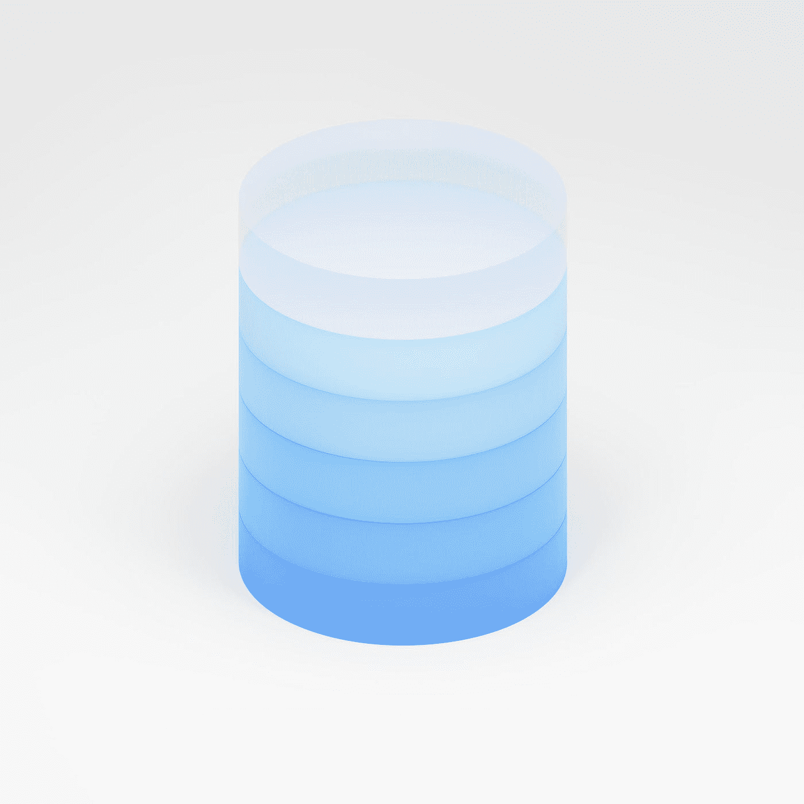
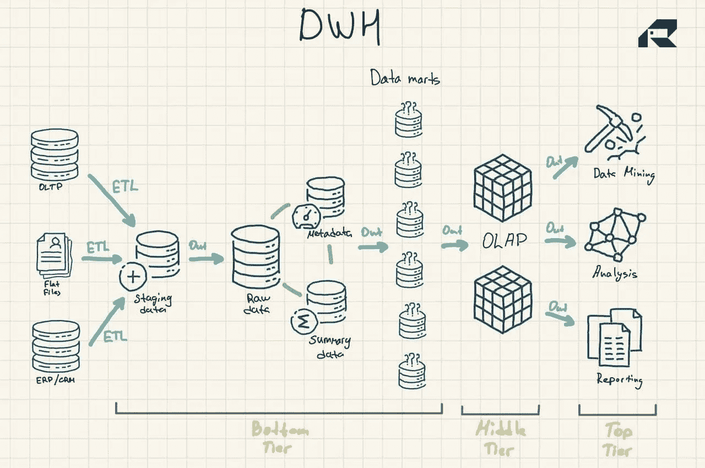
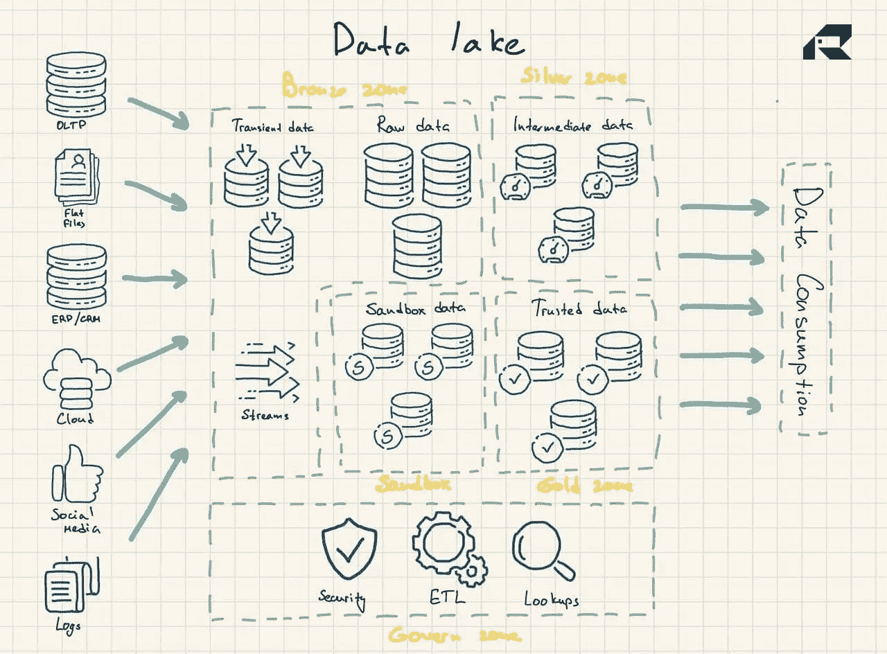
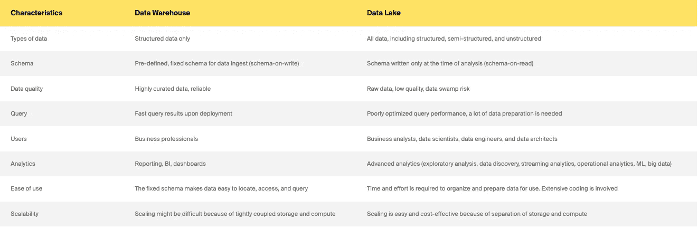
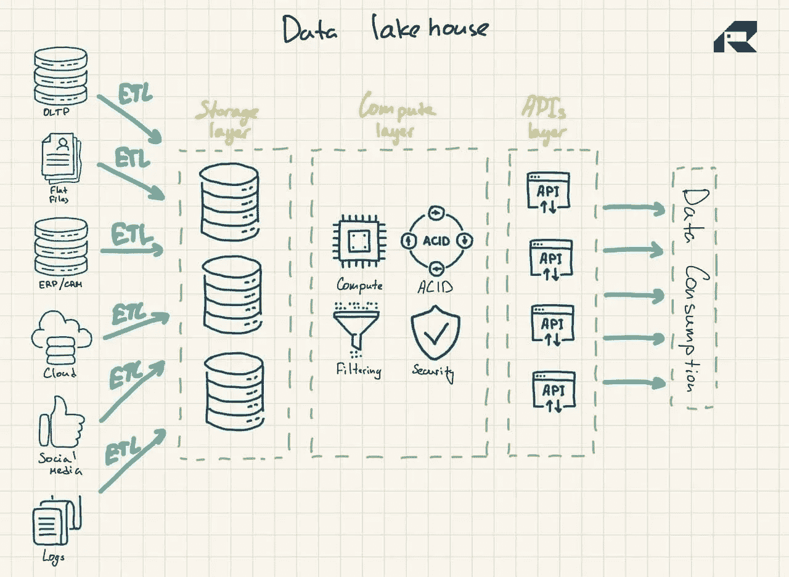
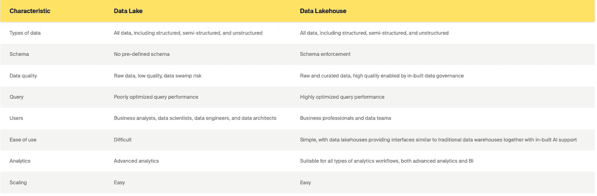

# 数据仓库、数据湖和数据湖库的权威指南

> 原文：<https://medium.com/geekculture/the-definitive-guide-to-data-warehouse-vs-data-lake-vs-data-lakehouse-8229a287b17a?source=collection_archive---------18----------------------->

各行各业的首席信息官都在努力控制数据激增，面临着严峻的挑战。其中之一是存储企业所有数据的位置，以提供[强大的数据分析](https://itrexgroup.com/services/data-analytics/)。

传统上有两种数据存储解决方案:数据仓库和数据湖。

数据仓库主要存储来自运营和事务系统的转换后的结构化数据，并用于跨这些历史数据的快速复杂查询。

数据湖就像一个转储，存储各种数据，包括[半结构化和非结构化数据](https://itrexgroup.com/blog/your-unstructured-data/)。它们支持高级分析，如用于实时数据处理或机器学习的流分析。

从历史上看，数据仓库的推广成本很高，因为除了维护它们的技能之外，你还需要为存储空间和计算资源付费。随着存储成本的下降，数据仓库变得更加便宜。一些人认为数据湖(传统上是一种更具成本效益的选择)现在已经死了。一些人认为数据湖仍然很流行。与此同时，其他人正在谈论一种新的混合数据存储解决方案——数据湖库。

他们每个人都有什么交易？让我们仔细看看。

这篇博客探讨了数据仓库、数据湖和数据湖库、流行的技术栈和用例之间的主要区别。它还提供了为您的公司选择正确解决方案的提示，尽管这一个有些棘手。

# 什么是数据仓库？

数据仓库旨在存储结构化的、精选的数据，将数据集组织在表和列中。这些数据很容易被用户用于传统的[商业智能](https://itrexgroup.com/services/business-intelligence/)、仪表板和报告。

# 数据仓库体系结构

三层架构是设计数据仓库最常用的方法。它包括:

*   *底层*:数据仓库的暂存区和数据库服务器，用于从各种来源加载数据。提取、转换和加载(ETL)过程是将数据推入数据仓库的传统方法
*   *中间层*:在线分析处理(OLAP)服务器，将数据重新组织成多维格式，以便快速计算
*   *顶层*:处理数据的 API 和前端工具

图 1:数据仓库参考架构

应该提到数据仓库的另外三个重要组件:数据集市、操作数据存储和元数据。数据集市属于底层。它们存储数据仓库数据的子集，为各个业务线服务。

*运营数据存储*作为一个存储库，基于简单的查询为运营报告提供组织最新数据的快照。它们可以用作数据源和数据仓库之间的中间层。

还有*元数据*——描述数据仓库数据的数据——存储在特殊用途的存储库中，也在底层。

# 数据仓库的发展和技术

数据仓库已经存在了几十年。

传统上，数据仓库托管在本地，这意味着公司必须购买所有硬件并在本地部署软件，无论是付费系统还是开源系统。他们还需要整个 IT 团队来维护数据仓库。从好的方面来看，传统的数据仓库带来了(今天仍然如此)快速洞察、无延迟问题、完全控制数据以及百分之百的隐私，并最大限度地降低了安全风险。

随着云的普及，许多组织现在选择迁移到[云数据仓库解决方案](https://itrexgroup.com/services/cloud-consulting/)，所有数据都存储在云中。它也在云中进行分析，使用某种类型的集成查询引擎。

市场上有各种成熟的云数据仓库解决方案。每个提供商都提供其独特的仓库功能和不同的定价模型。例如，Amazon Redshift 被组织为传统的数据仓库。雪花也是一样。微软 Azure 是一个 SQL 数据仓库，而谷歌 BigQuery 基于一个无服务器架构，本质上提供软件即服务(SaaS)，而不是基础设施或平台即服务，例如亚马逊 Redshift。

众所周知的本地数据仓库解决方案包括 IBM Db2、Oracle 自治数据库、IBM Netezza、Teradata Vantage、SAP HANA 和 Exasol。它们也可以在云上获得。

基于云的数据仓库显然更便宜，因为不需要购买或部署物理服务器。用户只需根据需要为存储空间和计算能力付费。云解决方案也更容易扩展或与其他服务集成。

数据仓库以顶级的数据质量和快速的洞察力服务于高度特定的业务需求，并将长期存在。

# 数据仓库用例

数据仓库能够对数 Pb 的历史数据进行高速、高性能的分析。

它们基本上是为双类型查询设计的。例如，数据仓库可能会给出一个关于特定时间段内销售额的答案，按地区或部门分组，以及销售额的同比变化。数据仓库的主要用例有:

*   交易报告提供业务绩效的情况
*   临时分析/报告，为独立和“一次性”的业务挑战提供答案
*   数据挖掘从数据中提取有用的知识和隐藏的模式，以解决复杂的现实世界的问题
*   通过[数据可视化进行动态展示](https://itrexgroup.com/services/data-visualization/)
*   深入查看数据的层次维度以获取详细信息

对于任何数据成熟的公司来说，在运营数据库之外的一个容易访问的位置拥有结构化的业务数据是非常重要的。

然而，传统的数据仓库不支持大数据技术。

它们还会批量更新，来自所有来源的记录会定期一次性处理，这意味着数据在汇总用于分析时可能会变得陈旧。数据湖似乎解决了这些限制。有一个权衡。我们来探索一下。

# 什么是数据湖？

数据湖主要收集原始形式的未经提炼的原始数据。数据湖和数据仓库之间的另一个关键区别是，数据湖存储这些数据，而不将它们排列成任何被称为*模式*的逻辑关系。然而，这就是它们实现更复杂的分析的方式。

数据湖获取(I)来自 ERP、CRM 或 SCM 等业务应用程序的事务性数据，(ii)中的文档。csv 和。txt 格式，(iii)半结构化数据，如 XML、JSON 和 AVRO 格式，(iv)设备日志和物联网传感器，以及(v)图像、音频、二进制、PDF 文件。

# 数据湖架构

数据湖使用平面架构来存储数据。它的主要组成部分是:

*   *青铜区*用于所有摄入湖中的数据。数据可以按原样存储用于批处理模式，也可以存储为流式工作负载的聚合数据集
*   *银区*根据业务需求过滤和丰富数据以供探索
*   *黄金区域*存储精选的、结构良好的数据，用于应用 BI 工具和 ML 算法。这个区域通常以支持传统数据仓库和数据集市的运营数据存储为特色
*   *沙箱*数据可用于假设验证和测试。它要么作为 Hadoop 或其他 NoSQL 技术的完全独立的数据库来实现，要么作为黄金区域的一部分来实现。

图 2:数据湖参考架构

数据湖本身并不包含分析功能。没有它们，它们只是存储本身没有用的原始数据。因此，组织在数据湖之上构建数据仓库或利用其他工具来使用数据。

为了确保数据湖不会变成数据沼泽，重要的是要有一个[高效的数据管理策略](https://itrexgroup.com/blog/data-management-strategy-benefits-principles-steps/)，在数据湖设计中包含内置的[数据治理和元数据管理](https://itrexgroup.com/services/data-management/)。在理想的情况下，数据湖中的数据应该被编目、索引、验证，并方便数据用户使用。但是这种情况很少发生，许多数据湖项目都失败了。这是可以避免的:不管数据团队的成熟度如何，至少安装必要的控制来加强数据验证和质量是至关重要的。

# 数据湖的演变和技术

21 世纪初大数据的兴起为组织带来了巨大的机遇和挑战。企业需要新技术来分析这些大规模、杂乱且增长速度惊人的数据集，以便[从大数据中捕捉业务影响](https://itrexgroup.com/blog/big-data-and-its-business-impact/)。

2008 年，Apache Hadoop 提出了一种创新的开源技术，用于收集和处理大规模的非结构化数据，为大数据分析和数据湖铺平了道路。不久之后，Apache Spark 出现了。它更容易使用。此外，它还提供了构建和训练 ML 模型、使用 SQL 查询结构化数据以及处理实时数据的功能。

如今，数据湖主要是云托管的存储库。所有顶级云提供商，如 AWS、Azure 和 Google，都提供基于云的数据湖和经济高效的对象存储服务。他们的平台附带了各种数据管理服务来自动化部署。例如，在一个场景中，数据湖可能由像 Hadoop 分布式文件系统(HDFS)或亚马逊 S3 这样的数据存储系统组成，并集成了像亚马逊 Redshift 这样的云数据仓库解决方案。这些组件将与生态系统中的服务分离，这些服务可能包括用于数据处理的 Amazon EMR、提供数据目录和转换功能的 Amazon Glue、Amazon Athena 查询服务或用于构建元数据库和索引数据的 Amazon Elasticsearch 服务。由于安全性、隐私或延迟等常见的云问题，本地数据湖仍然很常见。

也有本地存储供应商提供一些数据湖产品，但是他们的数据湖产品没有明确定义。与数据仓库不同，数据湖背后没有多年的实际部署。仍然有很多批评认为数据湖概念模糊不清。批评者还认为，任何组织中很少有人拥有针对原始数据运行探索性工作负载的技能(或热情)。

他们说，数据湖应该被用作所有企业数据的中央存储库的想法需要谨慎对待。还有一种煽动性的说法是，数据湖的日子屈指可数了。列举了以下原因:

*   数据湖不能按需高效地扩展计算资源(这是因为它们不是设计初衷)
*   数据湖背负着巨大的技术债务，它们的产生主要是由营销炒作驱动的，而不是技术原因(许多数据仓库也发生了同样的事情)
*   随着云数据仓库解决方案的兴起，数据湖不再提供显著的成本优势(成本问题不那么简单，因为很难预测计算成本)

这种批评是任何新兴技术的固有部分。然而，数据湖确实有明确的用例，如流分析。目前，它们还没有威胁到数据仓库。在某种程度上，数据湖甚至战胜了数据仓库，在存储数据方面提供了更广泛的分析能力、成本效益和灵活性。然而，随着数据仓库技术的成熟，许多人认为现在还没有明显的赢家。通常建议同时维护它们，或者……采用混合架构。请继续阅读。

# 数据湖用例

数据湖的主要思想是让企业能够尽快访问来自所有来源的所有可用数据。数据湖不仅仅是描述昨天发生的事情。数据湖存储大量数据，旨在使组织能够更多地了解现在(使用流分析)和未来(使用[大数据解决方案](https://itrexgroup.com/services/big-data/)，包括预测分析和机器学习)。数据湖的主要使用案例有:

*   向企业数据仓库提供数据集
*   执行流分析
*   实施 ML 项目
*   使用 Tableau 或 MS Power BI 等成熟的企业 BI 工具构建高级分析图表
*   构建定制数据分析解决方案
*   运行根本原因分析，允许数据团队追踪问题的根源

凭借强大的数据工程技能将原始数据移动到分析环境中，数据湖可能非常有用。他们允许团队对数据进行实验，以了解数据如何有用。这可能涉及构建模型来挖掘数据，并尝试不同的模式以新的方式查看数据。数据湖还允许与从网络日志和物联网传感器中涌入的流数据进行争论，并且不适合传统的数据仓库方法。

简而言之，数据湖使组织能够挖掘模式，预测变化，或围绕新产品或当前流程发现潜在的商业机会。用于不同的业务需求，数据湖和数据仓库通常是一前一后实现的。在我们进入下一个数据存储概念之前，让我们快速回顾一下数据仓库和数据湖之间的主要区别。

# 数据仓库与数据湖

# 一个新的混合架构，数据湖库怎么样？

除了市场营销，数据湖库的关键思想是为数据湖带来计算能力。在体系结构上，数据湖库通常包括:

*   *存储层*以开放格式存储数据(如拼花地板)。这一层可以称为数据湖，它与计算层是分离的
*   *计算层*为组织提供仓库功能，支持元数据管理、索引、模式实施和 ACID(原子性、一致性、可靠性和持久性)事务
*   *API 层*访问数据资产
*   *服务层* r 支持各种工作负载，从报告到 BI、数据科学或机器学习。

图 3:数据湖参考架构

data lakehouse 被吹捧为一个结合了两个世界最佳特性的解决方案，它同时解决了以下两个问题:

*   数据仓库限制，包括缺乏对依赖于结构化和非结构化数据的高级数据分析的支持，以及传统数据仓库无法将存储和计算资源分开的巨大扩展成本
*   数据湖挑战，包括数据重复、数据质量，以及需要访问多个系统来完成各种任务或实施与分析工具的复杂集成

数据湖库是数据分析领域的一项新进展。这个概念在 2017 年首次用于雪花平台。2019 年，AWS 使用 data lakehouse 术语来描述其亚马逊红移频谱服务，该服务允许其数据仓库服务亚马逊红移的用户搜索亚马逊 S3 存储的数据。2020 年，data lakehouse 术语被广泛使用，Databricks 将其用于其 Delta Lake 平台。

随着各行各业的公司都在采用人工智能来改善服务运营、提供创新产品和服务或推动营销成功，数据湖屋可能会有一个光明的未来。由数据仓库提供的来自运营系统的结构化数据不适合智能分析，而数据湖并不是为强大的治理实践、安全性或 ACID 合规性而设计的。

# 数据湖与数据湖之家

# 那么，数据仓库与数据湖和数据湖库:选择哪个呢

无论您是想从头构建一个数据存储解决方案，还是想更新您的遗留系统以支持 ML 或提高性能，正确的答案都不会很容易。随着供应商产品和定价模式的快速发展，在关键差异、优势和成本方面仍然存在许多混乱。此外，即使你有利益相关者的支持，这也总是一个困难的项目。然而，在选择数据仓库还是数据湖还是数据湖库时，有一些关键的考虑因素。

你应该回答的首要问题是:为什么。这里需要记住的一点是，数据仓库、湖泊和湖边小屋之间的关键区别不在于技术。它们是为了满足不同的业务需求。那么，为什么您首先需要一个数据存储解决方案呢？它是用于定期报告、商业智能、实时分析、[数据科学](https://itrexgroup.com/services/data-science-consulting/)还是其他复杂的分析？对于您的业务需求，数据一致性和及时性哪个更重要？花些时间开发用例。您的分析需求应该明确。你也应该深入了解你的用户和技能。一些经验法则是:

*   如果你有确切的问题，并且知道你想要定期得到什么样的分析结果*，那么数据仓库是一个不错的选择。*
*   *如果你在*一个高度监管的行业*如医疗保健或保险，你可能首先需要遵守广泛的报告法规。因此，数据仓库将是一个更好的选择。*
*   *如果您的 KPI 和报告需求可以通过*简单的历史分析*来解决，那么数据湖或混合解决方案将是一种矫枉过正的做法。请改用数据仓库。*
*   *如果您的数据团队正在进行*试验性和探索性分析*，请选择数据湖或混合解决方案。然而，您需要强大的数据分析技能来处理非结构化数据。*
*   *如果你是一个数据成熟的组织，想要*利用机器学习技术*，混合解决方案或数据湖将是一个自然的选择。*

*还要考虑你的预算和时间限制。数据湖的构建肯定比数据仓库更快，而且可能更便宜。您可能希望逐步实现您的计划，并随着规模的扩大增加功能。如果你想让你的传统数据存储系统现代化，你应该问自己为什么需要它。是不是太慢了？还是不允许在更大的数据集上运行查询？是否丢失了一些数据？你想推出不同类型的分析吗？您的组织已经在遗留系统上花费了大量资金，因此您肯定需要一个强大的业务案例来抛弃它。把它和投资回报率联系起来。数据存储架构仍在不断成熟。不可能确切地说出它们将如何演变。然而，无论您选择哪一条道路，识别常见的陷阱并充分利用现有的技术都是非常有用的。*

*我们希望这篇文章澄清了一些关于数据仓库、数据湖和数据湖库的混淆。如果您在构建数据存储解决方案时仍有疑问或需要顶级技术技能或建议，[请拨打 ITRex a line](https://itrexgroup.com/contact-us/) 。他们会帮助你的。*

**原载于 2022 年 2 月 23 日 https://itrexgroup.com***。***