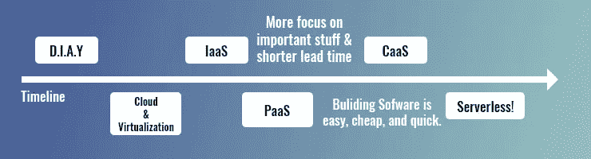

# 无服务器的发展

> 原文：<https://medium.com/geekculture/the-development-of-serverless-36a50bef1e52?source=collection_archive---------9----------------------->

Photo by [Jordan Harrison](https://unsplash.com/@jordanharrison?utm_source=medium&utm_medium=referral) on [Unsplash](https://unsplash.com?utm_source=medium&utm_medium=referral)

## 无服务器是一种云原生开发模型，允许开发人员构建和运行应用程序，而无需管理服务器。

[https://dev.to/tamerlang/serverless-for-dummies-444n](https://dev.to/tamerlang/serverless-for-dummies-444n)