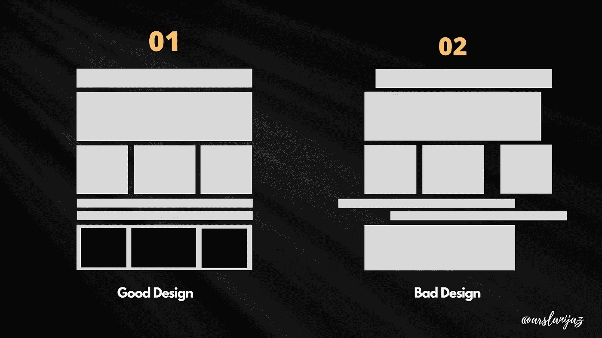

# 好的和坏的 UX 设计的区别

> 原文：<https://medium.com/geekculture/the-difference-between-a-good-bad-ux-design-91ac979323c7?source=collection_archive---------2----------------------->

## 阅读这篇文章，了解好的和坏的设计之间的区别。

好的设计是有效的，坏的设计是无效的。许多因素有助于设计的有效性，例如它的简单性、功能性和美观性。一个好的设计往往是精心规划和关注细节的结果。相比之下…