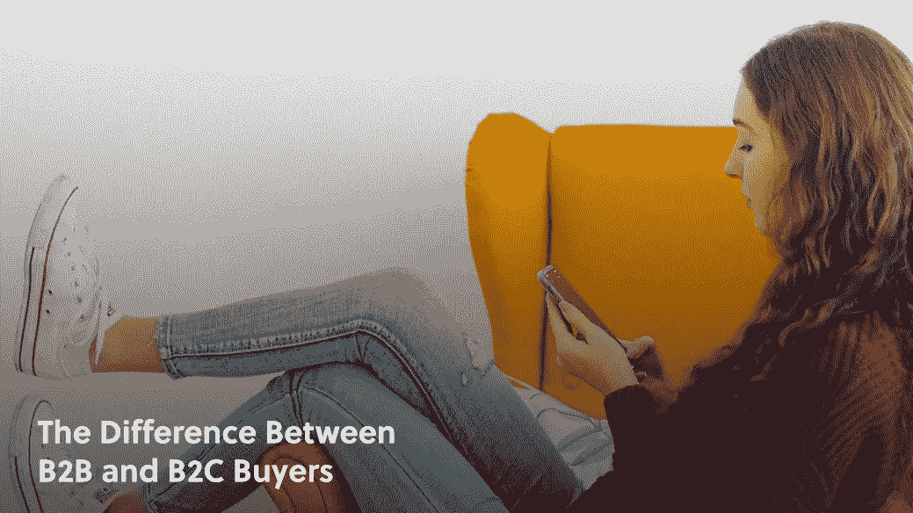
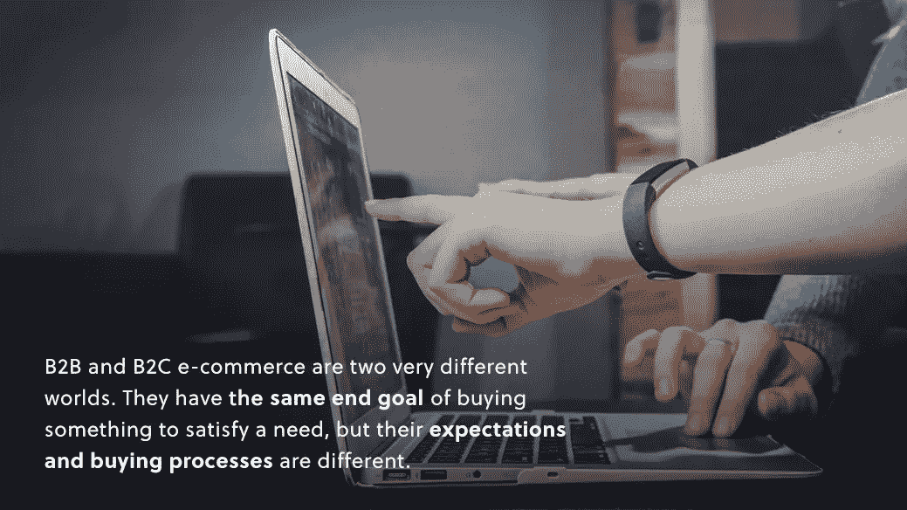
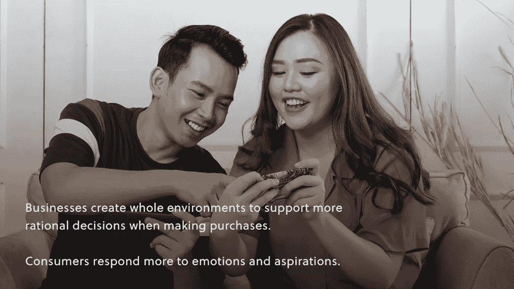

# B2B 和 B2C 买家的区别

> 原文：<https://medium.com/geekculture/the-difference-between-b2b-and-b2c-buyers-e08dec969230?source=collection_archive---------19----------------------->

## 电子商务的成功

## 了解你需要了解的关于你的目标买家的信息

现在电子商务的受众细分和个性化是巨大的。所有顶级大师都表示，消费者正在寻求更多的个性化，从产品推荐到他们 Instafeeds 上的广告。新的消费趋势也表明了消费者在购买方式和地点上的重大转变。

然而，我们谈论的是哪些消费者呢？

事实证明，尽管我们可以建立所有高度特定的受众群体(基于人口统计和行为数据)，但在电子商务世界中，我们需要首先解决一个更大的分歧:B2B 和 B2C 买家。

B2B(企业对企业)和 B2C(企业对消费者)电子商务是两个截然不同的世界。他们有相同的最终目标，即购买某些东西来满足需求，但是他们的期望和购买过程是不同的。

这意味着你接触他们的策略也必须不同。

请继续阅读，我们将分析 B2B 和 B2C 买家之间的主要区别，以及这些区别对您的电子商务战略意味着什么。

# 买家自己

如果你访问以下网站，你可以想象 B2B 和 B2C 买家之间的区别:

*   阿里巴巴(最受欢迎的 B2B 市场)
*   和亚马逊(B2C 销售的巨人)

然而，从根本上来说，为什么会有这种差异呢？如果 B2B 购买背后的业务团队中的个人是在个人基础上在线购买他们自己的商品的相同消费者，那么客户是完全不同的吗？

是的，他们确实是。

商业公司的目的是使利润最大化，这就要求降低采购成本。消费者总是在寻找一笔交易，但企业将有标准的操作实践来确定何时购买的成本对于他们想要满足的需求是合理的。

另一方面，消费者有情感购买的奢侈。

对购买行为的心理学研究表明，在购买产品时，理性和情感因素都会发挥作用。在电子商务体验中，用户可以通过浮华的图片和无数的广告从一个产品列表缩放到下一个，这些情绪甚至可以更快地被触发。

然而，B2B 买家会花更多的时间购买。这让情绪有时间酝酿，并被投资回报驱动的理性所取代。

**企业创造整体环境来支持更理性的购买决策。消费者对情感和愿望的反应更大。**

# 期望

B2B 和 B2C 买家的期望揭示了这两个客户市场之间更大的差异。

当个人消费者登陆产品页面时，他们希望以高度可视化和沉浸式的方式组织[信息](https://www.amberengine.com/blog-content/the-psychology-of-product-imagery-in-e-commerce?utm_source=blog&utm_medium=referral&utm_campaign=medium-blogs)。丰富的照片和 [AR 体验](https://www.amberengine.com/blog-content/top-5-examples-of-ar-product-experiences?utm_source=blog&utm_medium=referral&utm_campaign=medium-blogs)已经成为新的竞争规范。

他们也能更快地点击“购买”按钮。继续阅读，了解更多关于这些[消费者期望的新趋势](/amberengine/trends-in-consumer-expectations-6b11a59d9a7f)。

另一方面，B2B 客户需要更长的时间来决定购买。他们在权衡更复杂的因素，比如利益相关者的支持。他们还需要更多的培养和说服，才能准备好对你的品牌做出承诺，即使是第一次购买。

**换句话说，卖家有责任向 B2B 客户证明，一件产品将改善采购业务的流程或效率。这是一个出售它们的好主意。**

对 B2B 品牌来说，好消息是一旦 B2B 客户加入，他们就会长期加入。企业喜欢熟练，所以他们会一次又一次地从同一个经过审查的卖家那里购买。

# 购买过程

向任何受众成功销售都需要了解他们的购买过程。

当比较 B2B 和 B2C 市场的购买过程时，最大的区别是购买的规模。

作为消费者，我们经常购买很多小商品。我们去药房拿处方。我们在加油站停下来买了一瓶汽水。在网上，我们从一个品牌的网站上购买一条新的跑步短裤，然后在另一个网站上订购我们最喜欢的一盒格兰诺拉麦片。

你有没有注意到冲动购物的成分？这是消费者做的另一件 B2B 客户不做的事。

作为一个在线销售的品牌，通过展示相关的向上销售、向下销售、个性化广告和销售渠道，可以最好地满足消费者的购买过程。即使是你的[产品数据也应该以这样一种方式组织，即简化 B2C 买家的用户体验](https://www.amberengine.com/blog-content/what-poorly-managed-product-data-is-doing-to-your-users-buying-experience?utm_source=blog&utm_medium=referral&utm_campaign=medium-blogs)。

另一方面，B2B 买家从需要开始，而不是想要。然后，他们长途跋涉去寻找满足需求的解决方案。

一旦买家找到一些相关的选择，下一步就是让其他人加入进来。这可能意味着获得利益相关者的认可或征求同事的意见。

在任何情况下，购买过程都要花费很长时间。

B2B 过程也不会止于销售。这部分受众需要更多的售后支持，部分原因是他们购买的规模，部分原因是他们打算在未来再次购买相关产品。

# 产品规格

B2B 和 B2C 买家的产品数据也有很大不同。

简单地说，B2B 购买者喜欢技术性的“实质性”产品数据，而 B2B 消费者更喜欢充满情感的视觉体验。

要与 B2B 买家“交谈”，请确保您的产品数据突出以下数据:

*   产品能做什么
*   它值多少钱
*   它能给公司带来什么好处
*   其技术规格
*   产品成功的衡量标准
*   类似企业的评论

要与 B2C 买家“交谈”,你需要同样的技术数据，但首先要确保包括:

*   丰富的产品照片
*   情绪化的“权力话语”
*   生活方式的好处
*   受众目标和愿望
*   产品视频或 AR 体验
*   许多正面的消费者评价

如果你是一个正在从 B2B 向 B2C 转型(反之亦然)的品牌，组织你的产品数据来简化这些优化可能会成为一个大问题。

例如，如果你有数千个 SKU，以一种统一的、面向用户的方式更新所有的 SKU 需要大多数公司几个月的时间。

在电子商务中，你的品牌永远不会有多余的时间。

快速发展和竞争激烈的电子商务“新常态”要求产品数据针对多个渠道以及您的 B2B 或 B2C 受众进行优化。仔细阅读 [6 个迹象，你应该关心你的产品数据](https://www.amberengine.com/blog-content/6-signs-you-should-be-concerned-about-your-product-data?utm_source=blog&utm_medium=referral&utm_campaign=medium-blogs)，以便提前解决问题。

# 战略

B2B 市场的销售成本可能远远高于 B2C 市场。事实上，通常都是这样。这是因为 B2B 购买需要额外的时间和考虑。当然，利润来自于购买量的大幅增加。

**对于企业和消费者来说，购买之旅始于需求。一旦客户确定了需求，他们满足需求的方式就由不同的动机驱动，并通过不同的过程实现。**

从优化 B2B 或 B2C 市场开始，制定一个专门针对你的受众的策略。你仍然需要做一些基本的工作，用所有的人口统计和行为趋势来识别你的目标角色，来识别那些你想要接触的人。

你的化身研究从这个基本的分歧开始。

今天就为你的 B2B 或 B2C 受众制定高层次的销售策略。如果您还没有确定以下内容的指标，只需从您最有根据的猜测开始。一定要接触你的同龄人，以获得第二种意见。

记下:

1.  你将如何为你的产品定位情感上的*或*基于投资回报率的论点
2.  从销售线索出现开始的平均预期购买时间
3.  你将如何组织你的产品数据以适应你的客户群
4.  购买的平均预期规模
5.  每次转换的平均预期营销成本

我们都有迷失在杂草中的倾向。*如果没有那些诱人的兔子洞，爱丽丝梦游仙境*就不会发生。

在你让超级细分的奇迹发生之前，退一步看看你的受众是 B2B 还是 B2C。考虑到这些优化，您的整个电子商务战略将会更加强大，并且所有的决策都会更加容易。