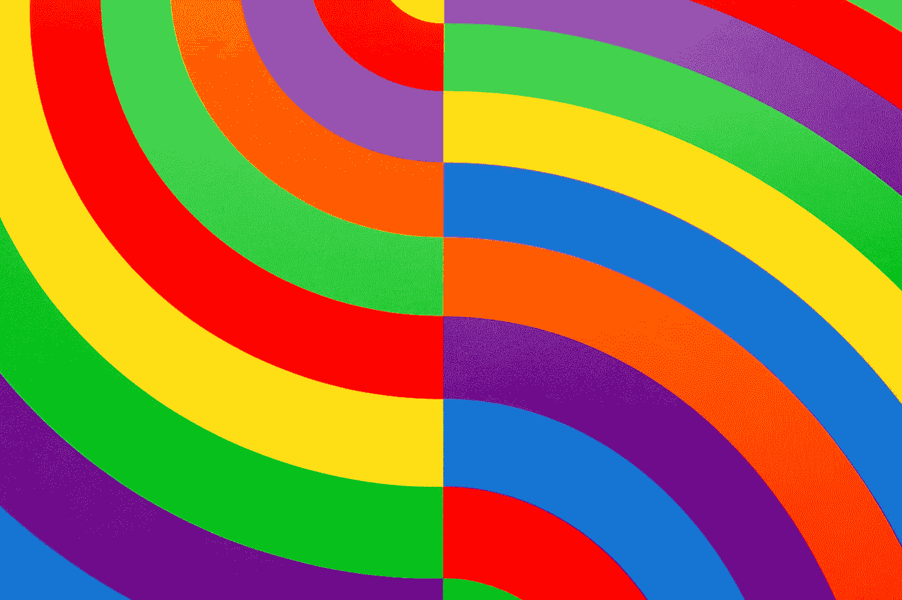

# 平面设计的不同类型

> 原文：<https://medium.com/geekculture/the-different-types-of-graphic-design-27770b8882b?source=collection_archive---------7----------------------->

Photo by [Clark Van Der Beken](https://unsplash.com/@snapsbyclark?utm_source=medium&utm_medium=referral) on [Unsplash](https://unsplash.com?utm_source=medium&utm_medium=referral)

平面设计是一门使用类型、空间、图像和颜色进行交流、设计风格和解决问题的艺术。该领域被认为是视觉传达和传达设计的一个子集，但有时术语“平面设计”被用作同义词。平面设计师创造和组合符号、图像和文本，形成思想和信息的视觉表现。他们使用印刷术、视觉艺术和页面布局…