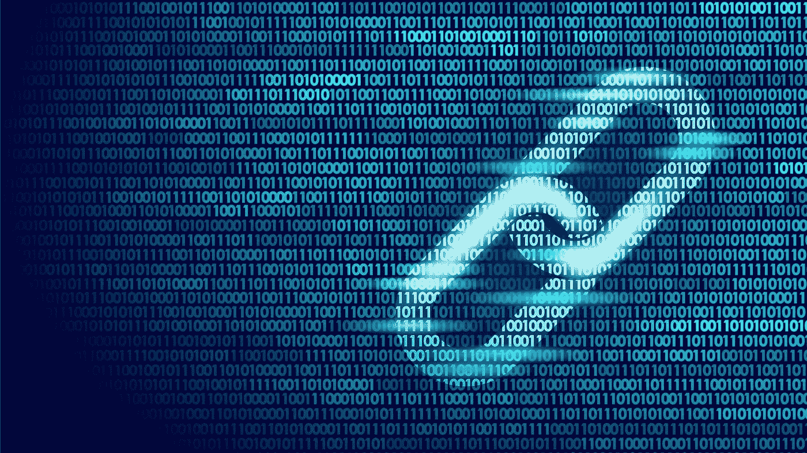
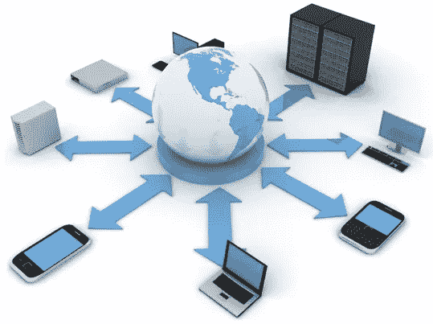
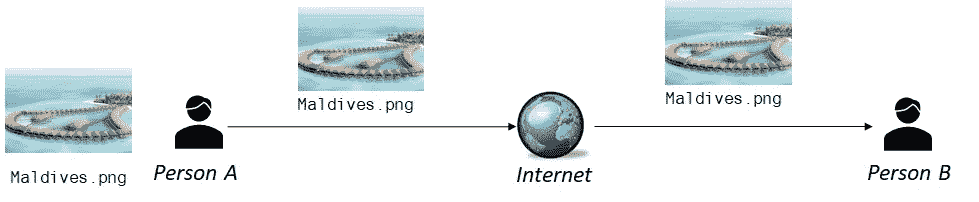
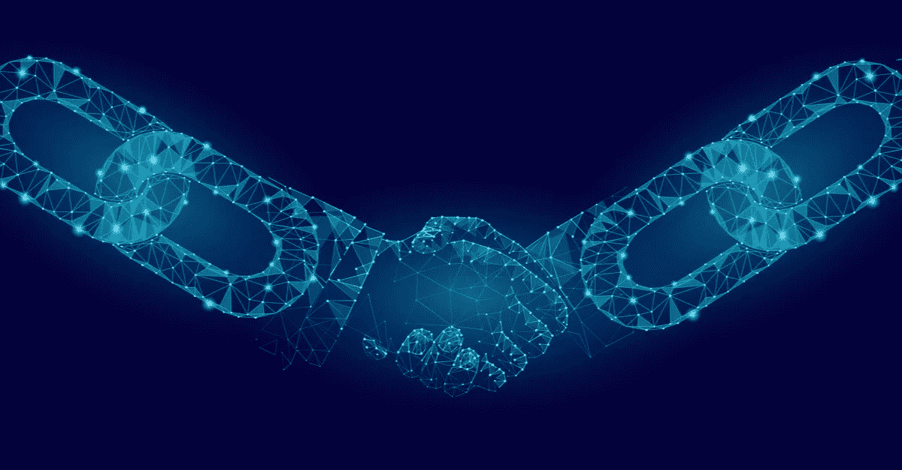
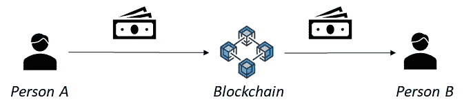
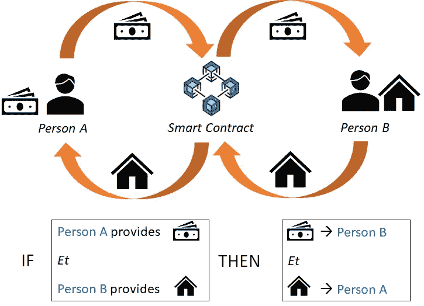
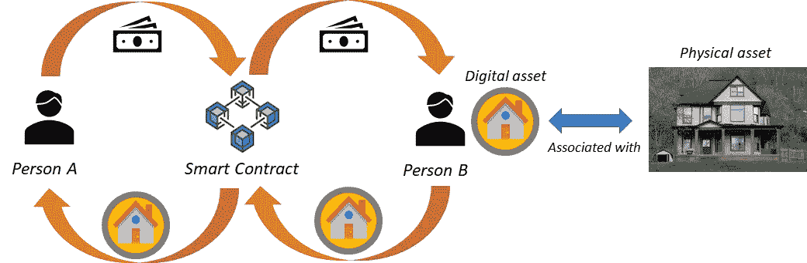

# 区块链技术的颠覆性潜力

> 原文：<https://medium.com/geekculture/the-disruptive-potential-of-blockchain-technology-6bcb62725894?source=collection_archive---------19----------------------->

## 技术带来的真正价值，简单解释一下。

Source: MarTech Today

自 2009 年以来，区块链获得了巨大的关注。今天，我们不再谈论“极客的事情”,而是谈论有可能在许多层面上改变我们经济的颠覆性技术。

但是具体怎么做呢？

**区块链是一个广泛而复杂的话题。**不仅涉及多个技术概念，更是一个很多领域还很模糊的新技术。

在这个迷宫中，人们可能不容易**具体理解区块链炒作背后的意义。**在本文中，我们不会花时间解释区块链是如何工作的(参见本文末尾的相关参考资料)，而是讨论什么是**该技术带来的价值**。

# 互联网和交易🌐

先从我们都知道的东西说起:**互联网**。你知道这个由相互连接的机器组成的网络，通过标准的传输协议进行通信。

这样说，人们可以理解为什么在 20 世纪 90 年代，**不是每个人都明白这项技术的颠覆性潜力**(看看这个[比尔·盖茨在 1995 年](https://www.youtube.com/watch?v=gipL_CEw-fk)试图以某种方式向记者解释它)。如果我们试图从技术角度理解区块链的潜力，那也是一样的。

现在回到互联网:25 年后，对比尔·盖茨来说显而易见的事情，现在对每个人来说都是显而易见的…

> 互联网允许人们以自由和分散的方式创建、发布、存储和共享信息。

我们开始了:**互联网带来的真正价值是普及信息获取和言论自由**。这就是互联网的巨大破坏所在！最终，这才是人们所关心的(而不是传输协议如何工作)。

Source: NCI Informatics

现在，虽然进行信息交换很方便，但是互联网不支持价值交换(交易)。

为了理解这一点，让我们举一个经典的例子:A 人通过电子邮件给 B 人发送了一张图片。这里的动词“发送”不太正确:从技术上来说，**发送者仍然可以访问图片**(例如从他的发件箱)。结果图片没有被“发”而是被“复制”了！

简而言之，**由于互联网复制信息，无法保证交换资产的唯一性**(也就是通常所说的数字稀缺性)。

一句话:**互联网无法支持点对点交易**。

但是，今天的交易是如何进行的呢？

# 我们传统系统中的交易💳

互联网无法支持点对点的价值交换，**数字交易目前通过中介代理** — 进行，例如银行、保险、新银行(Revolut，N26，…)、在线支付系统(PayPal)、…

这种基于中介的集中系统有一定的优势(如防止欺诈)，但也有明显的缺点，如:

*   **摩擦** —中介意味着交易时间和费用(例如，国际银行转账可能需要几天时间，费用超过 10 美元)。
*   **受限的可访问性** —要执行交易，汇款人和收款人都必须是中介机构的身份客户，例如，今天如果你没有在任何银行注册，就很难以数字方式汇款/收款。
*   **控制** —在交易过程中，甚至在某些情况下，中介代理对您的资产拥有完全控制权(例如，任何时候，持有您资金的银行都有权冻结您的账户)。
*   **缺乏透明度** —有时不太清楚中介如何处理交易和资产(例如，你的银行如何使用你储蓄账户中的钱)。这也引发了对数据操纵的担忧。
*   **网络安全漏洞** —交易记录和相关信息(如账户数据、私人数据等)通常存储在一个位置:中介的服务器。如果由于任何原因，这个节点受到损害(如网络攻击，系统故障)，所以是你所有的个人信息。

现在，这就是区块链最终发挥作用的地方。

# 区块链交易💸

> 区块链是一种建立在互联网之上的技术，**以分散、安全和透明的方式实现点对点交易。**

这是什么意思？基本上，随着互联网扰乱了我们处理信息的方式，区块链也在改变价值

*   它减少了交易摩擦(没有中间人)
*   它提高了可访问性(通过互联网访问)
*   它使各方之间能够相互信任(透明度和权力下放)

Source: Alamy Stock Photo

为了更好地理解区块链技术潜力，我们来看看三个核心创新:**数字稀缺性、智能合约和令牌化**。

> ***1。数字稀缺***

2009 年，比特币引入了一种传输协议，确保了**数字稀缺**。现代人类历史上第一次可以在没有任何中介的情况下进行**数字支付**(点对点支付)。

我们不会在这里深入讨论技术细节——如果你想了解比特币区块链是如何工作的，我邀请你看看[白皮书](https://bitcoin.org/bitcoin.pdf)。

> **2*。智能合约***

实现点对点支付已经是一大进步。但是，它仅限于单向流动(资产从 A 人流向 B 人)。如果 A 人和 B 人想进行一次**交换**怎么办？这就是第二代区块链开发的创新技术**智能合约**发挥作用的地方。

智能契约是一个可以对值执行操作的**算法。**

当涉及到执行交换时，而不是调用外部第三方，双方将合同条款写入算法(智能合同)。智能合同安全地托管在一个区块链上，使得它能够防篡改并且对双方透明。一旦满足合同条件，智能合同**自动执行交换**。

简而言之，**智能合约本质上扮演着自动化、透明的可信第三方的角色。**

> ***3。标记化***

智能合约支持数字资产之间的交换。但是**实物资产呢？**

在前面的例子中，考虑的交易是一笔**房地产交易**。天哪，一个算法应该如何管理一所房子？

这里的问题是，我们希望使用数字基础设施来处理物理资产。解决这个问题的方法叫做**标记化**。

好吧，首先，什么是代币？**代币是与部分或全部物理资产相关联的数字所有权**。

将房屋作为一个整体进行标记实际上意味着为所讨论的房屋生成一个唯一的数字产权(您也可以决定用 200 个标记来标记房屋，在这种情况下，一个标记将代表该房屋的 1/200)。

**代币在现实世界和数字世界之间架起了一座桥梁**。

当涉及到交换物理资产时，**智能合约使用与物理资产相关联的令牌执行操作。**交易完成后，就可以通过代币要求实物资产。

# 🎗️的主要收获

*   互联网能够实现点对点的信息交换，但不能支持交易，因为它会复制信息。
*   区块链是一种建立在互联网之上的技术，能够实现点对点的价值交换。
*   与当前的交易系统相比，区块链减少了**摩擦**，增加了**可及性**，使各方之间能够**信任**。
*   区块链技术的附加值可以在三个主要创新下理解:**数字稀缺性**(点对点单向支付)**智能合约**(透明自动化的数字合约)**令牌化**(与实物资产的数字链接)。

为了更好地理解区块链是如何工作的，我邀请大家来看看安德斯·布朗沃斯的这个视觉演示

此外，如果你对投资加密货币感兴趣，这里有两篇关于[一般最佳实践&工具](/geekculture/tips-tools-for-cryptocurrency-investors-5ff20685d9f8)和[如何保持资金安全](/geekculture/how-to-keep-your-cryptocurrencies-safe-55915a26f5b7)的文章。

我希望你喜欢这篇文章！

如果是这样，请不要犹豫，分享你的反馈👏

这里是我的个人网站，在这里你可以找到我所有的文章:[*bloom sphere*](https://bloomsphereofficial.wordpress.com/)

*联系人:*[*LinkedIn*](https://www.linkedin.com/in/yann-delclos/)*或* [*脸书*](https://www.facebook.com/yann.delclos.9/)