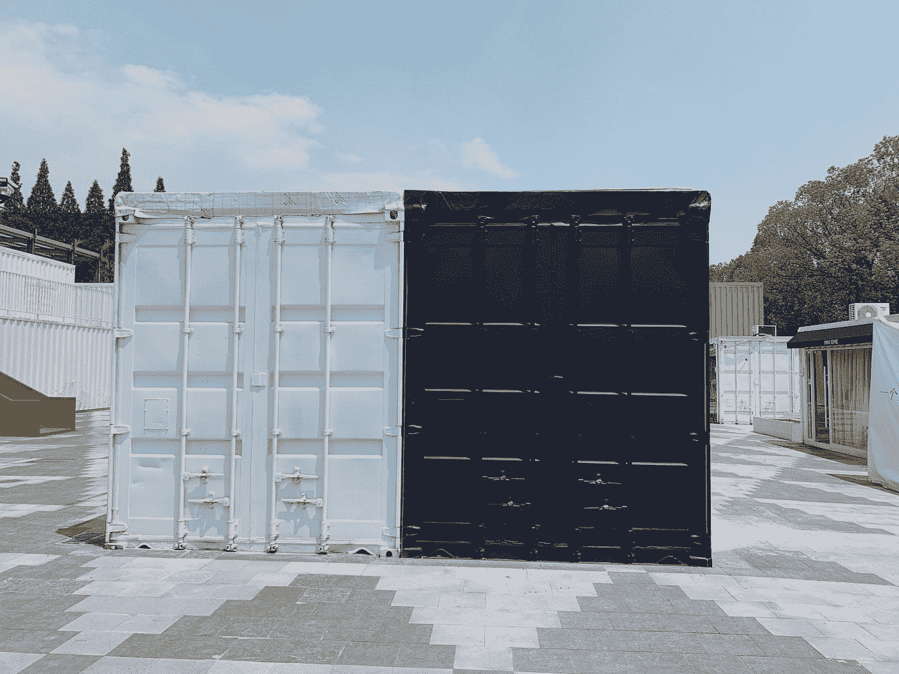

# Docker 架构

> 原文：<https://medium.com/geekculture/the-docker-architecture-7f423a6c3b5c?source=collection_archive---------2----------------------->

## Docker 是一组平台即服务(PaaS)产品，使用操作系统级虚拟化来交付称为容器的软件包中的软件。

很多软件工程师会认为，软件测试人员或者软件支持工程师(维护)要掌握的就是使用 docker 的知识。然而，目前…