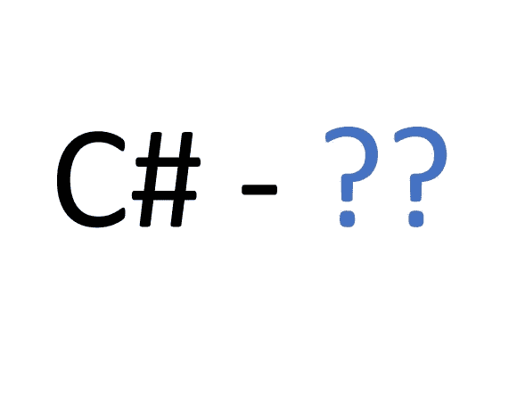

# C#中的双问号——？？

> 原文：<https://medium.com/geekculture/the-double-question-mark-in-c-9eb59fd8e86e?source=collection_archive---------2----------------------->



## 什么？？

## 这个 ***零合并算子***

它被称为 ***零合并算子。*** 又名**双问号**。

## 单个问号概述

在几乎任何编程语言中，我们对单个**问号** **运算符**的用法都不陌生:

```
MyClass myObj =…
```