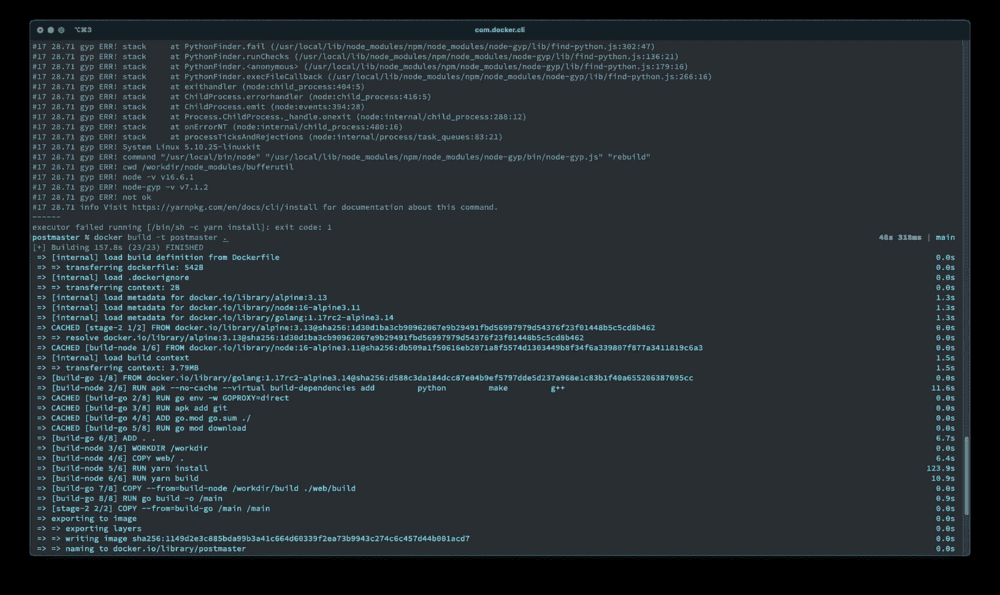

# React + Go 项目最简单的 docker 文件

> 原文：<https://medium.com/geekculture/the-easiest-dockerfile-for-react-go-projects-9ef4668bf337?source=collection_archive---------9----------------------->

Courtesy Mike Mackintosh // Dockerfile build output

## 欢迎码头工人

谈到技术，我有时会开玩笑说自己“太老了，不适合做这个”。虽然这是一半的事实。我还记得部署 prod 变更意味着在 Dreameaver 中连接到远程服务器并保存您的文件，或者将站点代码编译成 RPM/DEB 包，该包将被推送到内部存储库，然后通过 Chef/Puppet 提取…