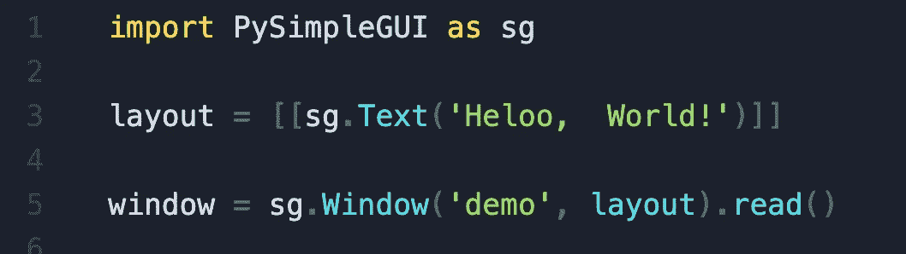
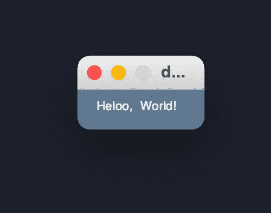
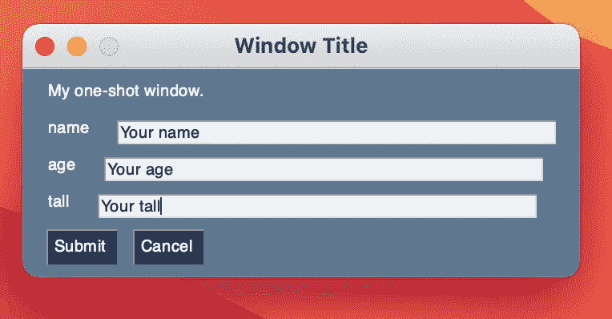
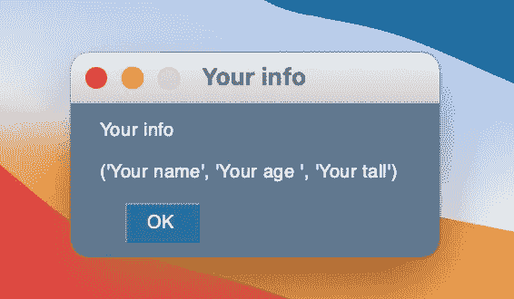

# 构建 Python GUI 应用程序的最简单方法(Pysimplegui)

> 原文：<https://medium.com/geekculture/the-easiest-way-to-build-a-python-gui-application-pysimplegui-b676928274ae?source=collection_archive---------12----------------------->


Photo by [KOBU Agency](https://unsplash.com/@kobuagency?utm_source=medium&utm_medium=referral) on [Unsplash](https://unsplash.com?utm_source=medium&utm_medium=referral)

# 为什么是 Pysimplegui？

多亏了它的机制。

# **首先让我们从安装开始:**

在你的**终端**或者 cmd**上运行这个命令来获得你需要的包。**

```
pip install PySimpleGUI
```

# **让我们看看一个简单的 Hello_world 应用程序会是什么样子:**

# 屏幕上显示程序运行的图片



代码现在看起来很干净，**布局**使用了**嵌套列表**在这种情况下一个 *text_element* 包含 Hello World 然后我们嵌套了我们的 text_element，***read()****是一个负责渲染窗口的函数。*

# *现在让我们更深入一点，用一些额外的元素创建一个 GUI:*

*这个程序获取你输入的信息，然后显示出来。*

*代码:*

*如代码所示，我们使用文本对齐的 Input_element 来简化 ui 并从输入中获取数据，之后我们将 event，values 设置为 window.read()，然后应用一些逻辑，弹出窗口是您向用户显示结果的方式。*

****

*那是我们的教程，还有一些很棒的源码比如[*Pysimplegui*食谱*。*](https://pysimplegui.readthedocs.io/en/latest/cookbook/)*