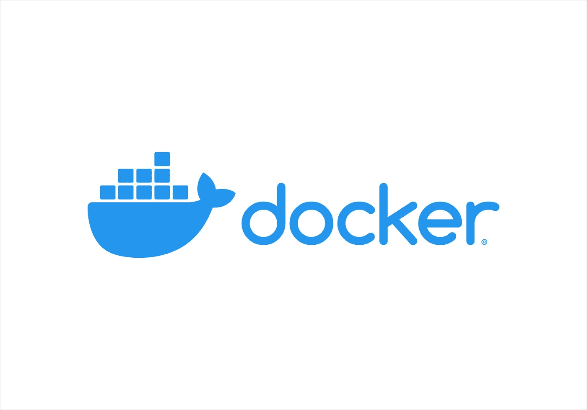

# 将您的 Laravel 应用程序归档的最简单方法

> 原文：<https://medium.com/geekculture/the-easiest-way-to-dockerize-your-laravel-application-94977fe2ed6d?source=collection_archive---------0----------------------->

Docker Moby Color

你熟悉码头工人吗？如果是这样的话，你可能已经知道今天，大多数 web 应用程序都是 dockerized。这意味着，使用 Docker，应用程序将更容易在不同的设备上运行，无论我们在什么操作系统或环境下工作。因为 Docker 在一个地方确保了依赖关系的一致性。它始于…