# RSA 加密背后的优雅数学

> 原文：<https://medium.com/geekculture/the-elegant-maths-behind-the-rsa-encryption-5fafdcabf48f?source=collection_archive---------36----------------------->


Photo by [Stefan Steinbauer](https://unsplash.com/@usinglight?utm_source=medium&utm_medium=referral) on [Unsplash](https://unsplash.com/?utm_source=medium&utm_medium=referral)


Adi Shamir, by Ira Abramov — ([Flickr](https://www.flickr.com/photos/38872520@N00/3814143223/,)) [CC BY-SA 2.0](https://commons.wikimedia.org/w/index.php?curid=18940195)

RSA 以麻省理工学院(MIT)的 Rivest、Shamir 和 Adleman 命名。它是一种指数密码系统，基于数论中的概念:模运算和费马小定理。在本文中，我们将涵盖加法，乘法和指数密码，并显示，用简单的例子，是什么使 RSA 如此有趣。


Pierre de Fermat, [Source](http://www-groups.dcs.st-and.ac.uk/~history/PictDisplay/Fermat.html), ([Public Domain](https://commons.wikimedia.org/w/index.php?curid=36804))

但在我们讨论上述密码之前，我们需要先了解费马小定理。皮耶·德·费玛是 17 世纪的法国数学家，他的最后一个定理在大众文化中广为人知，经过几个世纪的努力，安德鲁·怀尔斯在 90 年代证明了这个定理。

他的另一个定理，即所谓的“小定理”，构成了指数密码的基础。它说如果 *p* 是一个质数并且 *a* 大于零并且不是 *p* 的倍数，那么下面的等式适用:

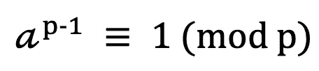

Fermat’s Little Theorem

(如果你需要复习模运算，请查看本页

举个例子，p=7，a=3，我们有:

```
3^(7–1) = 3⁶ = 729 = 104 * 7 + 1 = 1 (mod 7), as expected
```

另一个例子，假设 p=5，a=21，则:

```
21⁴ = 38,896 * 5 + 1 = 1 (mod 5)
```

我们将在后面看到这个定理是如何与指数密码相关的。

# 加法密码

加法密码，也称为凯撒密码，非常简单，使用基本的模加法。为了简化，让我们用 0 到 25 的值来表示字母，所以我们将使用加法模 26。加法密码只是通过给一个字母添加一个固定值 *k* 来转换它。

例如，如果我们使用一个 k=17 的键，我们将字母与它们在字母表(从 0 到 25)中的位置进行匹配:H=7，E=4，L=11，0=14，我们得到:

```
**H** (7) → 7 + 17 = 24 (Y)
**E** (4) → 4 + 17 = 21 (V)
**L** (11) → 11 + 17 = 28 = 2 mod 26 (C)
**L** (11) → 11 + 17 = 28 = 2 mod 26 (C)
**O** (14) → 14 + 17 = 5 mod 26 (F)*HELLO* then becomes *YVCCF*
```

要破译这个信息，我们只需加上 17 的加性倒数(模 26)，也就是 9，即 17 + 9 = 0(模 26)，我们得到:

```
Y (24) → 24 + 9 = 7 mod 26 (H)
V (21) → 21 + 9 = 4 mod 26 (E)
C (2) → 2 + 9 = 11 (L)
C (2) → 2 + 9 = 11 (L)
F (14) → 5 + 9 = 14 (O)*YVCCF* then becomes *HELLO* again
```

# 乘法密码

乘法密码使用模乘而不是加法。这是一个类似的过程，但我们需要确保我们的 *k* 值(每个元素所乘以的值)与符号集中的元素总数 *n* 互质。我们需要 k 和 n 互质的原因是，为了解密一个编码信息，我们需要 k 的乘法逆运算——k’，如果 k 和 n 互质，这个乘法逆运算将一直存在。提醒一下，k’是 k 的乘法逆模 n，如果:

```
k’*k = 1 (mod n)
```

我们来看一个例子，如果我们取同一个单词(“HELLO”)对应的数值:(7，4，11，11，14)，n=26(对于字母表的 26 个字母)，k=7，与 26 互素我们得到:

```
**H** (7) --> 7 * 7 = 23 mod 26 (X)
**E** (4) --> 4 * 7 = 2 mod 26 (C)
**L** (11) --> 11 * 7 = 25 mod 26 (Z)
**L** (11) --> 11 * 7 = 25 mod 26 (Z)
**O** (14) --> 14 * 7 = 20 mod 26 (U)*HELLO* becomes *XCZZU*
```

为了破译消息，我们需要 7 的乘法逆模 26，也就是 15，作为 15 * 7 = 105 = 1 (mod 26)。请看下面的方框，如何使用欧几里德算法求乘法逆运算。

然后，我们可以如下破译我们的“XCZZU”消息:XCZZU 有数值(23，2，25，25，20)因此:

```
**X** (23) --> 23 * 15 = 7 mod 26 (H)
**C** (2) --> 2 * 15 = 4 mod 26 (E)
**Z** (25) --> 25 * 15 = 11 mod 26 (L)
**Z** (25) --> 25 * 15 = 11 mod 26 (L)
**U** (25) --> 25 * 15 = 11 mod 26 (L)
```

```
**Finding multiplicative inverses using the Euclidean algorithm**We are looking for k' such that k'*k=1 (mod n), which in our example (with k=7) is k'* 7 = 1 (mod 26). This is equivalent to stating:
**7 * k' = 26 * x + 1**, for some integer xWe then use the Euclidean algorithm and rewrite the equation with the remainder on one side:26 = 7 * 3 + 5, which can be rewritten as **5 = 26 - 7 * 3**
7 = 5 + 2, which can be rewritten as **2 = 7 - 5**
5 = 2 * 2 + 1, which can be rewritten as **1 = 5 - 2 * 2**We then extend the Euclidean algorithm, starting from the last equation and replacing 2, 5 and 7 by the equalities above:1 = 5 - 2 * 2
1 = 5 - 2 * (7 - 5) = (-2) * 7 + 3 * 5
1 = (-2) * 7 + 3 * (26 - 3 * 7) = 3 * 26 - 11 * 7So we end up with the following equation:7 * (-11) = 26 * 3 + 1, in the form 7 * k' = 26 * x + 1 we were looking for.And so k' = (-11) = 15 (mod 26)
```

# 指数密码

在快速概述了加法和乘法滤波器之后，我们现在可以进入下一步，指数密码及其具体实现 RSA。指数密码具有以下形式:

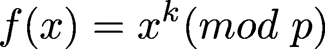

使用:

*   p 一个质数，
*   0 <= k <= p-1 and
*   k coprime with (p-1)

To decipher it we use the multiplicative inverse of k in Z(p-1), k’:


Again, let’s take an example with p=29 for instance and k=5, coprime with (p-1)=28\. Again, let’s use HELLO encoded as (7, 4, 11, 11, 14):

```
**H** (7) --> 7⁵ = 16 mod 29 (Q)
**E** (4) --> 4⁵ = 9 mod 29 (J)
**L** (11) --> 11⁵ = 14 mod 29 (O)
**L** (11) --> 11⁵ = 14 mod 29 (O)
**O** (14) --> 14⁵ = 19 mod 29 (T)So *HELLO* becomes *QJOOT*We can use the technique described in the box below to find the modulus of those exponential, for example 11⁵ = 161,051 = 14 mod 29 can also be obtained as follows:11² = 121 = **5** mod 29
So we can deduce that 11⁴ = **5**² = 25 mod 29
Finally, to calculate 11⁵ we can multiply 11 (mod 29) and 11⁴ (mod 29), so 11 * 25 = 14 mod 29, as expected.
```

To decipher the message “QJOOT”, we use the multiplicative inverse of 5 in **Z** 28，17 (as 5 * 17 = 1 mod 28)

```
**Q** (16) --> 16¹⁷ = 7 mod 29 (H)
**J** (9) --> 9¹⁷ = 4 mod 29 (E)
**O** (14) --> 14¹⁷ = 11 mod 29 (L)
**O** (14) --> 14¹⁷ = 11 mod 29 (L)
**T** (19) --> 19¹⁷ = 14 mod 29 (O)
```

```
**A 'trick' for dealing with the modulus of big exponentials**There is a neat property of modulos:
if a = b (mod n) then m*a = m*b (mod n)
And that obviously also works with exponentsFor example:
3² (mod 5) = 4
Now, if we want to find the result of 3⁴=81 (mod 5) we can also square the result of 3² (mod 5)
We know that 3⁴ = 81 = 1 (mod 5)
But also, using the result of 3² mod 5 (4), we get: 4² = 16 = 1 (mod 5)This trick allows us to use repeated squaring to find the modulo of very big exponents. Let's say we want to find the result of 5³⁵ (mod 7).
We would do as follows:
5² (mod 7) = 4
5⁴ (mod 7) = 4²(mod 7) = 2
5⁸ (mod 7) = 2² = 4
5¹⁶ (mod 7) = 4² = 2
5³² (mod 7) = 2² = 4And as 5³⁵ = 5³² * 5² * 5, we now know that 5³⁵ (mod 7) = 4 * 4 * 5 (mod 7) = 80 (mod 7) = 3 (mod 7)
```

# 为什么有效？

要了解指数密码的工作原理以及它们是如何被破译的，我们需要回到费马小定理。我们的解密密钥 k’是 Z(p-1)中 k 的乘法逆元，因此我们知道 k’* k = 1，因此:

k * k' = l * (p-1) + 1 (mod p-1)，根据定义，对于某个整数 l。

因此，当我们加密一条信息时，我们得到 x^k，当我们解密它时:

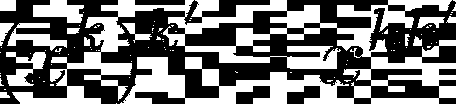

但是，如上所述，kk' = l (p -1) + 1，因此:

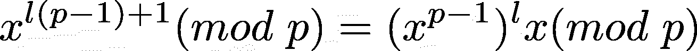

我们知道，使用**费马小定理**，x^(p-1 = 1(mod p ),所以我们剩下:

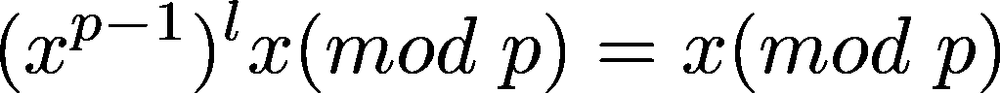

不出所料，我们得到了最初的消息。

# 最后，RSA 密码系统

RSA 密码是基于上面看到的指数系统，但有一个额外的扭曲。对于 RSA 来说，我们需要两个素数， *p* 和 *q* ，我们使用它们的乘积 *pq* 作为**公钥**的一部分(稍后将详细介绍)。它的工作原理如下:

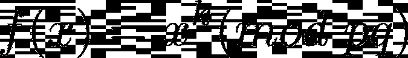

与 *p，q* 质数和 *k* 在 *Z(p-1)(q-1)* 并与 *(p-1)(q-1)* 互质

为了破译我们使用的信息:


其中 k’是 Z(p-1)(q-1)中 *k* 的乘法逆

下面举个例子，用 *p* =13、 *q* =17，我们得到 *pq* =221。我们还需要我们的 *k* ，与(p-1)*(q-1)=12*16=192 互质，所以比如说 *k* =5。 *pq* 和 *k* 的组合就是我的**公钥** : (221，5)😎

现在，我可以和任何人分享这个公钥，这样他们就可以对只有我能破译的信息进行编码。显然，在现实生活中，我们会使用更大素数的乘积(大得多！).😵

让我们举一个例子，假设我与你共享我的公钥(221，5 ),你想给我发送一个编码的消息“你好”,你将如下进行:

```
**H** (7) --> 7⁵ = 11 mod 221
**E** (4) --> 4⁵ = 140 mod 221
**L** (11) --> 11⁵ = 163 mod 221
**L** (11) --> 11⁵ = 163 mod 221
**O** (14) --> 14⁵ = 131 mod 221So *HELLO* becomes (11, 140, 163, 163, 131). We keep the numerical values as we don't have matching symbols for values higher than 25 in this case.
```

然后，我收到以下消息:(11，140，163，163，131)并且需要我的密钥来解密它。我的秘钥是 Z(p-1)(q-1)中 k=5 的乘法逆， **Z** 192。那个乘法逆 k’等于 77，因为 77 *5 (mod 192) =1。所以我得到:

```
11 --> 11⁷⁷ (mod 221) = 7 (H)
140 --> 140⁷⁷ (mod 221) = 4 (E)
163 --> 163⁷⁷ (mod 221) = 11 (L)
163 --> 163⁷⁷ (mod 221) = 11 (L)
131 --> 131⁷⁷ (mod 221) = 14 (O)
```

即使有人截获了我的公钥，(221，5)，他们也需要知道 221 的两个质因数。在这种情况下非常简单，但在处理大数字时要复杂得多，例如 9，995，533，757，761，999 是 99，959，203 和 99，996，133 的乘积(实际上使用的数字比上面的大得多)。看看这个生成大素数的工具:【https://bigprimes.org/

# 数学:为什么 RSA 行得通

让我们来看一下为什么会这样的直觉。顺便说一句，这绝不是正式的证明。记住，x^k 是我们的加密信息，应该由 x^k)^k'=x^kk'来解密。

k '是(p-1)(q-1)中 k 的乘法逆元，所以 kk'=1 mod (p-1)(q-1)，因此:


根据定义。这给了我们:

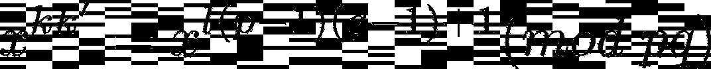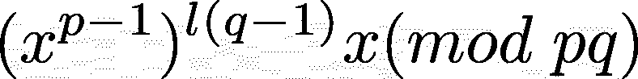

利用费马小定理我们知道:

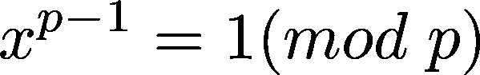

所以:

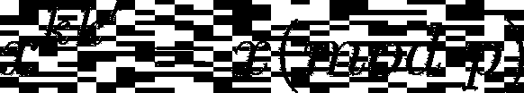

按照同样的逻辑:

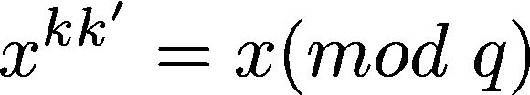

所以:

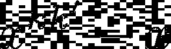

能被 p 和 q 整除，**，也能被 pq 整除，因为 p 和 q 都是素数**。这最终给了我们预期的结果:

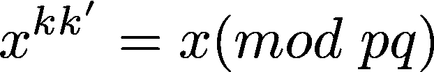

**Python 中的一个简单实现**

在我们结束之前，这里有一个**非常简单且不健壮的**Python 实现，首先是一个加密文本的函数:

```
def rsa_cipher(text='HELLO', public_key=[13*17,5]):
    text=text.upper()
    k=public_key[1]
    pq=public_key[0]
    x=[]
    for t in text:
        m=ord(t)-65
        x.append((m**k)%pq)
    return x
```

要解密它:

```
def rsa_decipher(nbers_list=[], private_key=[13*17,77):
    x=[]
    k=private_key[1]
    pq=private_key[0]
    for t in nbers_list:
        x.append(chr((t**k)%pq+65))
    return x
```

# 最后一点:欧拉的熵函数

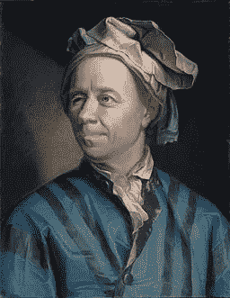

Jakob Emanuel Handmann, [Public domain](https://commons.wikimedia.org/wiki/File:Leonhard_Euler.jpg)

伦纳德·欧拉是 18 世纪一位非常多产的瑞士数学家，以[欧拉恒等式](https://www.cantorsparadise.com/about-eulers-identity-5dff4a47ec95)而闻名，被认为是数学中最具象征意义的恒等式之一。他也是欧拉函数的创造者，也称为 phi 函数。全因式函数φ( *n* )给出小于 n 且与 n 互质的整数的个数。例如，全因式φ(4)=2，因为 1 和 3 与 4 互质。φ(10)=4，因为 1，3，7 和 9 与 10 互质。事实证明，对于 n 为正整数且 x 和 n 互质的情况，这个等式可以用来推广我们在本文开头看到的费马小定理:

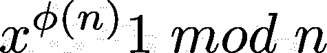

我们很容易看出，费马的版本是这个等式在 n 是质数时(如，当 p 是质数时，φ(p)=p-1)的特例。