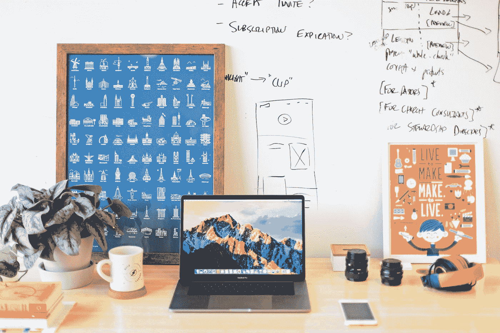

# 成功 UX 设计的要素

> 原文：<https://medium.com/geekculture/the-elements-of-successful-ux-design-2d836e60b50c?source=collection_archive---------3----------------------->

## UX 设计就是要了解你的用户，并给他们他们需要的东西！

Photo by [Mia Baker](https://unsplash.com/@miabaker?utm_source=medium&utm_medium=referral) on [Unsplash](https://unsplash.com?utm_source=medium&utm_medium=referral)

成功的 UX 设计都是关于创造一个既直观又令人满意的用户体验。许多因素造就了一个成功的 UX，包括精心的规划、用户研究以及设计师和开发者之间的有效沟通。通过理解…