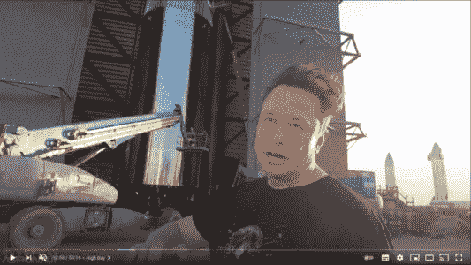

# 埃隆·马斯克项目工作流程

> 原文：<https://medium.com/geekculture/the-elon-musk-project-workflow-e70807a10a7?source=collection_archive---------38----------------------->

在 youtuber 宇航员最近的一次采访中，埃隆·马斯克带我们参观了 SpaceX 火箭工厂“星际基地”。有一次，他谈到他的项目遵循的工作流程，以保持一切专注和有效。这听起来像是相当大的常识，但来自一个在大约 15 年内创造了可重复使用火箭的人，这是值得分析的。

首先，我们不是马斯克的超级粉丝。但我们不得不承认，他是“企业家”的化身，他的公司做了一些疯狂的事情。因此，你可以观看由《每日宇航员》制作的三集系列节目“与伊隆·马斯克的星际之旅”，就像你在观看一场关于真实的托尼·斯塔克的网飞秀一样。

*   [埃隆·马斯克的星际之旅【第一部】](https://youtu.be/t705r8ICkRw)
*   [与埃隆·马斯克的星际之旅【第二部】](https://youtu.be/SA8ZBJWo73E)
*   [埃隆·马斯克的星际之旅【第三部】](https://youtu.be/9Zlnbs-NBUI)

从第一部分的 13 到 28，他分享了他管理项目的工作流程。可以总结如下:

1.  **少哑要求**
2.  **移除或删除步骤**
3.  **简化优化**
4.  **走得更快**
5.  **自动化**

*Starbase Tour with Elon Musk [PART1] by Everyday Astronaut*

像那样，感觉相当明显。但是，正如我们在法语中所说的那样，任何常识性的说法都是这样的。我们可以用“不用说，但说出来会更好”来翻译。所以让我们来分解一下他对每一步的意思。

# 1.不那么愚蠢的要求

你总是不得不质疑什么是满足需求所必需的，尤其是当它来自非常聪明的人时(马斯克说)。当一些专家告诉我们一些事情时，我们倾向于盲目地相信他所说的。没有人是完全“愚蠢的需求”的证据。

此外，在规范中，我们看到[需求和解决方案往往是混合的](https://www.naept.com/en/blog/needs-assessement-some-best-practices/)。因此，询问需求有助于发现描述解决方案而不是需求的有偏见的需求。讲述解决方案往往会忽略所有其他满足需求的方式。其他方式可能会更好。

# 2.移除或删除步骤

一旦明确了需求，摆脱了所有的“万一我们需要”，你就可以设计一个策略来达到目标。现在你不得不质疑这些步骤，它们真的是必要的吗？你真的必须这样或那样做才能达到目标吗？

马斯克说，如果你至少有 10%的时间不移除或删除东西，那么你做得太多了。

# 3.简化和优化

只有现在，您的需求和过程是精益的，并且与需求相匹配，您才能考虑简化和优化它们。不是更早。

在马斯克看来，一个工程师最常犯的错误就是试图改进不该存在的东西。不惜一切代价避免无用的优化。

# 4.走快点

现在投资于一切能帮助你走得更快的手段。你的生产线速度总是可以提高的。

# 5.使自动化

最后尝试自动化。现在你已经完全了解你的生产线和哪些部分是耗时的，你可以自动化过程或决策，使它进行得更快。

他表示，他在特斯拉 Model 3 生产过程中犯的一个大错误是，用错误的方式完成了这一过程。他首先尝试自动化，然后走得更快，如此这般。

# 测试

然后他简单讲了一下生产线上的测试。作为一名前验证工程师，我起初对他关于测试的说法感到惊讶。他说在生产过程中，我们不应该在两个步骤之间进行测试！

我会天真地说，我们应该测试每一个步骤，以尽快发现问题，并从生产线上移除有缺陷的产品或机器。

他说，在开发或调试生产线时，是的，每一步都要进行测试，要么正确配置，要么识别错误。但是一旦生产线完美运行，保持那些“每一步”测试会使它变慢。而且你得到的质量并不能弥补生产力的不足。此外，你仍然可以有一些假阳性。

所以我们应该把所有的测试都放在生产线的末端，也许把一些很难在末端执行的测试放在中间。只有当一个 bug 出现时，所有的武器才会开火。

你觉得怎么样？你会如何质疑这一过程？怎么让它不那么哑？