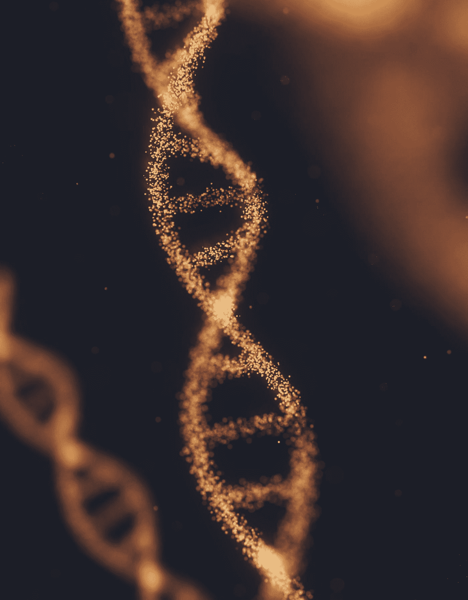

# 人类亚种的出现

> 原文：<https://medium.com/geekculture/the-emergence-of-human-subspecies-f4e8866d5321?source=collection_archive---------14----------------------->

## 随着基因编辑和控制论的进步，人类物种可能会分裂。

Photo by [ANIRUDH](https://unsplash.com/@lanirudhreddy?utm_source=medium&utm_medium=referral) on [Unsplash](https://unsplash.com?utm_source=medium&utm_medium=referral)

## 打开潘多拉的盒子

路过总有一个点是你无法回头的。你不能把源氏放回瓶子里。虽然这个概念适用于许多领域，如人工智能…