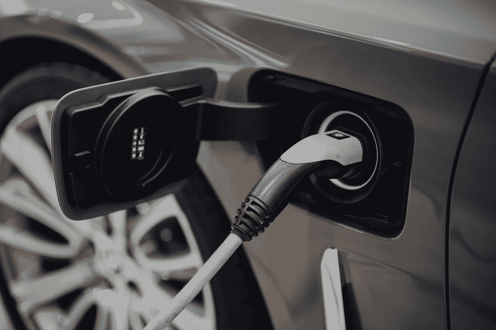

# 能量转移问题。给电动汽车充电。

> 原文：<https://medium.com/geekculture/the-energy-transfer-problem-charging-electric-vehicles-ed662c2a3cd6?source=collection_archive---------19----------------------->

电动汽车只能储存内燃机(ICE)汽车的一小部分能量，通过给电池充电(目前)来获得这些能量比装满一个油箱需要更长的时间。尽管有这种限制，电动汽车现在可以用相对较少的能源管理一个有竞争力的范围，充电时间继续改善。

