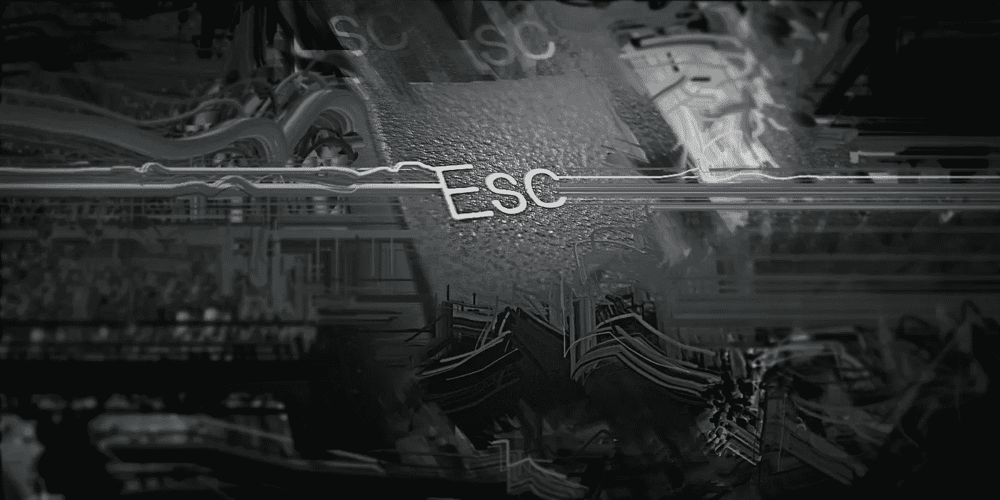

# 退出按钮是一个功能

> 原文：<https://medium.com/geekculture/the-escape-button-is-a-feature-1e6c67276753?source=collection_archive---------67----------------------->

当给你的游戏使用全屏模式的选项时，给玩家一个不用 X 框点击关闭窗口就能退出游戏的方法是很重要的。要开始，我需要做的就是参考 Unity **文档**关于**退出**一个**应用**。

**退出方法**是一个**公共静态**声明，因此可以从任何地方**调用它**。