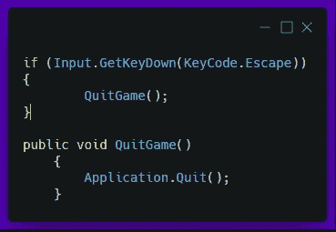
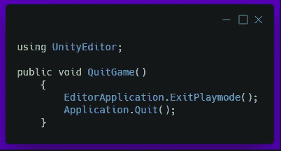
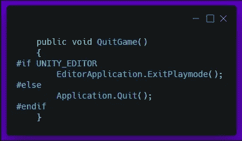
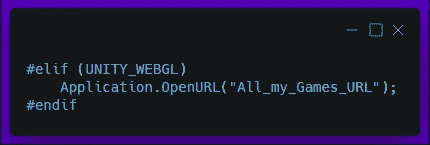

# 退出按钮是一个功能

> 原文：<https://medium.com/geekculture/the-escape-button-is-a-feature-9abe86708397?source=collection_archive---------41----------------------->

既然我们已经在两个不同的平台( ***'*** [***桌面-Windows***](/geekculture/how-to-build-and-test-your-game-in-unity-1eeab1b7937e)***'***和***'***[***web GL***](/geekculture/how-to-host-unity-games-on-the-web-16be49449b10)***'***)上构建了我们的应用程序，那么是时候解决这个问题了。没有办法退出游戏。唯一的方法是关闭 WebGL 的浏览器或者使用桌面构建的任务管理器。虽然这可行，但远非理想。也就是说，是时候实现**退出**特性了！

Original animation by [Alfrey Davilla](https://dribbble.com/vaneltia) — [https://dribbble.com/shots/3020221-Escape-from-Work](https://dribbble.com/shots/3020221-Escape-from-Work)

我将利用***’***[***游戏管理器***](https://matej-marek94.medium.com/setting-up-the-game-manager-using-the-singleton-pattern-d46f9fcb153f)***’***和*‘Escape’*键来实现这个功能！

我们需要做的就是在*‘Update()’*循环中检查‘Esc’键是否被按下。当它存在时，我们调用 Unity 为我们提供的退出应用程序的方法！

我还决定创建一个公共方法，我们稍后可能会通过“主菜单”中的按钮上的事件或者以其他方式调用它。

> 有一点需要注意的是,‘应用。在编辑器中不会调用“Quit()”方法——因此，要测试这个功能，您必须构建您的游戏。

如果我们想在 Unity 的编辑器中也有这样的特性，我们可以使用*‘Unity editor’*名称空间和*‘editor application’。ExitPlaymode()'* 方法。

有了这个，你的游戏可以在任何平台上通过点击*‘Escape’*键关闭！-但是……还有一点特殊的代码可以添加到我们的脚本中——那就是[*‘平台相关编译’的用法*](https://docs.unity3d.com/Manual/PlatformDependentCompilation.html) 通过这段代码，你可以指定哪几行代码应该运行在不同的平台上。

您还可以指定应该为“WebGL”版本专门发生的事情，例如:

今天到此为止；我们现在已经实现了逃脱功能——一种让玩家安全便捷地退出游戏的方式，每个游戏都应该以某种方式包含这一功能。

但是现在就这些了，感谢您的阅读，并随时关注我的更多文章——和往常一样，祝您好运，下次再见。