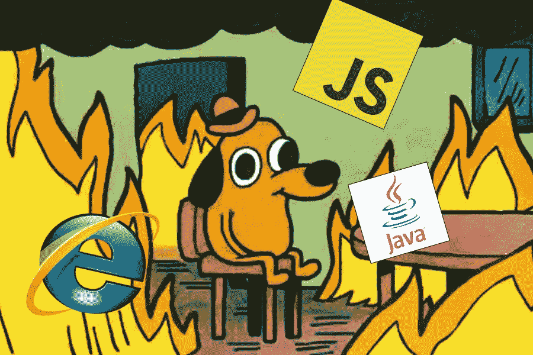

# 编程的永恒地狱

> 原文：<https://medium.com/geekculture/the-eternal-hell-s-of-programming-21feef512387?source=collection_archive---------24----------------------->

## 编程中令人讨厌且过于常见的事件

每个程序员都有一个关于他们生活中恶性循环的故事可以分享。以下是一些常见的折磨那些永远被诅咒的人的方式:

# 1.环境

它在我的电脑上工作。怎么对你的不起作用？让我们使用相同的操作系统。你怎么…