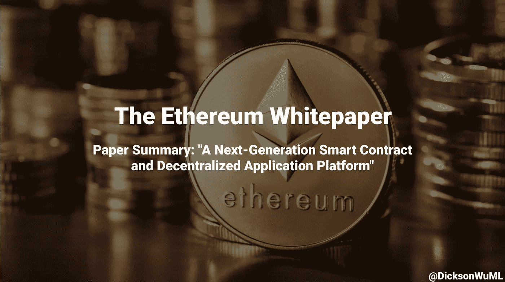
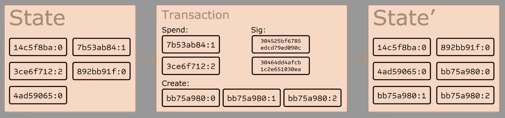
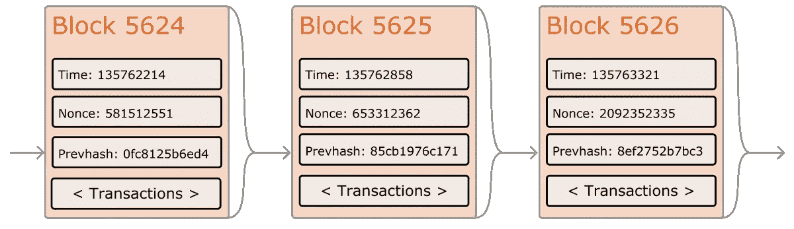
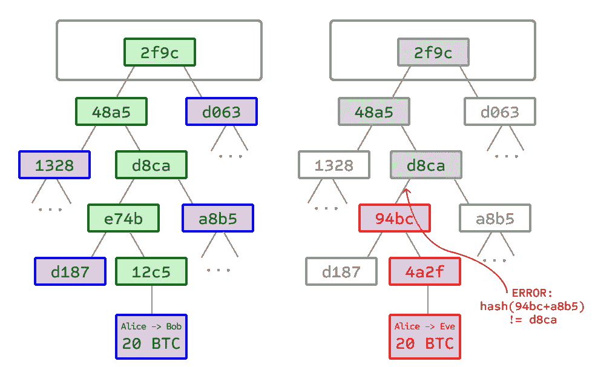
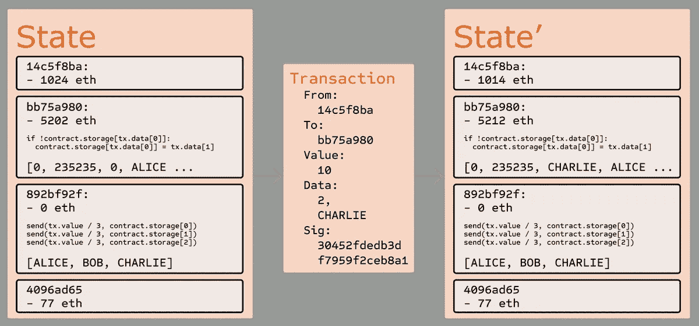
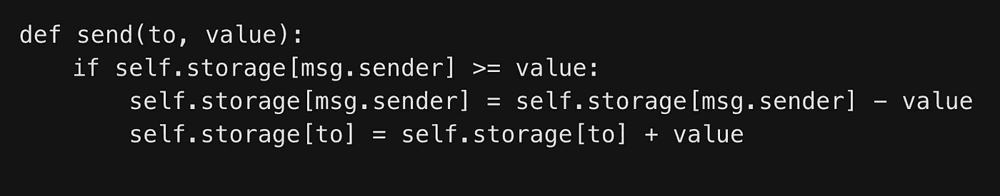
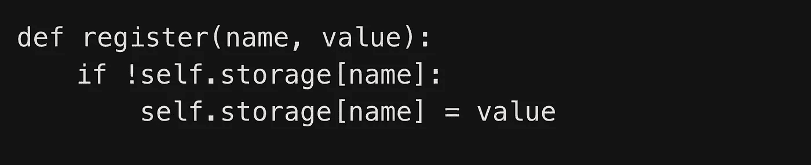
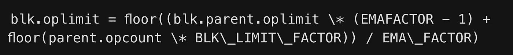
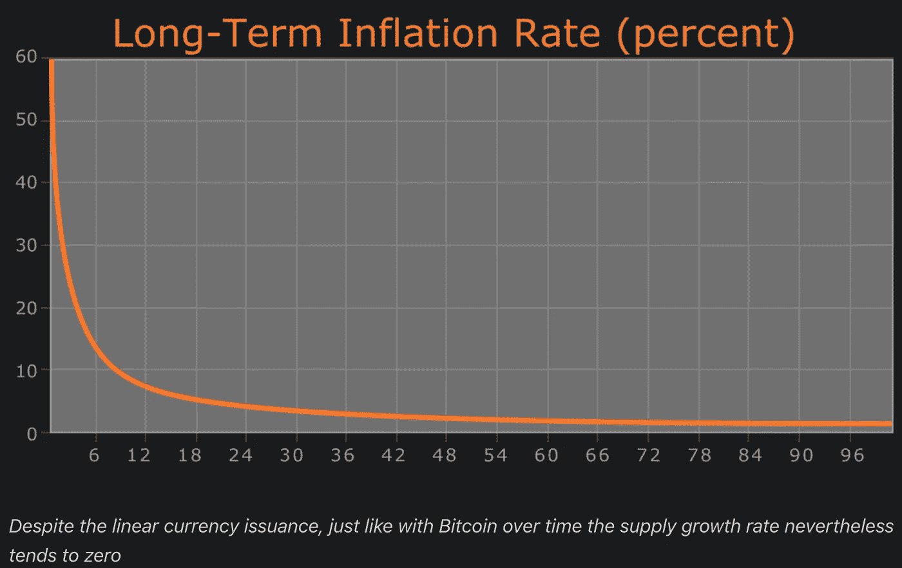

# 以太坊白皮书

> 原文：<https://medium.com/geekculture/the-ethereum-whitepaper-31b46d092630?source=collection_archive---------1----------------------->

## 论文摘要:“下一代智能合同和分散应用平台”

> 论文作者:*维塔利克·布特林*

# 简介:

2009 年，**比特币**诞生。那一天是货币激进革命的开始！为什么？它是第一个没有支持、没有内在价值、没有集中控制者的资产(但却获得了牵引力和价值)。而且:这是**区块链**的主要用法，它有巨大的子分支！

分支机构包括:

*   **彩色硬币**:区块链上的数字资产(例如:客户货币&金融工具)
*   **智慧财产**:实物资产所有权
*   **Namecoin** :不可替代资产(例如:域名)(不可替代意味着你不能复制它或被替代(一个 NFT 只能被一个人拥有))
*   **智能合约**:区块链上的代码，在满足特定条件时可以执行
*   **分散的自治组织(DAO)** :字面上的名称:P

为什么**以太**？以太坊是一个区块链，它有一个**图灵完全编程语言**，能够做上面所有的子分支+应用程序，这些应用程序还没有被想象出来！

# 比特币及现有概念介绍:

## 历史:

虽然比特币是在 2009 年创造的，但去中心化数字货币的想法早在**20 世纪 80 年代和 90 年代**就存在了！Chaumian blinding 有很多隐私——但它失败了，因为它依赖于一个集中的中介。

1998 年， **B-money** 被提出作为一种通过解决计算难题来获得资金的分散共识方式——但它失败了，因为它没有详细说明如何实现分散共识。

2005 年，**可重复使用的工作证明** →导致了加密货币的想法。但是由于依赖可信计算，它失败了。终于在 2009 年，**比特币**通过组合前人创造出来了！

为什么**工作证明**这么重要？是因为一下子解决了很多问题！

*   **简单有效的共识机制**。节点可以就比特币分类账的状态达成一致
*   允许**自由进入成为矿工**，但**也防止西比尔攻击**(在那里你只是做一吨的假账户)。这是通过一个经济障碍实现的——你需要计算能力

另一种选择是**利益证明**——节点的权重与其持有的货币数量成正比。这两种方法都是加密货币的支柱。

## 作为状态转换系统的比特币

你可以从比特币是一个**状态转换系统**的角度来看待它:

您有一个状态(余额分类帐)→转换到→一个新状态，其中包含更新的余额分类帐。

我们甚至可以正式定义系统:“**应用(S，TX) → S '或错误**”。其中比特币是应用函数。如果我们试图发送比实际更多的资金，就会出现错误。

比特币的**状态**只是一个**硬币或 UTXOs** 的集合——但是没有所有者和余额的列表！只有 UTXOs。这些 UTXOs 会说它们的主人是谁(这样主人就能真正花掉它)+它们值多少钱。

**交易的输入**=对现有 UTXO 的引用+所有者的加密签名。事务的**输出**是新的 UTXO。

因此，应用(S，TX) → S '的**过程**为:

1.  对于 TX 中的每个输入:如果 → UTXO 不在 S 中(不能发送不存在的硬币)或者签名与 UTXO 的所有者不匹配(不能发送不属于你的硬币)，则返回一个**错误**
2.  如果输入 UTXO 的面额(值)之和< sum of denominations of output UTXOs (conservation of value) **返回错误**
3.  **返回 S'** 。移除输入 UTXOs +添加输出 UTXOs

## 采矿:

我们不能只是将分类账保存在服务器上，那将是集中的。相反，我们需要确保整个事情是分散的 T21。所以我们必须确保大量的**节点同意一个共同的历史**。

我们通过让节点不断地**尝试创建新的块**来添加到最长的链中来做到这一点。每隔 **~10 分钟**创建一个新块。该块的内部包含:

1.  **时间戳**
2.  **随机数**
3.  **引用**到前一个(的散列)块

最后一部分**将这些块链接在一起**。

有一种算法可以检查这些块是否有效:

1.  检查**引用的**(前一个)块是否确实存在并且有效
2.  检查块的**时间戳是否大于前一块且小于未来 2 小时**
3.  检查 **PoW** 是否有效
4.  检查块内的**单个交易**是否有效

我们可以在这里看到，**比特币** **不以任何方式跟踪状态**——它只是保持**确认交易是有效的**并且发生了。实际获得状态的唯一方法是计算从起源块到当前块的所有内容。另外:块内的事务顺序很重要。

为了**调整 PoW** 的难度，我们要求产生的散列具有一定数量的前导 0 →,这意味着输出小于某个数字。截至 10 月 15 日，它是 2 ⁸⁷，这意味着您需要尝试~2⁶⁹尝试才能获得有效的散列。每 2016 块调整一次编号。

这就是为什么工作证明需要这么多工作。哈希函数是不可逆的，因此您必须**强力**猜测 nonce(工作)直到您最终找到有效的哈希！

如果你**开采区块**，你会得到**奖励比特币**。同样，如果输入面额<输出面额，那么这就是**交易费用**。

如果我们想要攻击网络(也就是给某人汇款，然后通过建立另一个区块链分支来重复交易)，我们将需要大部分的计算能力。

这是因为当其他人都在有效链上工作时(攻击者将钱发送给其他人)，攻击者必须独自建立一个比有效链更长的链。除非你拥有大多数的计算能力，否则这是不可能的。

## Merkle 树:

现在，我们不再将所有的事务存储在块中——相反，为了节省空间，我们将所有的事务存储在 Merkle 树中。Merkle 树是一棵二叉树，其中每个节点只是其子节点的散列——除了树叶，树叶是事务。根节点(最终散列)是唯一包含在区块链中的东西。

现在，为了验证一个事务，您可以下载 Merkle 树的一个**删减版本**，然后计算散列来查看根节点是否与您新计算的散列节点相匹配。

如果我们从 2014 年 4 月开始在 RAM 中存储 15GB 的完整数据块，并且每月增长约 1GB。取而代之的是一个叫做**简化支付验证** (SPV)的协议，它利用 Merkle 树来运行！

## 替代区块链应用:

除了交易，区块链还有其他应用！

*   **Namecoin** :在这里可以注册自己的名字，别人拿不走。
*   **彩色硬币**:在这里你可以创造自己的硬币(或 NFT)。你通过公开宣布某些 UTXO 是这些颜色来给硬币上色，然后你递归地搜索你的 UTXO 来找到它的颜色
*   **元币**:生活在比特币之上的协议，其中有不同的状态转换。不能实现复杂的事务，但是可以做简单的。

因此，通常有两种**方法来建立共识协议**:

*   建立一个全新的系统:增加了灵活性，但是难以实现。并非所有的应用程序都能够获得支持来构建自己的区块链
*   **在比特币的基础上建立一个**:不需要从零开始——但在复杂性和可扩展性方面存在限制。它们不继承 SPV，因此无法扩展。

## 脚本:

有了比特币，我们实际上可以实现**智能合约**！这意味着，为了让交易通过，它必须由智能合约本身来验证。我们可以做像 Multisig(多方确认某物通过)或分散的交叉加密货币交换这样的事情。

但是有**限制**:

*   **缺乏图灵完整性**:即缺失循环，导致 if 语句空间低效
*   **价值盲**:所以我们无法精细控制可以提取的金额。UTXOs 要么全有，要么全无
*   **状态缺失**:utxo 耗尽或未耗尽。所以很难有状态
*   **区块链盲** : UTXOs 连区块链的数据都看不到

所有这些限制意味着我们可以用三种方式来绕过它:建立一个新的区块链，在比特币的基础上编写脚本，或者在比特币的基础上建立一个元货币。**各有各的弊端**。

介绍**以太坊**！以太坊让人们更容易在其上构建应用程序，同时与经济环境和区块链的安全联系在一起。

# 以太坊:

以太坊就是提供一个**平台来构建 dapp**！它们针对快速开发时间、安全性和高效交互进行了优化。以太坊是一种**图灵完全编程语言**，值+区块链+状态感知区块链，所以我们可以创建任何我们想要的 Dapp！(Namecoin = 2 行代码，货币和信誉系统= 20 行代码)。

## 以太坊账户:

以太坊的状态和比特币有点不同——有**个账户**！这些账户是 20 字节的地址，其中有 **4 个字段**:

*   Nonce (作为一个计数器，这样你就不能发送相同的付款)
*   **以太**(以太坊的密码燃料，是交易费)余额
*   **合同代码**
*   **储存**

有 **2 种类型的账户**:

*   **外部拥有的账户**:由私钥/人控制。外部拥有的帐户没有代码+可以发送消息(又名交易)
*   **合同账户**:受合同代码控制。当他们收到消息时，他们激活并执行他们的代码。合同！=那些纸质合同。相反，它们就像执行代码的小机器人，但也有自己的以太平衡

## 消息和交易:

以太坊中的**交易**是指由**人**签名并发送的交易。该**交易包含**:

*   **消息的接收者**
*   **发送人签名**
*   **转账金额**
*   **可选数据字段**
*   **STARTGAS** =交易可以使用的最大气体量
*   **汽油价格** =每个计算步骤的费用

前 3 个=加密货币的标准字段。数据字段=默认情况下不做任何事情，但是智能合约能够读取这些数据并使用它们来做事情。

STARTGAS 和 GASPRICE 是为了**防止 DDOS 攻击**(也就是运行无限循环的人)。由于每次计算都要花钱(不同的计算花费不同的金额)，攻击者必须按比例支付他们使用的所有资源。

## 消息:

**契约**实际上也可以向其他契约发送消息！它们被称为…信息。邮件包含:

*   **消息发送者(隐式)**
*   **消息的接收者**
*   **转移的乙醚量**
*   **可选数据字段**
*   **启动气体**

从字面上看，它和交易是一样的——只不过是通过合同而不是个人发送的。这些是通过 CALL 操作码执行的。

注意:对于 STARTGAS，这是事务及其所有子执行的 GAS 总量。

## 以太坊状态转换功能:

以下是以太坊应用(S，TX) → S '的**步骤**:

1.  检查**交易是否填写**，有效签名，nonce =发送方的 nonce
2.  计算**交易费用** (STARTGAS * GASPRICE)，找到寄件人地址(从签名)。从余额中减去交易费+增加随机数
3.  **初始化气体** =启动气体。每字节减去一些 gas 来支付交易
4.  **向收款人汇款**。如果接收者不存在，请创建一个帐户。如果接收器是一个合同，运行它→直到完成或耗尽天然气
5.  如果任何时候**出现故障** , **会恢复一切**，除了支付费用的天然气→这些费用会被发送给矿工
6.  否则，**将剩余的气体**费用退还给发送者→发送费用用于矿工

如果我们发送给另一个人，那么交易成本将只是 GASPRICE *交易长度(以字节为单位)。此外，就其回复而言，消息的工作方式类似于事务(仅回复消息及其所有子执行，而非契约)。

## 代码执行:

以太坊中的所有代码都是用底层的基于栈的字节码编写的。我们可以存储数据的地方有 **3 种类型**:

*   **堆栈**:后进先出容器(计算结束后复位)
*   **内存**:无限扩展数组(计算结束后复位)
*   **存储**:长期存储，键/值存储。这是保存在区块链

EVM 执行模型非常简单。只是有一个不断更新的巨型元组: **(block_state，transaction，message，code，memory，stack，pc，gas)** 。

每一轮执行=执行代码中的第“pc”个字节→其中每个指令都有自己的关于如何影响元组的指令(ADD 从堆栈中弹出前 2 项，然后追加它们的总和，gas 减 1，pc 增 1)。

## 区块链和采矿:

以太坊很像比特币的区块链——当然除了一些不同之处！以太坊的方块有过渡列表+最近状态+ 2 个新值(方块数和难度)。**块验证看起来像**:

1.  检查**前一个参考块**是否存在并且有效
2.  检查块的**时间戳是否大于前一个块并且小于未来 15 分钟**
3.  检查区块的**内容(区块号、难度、交易根、根叔、气限)是否全部有效**
4.  检查**电源是否有效**
5.  **执行所有单个交易** +更新状态+支付矿工
6.  **检查该状态的 Merkle 树**根是否等于块头的最终状态根

将所有东西都存储在 Merkle 树中似乎效率很低——但是大多数时候树的大部分实际上不会改变，因此树的大部分只是指向前一个块的 T2 指针。我们用一个 **Patricia** **树**来做这件事，在这里我们可以有效地插入和删除节点。这可以节省 5 到 20 倍的空间。

注意:合同的执行就像交易的执行一样。它们只是状态转换！

# 应用:

以太坊有 **3 种应用:**

1.  **金融应用**:子货币、金融衍生品、对冲合约、储蓄钱包、遗嘱、雇佣合约
2.  **半金融应用**:自动执行奖金
3.  **非金融类** : DAOs 和网络投票

## 令牌系统:

令牌系统代表了各种各样的东西！代币代表资产，代表智能财产、不可伪造的优惠券或没有常规价值。

从根本上说，令牌系统就是字面意思:从 A 中减去 X 个单位，给 B X 个单位——假设 A 至少有 X 个单位，A 确认了这一点。因此实现起来非常简单:

我们需要添加几个额外的功能(如分配货币，边缘情况，让其他合同查询余额等)，但它超级简单！

一个超级酷的功能是，我们可以用我们的硬币支付矿工！我们创建了一个存储乙醚的合同，可以退还乙醚的费用，然后收取这些费用，并在持续的拍卖中转售。

## 金融衍生品和稳定价值货币:

金融衍生品非常适合智能合约，而且代码实现起来非常简单。但是我们可能**需要区块链**没有的信息(比如 ETH wrt USD 的价格)。嗯，我们可以有一个**数据馈送契约**(你向它发送一条消息，有人更新数据，然后你将数据发送回契约)。

但是加密商务有一个问题→不稳定(商人不喜欢这样)。解决这个问题的一个方法是创造一种子货币，然后承诺 1 单位的子货币等于 1 美元或其他什么。但这不是一个伟大的系统，因为你不能总是相信他们+现实世界的因素(银行基础设施太弱或敌对)。

但是我们可以用**金融衍生品作为替代**。投机者提供资金来支持该资产，并且它与一个智能合同相关联，因此他们不能退出！(尽管这仍将依赖于一个集中的公司来提供价格，但仍是对依赖于一个发行者的巨大改进)

## 身份和声誉系统:

我们可以很容易地在以太坊中实现 Namecoin:

我们也可以有一个更复杂的版本(让其他合同查询它，有一个“所有者”的概念，信誉和信任网的功能)！

## 分散式文件存储:

以太坊允许人们将他们的硬盘出租给他人，并且允许人们以一种分散的方式存储他们的文件。我们可以通过以下方式构建它:

*   把我们所有的数据分成块，然后加密
*   用它做一棵 Merkle 树
*   将创建一个契约:每 N 个块我们在 Merkle 树中选择一个随机索引。
*   我们向第一个能够给出 Merkle 树中该索引的类似支付验证的证明的实体支付 X Ether
*   如果我们想恢复文件，我们只需使用微支付渠道

为了提高安全性，我们可以将文件发送到许多地方，然后建立一个合同，只有在有加密证据证明存储节点仍在存储文件的情况下，才会向存储节点支付费用。

## 分散的自治组织:

为什么我们不实施一个类似民主的系统，让成员(根据他们的股份或者每个人都有平等的投票权)投票决定组织应该如何行动。这将由**用密码术**强制执行！

道可以决定花费他们的资金，修改它的代码，提出奖金，修改工资和其他随机的东西！如果 2/3 的人同意修改代码，我们可以通过允许代码自我修改来实现 DAO。我们可以通过对存储在可修改存储器中的代码进行智能合约调用来修改智能合约。Dao 有 3 种交易类型:

*   [0，I，K，V] =索引为 I 的建议，将地址存储 K 更改为 V
*   [0，i] =为 I 投赞成票
*   [2，i] =如果有足够的票数，则完成提案 I

这有令人兴奋的应用和功能！我们必须实现存储所有这些协议以及谁投票支持它们，添加+删除成员，甚至液体民主(您可以指定另一个人为您投票，并且可以传递)。

我们可以有一个分权的公司，在那里，股份决定着选票。在这里，我们需要一个系统，在这个系统中，我们需要资产管理、购买和查看股票的能力、接受报价和流动民主(也称为董事会)。

## 更多应用:

*   节省钱包:你可以把你的钱存到一个智能合同里，而不是你的钱包里。给你每天能从钱包里拿出的钱设定上限。甚至可以把这个能力给另一个人(你有能力关闭这个能力)，或者给另一个钱包。这样，万一你被黑了，就安全多了
*   农作物保险:我们可以签订一份智能合同，根据外界提供的数据自动向你支付费用。这可能是降水或自然灾害
*   **分散式数据反馈**:你可以众包一些人来为你提供答案，并且只支付那些在 25%和 75%之间的人。如果只有这个范围能得到报酬，每个人都会想只给你提供其他人会提供给你的信息，这就符合事实。因此，这可以用来从外界获取信息
*   **智能多重签名托管**:比比特币高级多了。在这里，你可以量化有多少钥匙=他们可以花多少钱，并且是异步的(相对于比特币，如果你达到一个阈值，他们可以花光所有的资金)
*   **云计算**:你可以花钱请人帮你做计算！这可以用于 SETI、蛋白质折叠或遗传算法等项目。你必须建立它，这样人们就不能作弊，你必须验证他们做的都是正确的
*   点对点赌博:这允许接近零的费用+没有能力在赌博中作弊！
*   预测市场:给我们一个预言，我们可以构建一个预测市场
*   **连锁分散市场**:以身份+信誉体系为基础

# 杂记和关注:

## 修改后的 GHOST 实现:

区块链有 **2 个问题**需要**快速确认时间**。首先是**高陈旧率**——意味着你做了所有的工作来获得正确的散列——但是没有用。因为找到块很快，所以瓶颈是因为通过网络的传播。因此，许多节点最终会浪费计算，对安全性没有贡献。

另外还有一个**集中化问题**—**你的矿池越大，你的计算就越有效率**。这让他们比那些矿业力量较弱的公司更有优势。因此，当你把这些问题结合在一起时，快速的确认时间允许矿池垄断开采过程。

为了解决第一个问题，我们使用 **GHOST** ，贪婪最重的观察子树。我们**将陈旧的块包括在哪个链最应该被信任的计算中**。如果一个链有更多的“叔叔”,那么它的权重会更大。

解决第二个问题，可以**奖励 stales** (大叔块 87.5%，侄子块 12.5%)。但我们不奖励交易费。

以太坊实现了一个**简化鬼**向下 **7 级**。看起来像是:

*   块将**指定**一个父级和**0/更多的叔级**
*   **叔伯必须具有**的属性:当前块的第 2 到第 7 个祖先的直接子代。不能是当前块的祖先。这个叔叔在这个街区和区块链一定是独一无二的
*   如果你**包括一个叔叔**，你将获得 3.125%的新增币基**奖励**。叔叔得到 93.75%

我们上升到第 7 代，因为如果它是无限的，有太多复杂的计算来确保叔叔是有效的，另外你可以开始激励矿工挖掘攻击者的链。

## 费用:

如果你在区块链上发布一项交易，整个网络都必须下载并验证它。有人可能会利用这一点来攻击网络，因此我们需要对其进行监管。

比特币的方式只是让交易发送一笔**可选费用**给矿工(因此，如果你不包括费用，你最终会等待很长时间/永远不会让你的交易通过)。人们喜欢这一点，因为这就像有一个矿工和交易的市场，可以找到费用支付的完美平衡。

但是这个模型的问题是你没有考虑到所有其他节点也必须下载和验证它。几乎所有的计算实际上都是其他节点，而不是挖掘器。因此，你可以在这里得到一个悲剧的情况。

但是有一种方法可以绕过它。假设你需要做 k 次操作，每次操作奖励 R，有 N 个矿工，C 是每次操作的成本。当矿工在看区块时，他们可以看到他们的预期支出是 kR/N，而成本是 kC。

因此，他们可以直接**不去打扰**在 **kC > kR/N** →换句话说，区块**将只开采 R > NC** 的区块。那就解决问题了！

但是**现实偏离了**:

1.  挖掘者比验证节点付出更高的成本。因为验证需要时间，这增加了块失效的机会
2.  存在非挖掘完整节点
3.  所有节点的挖掘能力并不相等
4.  攻击者仍然可以签订成本极低的合同

1 和 2 相互抵消(miner 包括更少的事务，但是 NC 增加)。但是 3 和 4 都是问题。但是我们可以通过以下方式来限制一个块可以完成的操作数:

其中这些值随着时间不断变化。

此外，拥有更大的块意味着你增加了传播时间，这意味着你增加了它失效的机会。这在比特币中是个问题，但在以太坊中没那么严重，因为有幽灵协议。

## 计算和图灵完备性；

以太坊虚拟机**图灵完成**！为了进行循环，有一个跳转函数可以跳转到代码的前一部分(和条件跳转→ JUMPI)。并且调用其他契约，这将是一个无限循环。

我们**通过尽可能多的计算步骤来绕过恶意的无限循环**。如果我们超过了，我们抛出一个错误，一切都被尊重。这里有几个我们可以攻击网络的场景，以及我们如何预防它:

*   **基本无限循环**:我们只是照常还原，并收取计算费用
*   一个 suuuuuuuppper 长无限循环，只有在创建了几个块之后**才会完成(因此块变得无效):我们只需查看 STARTGAS(也就是我们正在执行的一些步骤)。如果它太长，我们就不去挖掘它了**
*   一种情况是我们有足够的汽油从一个账户中赚钱，但不把钱寄出去:反正已经恢复了，所以不用担心
*   如果我们调用其他契约来聚合它的数据，并且攻击者接管了其中一个契约，然后**将它转换成一个无限循环**来返回一个错误:我们对所有消息都有一个 gas 限制

但是图灵完全语言有什么大不了的？图灵不完全性(不允许 for 循环)实际上并没有那么大的限制:不能调用创建其他契约的契约(更不用说我们甚至不能判断某个东西是不是契约)。所以**图灵不完全性只是更难实现**的所有边缘情况。

因此，实现图灵完全语言要容易得多！

## 货币和发行:

不仅仅是以太，以太还有亚单位(就像美元和美分一样):

*   **1:魏** →费用及协议执行
*   **10 : Szabo** →费用和协议实施
*   10 ⁵:芬尼 →微交易
*   **10 ⁸:乙醚** →正常交易

**发行模式**为:

*   以太坊基金会将出售一吨以太(1000–2000 BTC)→用于支付开发+工资+投资。如果你早点买，你会得到折扣
*   0.099x =偿还早期出资人
*   0.099x =长期储备
*   0.26x =永远每年发给矿工

这里有一些设计选择:

*   有一个**资金池**:如果没有资金池，那么他们将被迫在那里生产更多，以匹配相同的通货膨胀率，这意味着他们得到更多的比特币→但他们宁愿持有更多的比特币
*   **供应量线性增长**:这是为了防止比特币的过度囤积——每个人在现在和未来都有机会获得 ETH。但仍有持有 ETH 的动机，因为增长率趋于 0。但是我们还是会增加更多，因为我们会随着时间的推移失去 ETH

ETH 可能会改用**股权证明**，这将使发行利率降至每年 0 或 0.05 倍。另外，如果以太坊失去了资金或类似的东西，任何人都可以创建以太坊的未来候选版本，但他们会限制你可以生产的以太坊的数量。但是他们必须遵守社会契约。

## 采矿集中化:

**比特币**，令人惊讶的是，其挖掘算法存在一些问题，导致其**收敛到** **集中化**。首先，我们有专门用于比特币 **挖掘**的**超级专用硬件，比普通硬件快几千倍——增加了进入门槛，从而增加了集中化。**

此外，大多数比特币矿工甚至不会自己验证这些区块，他们依靠一个矿池来给他们所有的区块头。前 3 个挖掘池占用了超过 50%的处理能力，因此从技术上讲，可能会尝试 51%的攻击。

以太坊以不同的方式来避免这些问题。以太坊需要从一个状态中抓取随机数据，计算机随机选取最后 N 个块中的交易，返回一个 hash。

以太坊避免了第一个问题，因为以太坊合同中有不同的代码，因此**你不能有超级专业的软件**来处理它。我们避免了第二个问题，因为**矿工需要在他们身上存储整个区块链**，因此不需要采矿池。

“因此，我们正在开发的解决方案最终是一个**适应性经济人类解决方案** **而不是纯粹的技术解决方案**”

## 可扩展性:

**无论是比特币还是以太坊，可扩展性都是个大问题**。比特币目前为 15GB，每小时增长 1MB。但是如果它处理像 VISA 这样的东西，它将是每 3 秒 1MB，每小时 1 GB，每年 8 TB。

以太坊可能会遇到同样的问题:以太坊上有如此多的应用程序(它不仅仅是一个硬币(不像比特币))，但我们只需要存储状态，而不是整个历史，这样就有点帮助了。

**大块**有什么大不了的？**集权**。如果区块链的大小是 100TB，那么实际上只有少数人能够运行完整的节点。其余的将运行 SPV。这意味着大节点可能真的串通作弊。SPV 节点将无法检测到，直到为时已晚。在这一点上，逆转的唯一方法是光节点同意并对欺诈块进行 51%的攻击。

但是以太坊避免了这个问题。第一，**所有节点必须是满节点**。其次，在每个事务之间的**中，我们提供了一个**中间状态根**。这样，只要有一个诚实的节点存在，它们就可以证明交易是无效的，并将其传播到网络的其余部分。**

攻击者可以通过大量不完整的块来绕过它，但是有一个协议，在处理它之前你需要证明块是有效的[我不完全理解这一部分]

# 结论:

以太坊是加密货币的**升级版本，通过一种**图灵完全编程语言**允许存在**智能合约和 dapp**。**

但有意思的是，Etheruem 能做的不仅仅是钱。我们可以做分散的文件存储、计算、预测市场等等！它在点对点协议之间增加了一个经济层，并帮助甚至与金钱无关的领域！

以太坊是任意的状态转换函数，它可以在未来的许多年里支持金融和非金融应用**！**

如果你想了解更多:阅读这里的文章！

感谢阅读！我是迪克森，一个 18 岁的加密爱好者，很高兴用它来影响数十亿人🌎

如果你想跟随我的旅程，你可以加入[我的每月简讯](https://bit.ly/DicksonNewsletter)，查看[我的网站](https://bit.ly/DicksonWebsite)，连接 [LinkedIn](https://bit.ly/DicksonLinkedin) 或 [Twitter](https://bit.ly/DicksonTwitter) 😃