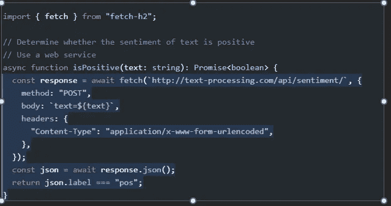
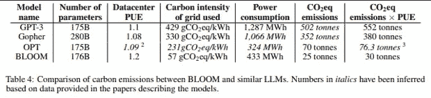
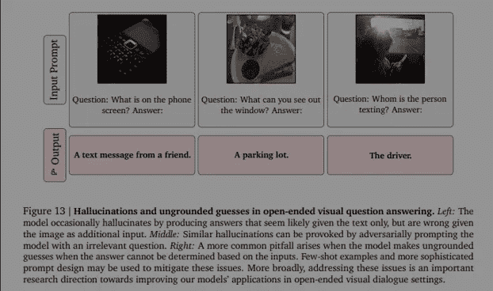
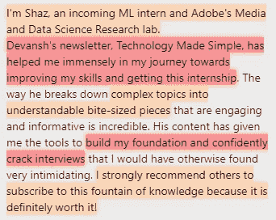

# 像 ChatGPT 和 GitHub Copilot 这样的人工智能程序员的伦理

> 原文：<https://medium.com/geekculture/the-ethics-of-github-copilot-20f4390de43c?source=collection_archive---------8----------------------->

## 像 Copilot 和 ChatGPT 这样的代码生成模型是否道德或有用？从软件开发人员的角度来看。

我们生活在人工智能和技术的黄金时代。技术已经显示出重塑社会的惊人潜力。由于惊人的业绩记录和大量的投资资金，科技已经成为当今世界的主导力量。仅 IT 行业在 2022 年的复合年增长率(CAGR)为 11.6% [1]，价值*为 93，585.1 亿美元。因此，关注该领域的重要发展是很重要的，因为它们具有塑造社会的潜力。就即将到来的开发项目的道德规范进行知情的对话和激烈的讨论，对于将此类项目的负面外部性最小化至关重要。*

近年来最具潜在影响力的项目之一是 GitHub Copilot。" *GitHub Copilot 使用 OpenAI Codex 实时建议代码和整个功能，就在你的编辑器中*"给定函数描述和声明，开发人员可以生成完整的代码块。这不仅仅是简单的实现(更高级的 ide 可以做到)，如下图所示。

*图 1-这是网站上给出的例子之一。突出显示的部分是由 Copilot [2]* 生成的代码

鉴于它可以根据英文文本提示生成代码，许多人一直将 GitHub Copilot 视为软件工程师的潜在目标。当你可以使用人工智能为你生成代码时，为什么要为编码员付费呢？虽然这是最明显的(也是最富诗意的)用例，但这项技术在各方面都有深远的影响，在该解决方案被大规模采用之前，必须考虑到这一点。过快地采用这一系统将是愚蠢的**，并且违反 ACM 3.7，“识别并特别关注融入社会基础设施的系统”** [12]，并且将导致可怕的后果。全面评价 Copilot 很重要，了解它的优点和缺点。

我们可以通过评估 Copilot 对各种利益相关者的影响来理解这些问题。通过这样做，我们可以更准确地描述这项技术是否道德。GitHub Copilot 潜力巨大。然而，在评估 GitHub copilot 的影响时，我们可以看到它有几个道德缺陷，**违反了 ACM 1.2(不伤害)、ACM 1.6(尊重隐私)和 ACM 道德准则的其他核心原则**。必须解决这些违反行为，使之成为真正可行的解决办法。

受 Copilot 影响的第一个主要利益相关者，也是最容易被忽视的，是环境。在典型的以人类为中心的方式中，人们一直在谈论法律和伦理的边缘案例，并错过了房间里的巨象(杀手- **这些模型运行起来极其昂贵。**据研究人员写道，**估计 BLOOM 的碳足迹，一个 176B 参数语言模型[3]** ，训练大型语言模型 BLOOM 大约需要 50.5 吨二氧化碳当量。GPT 3 号释放了 500 多吨二氧化碳当量。值得注意的是，Codex(Copilot[2]的基础)是基于 GPT-3 [4]。请参考下表了解更多信息

*图 2——这些 LLM 是能源消耗大户。*

**这与 ACM 的准则 1.2“避免伤害”是非常直接的矛盾**。在这里，伤害被定义为“负面后果，特别是当这些后果是重大的和不公正的”“[12]。这些极端的排放势必会对环境造成严重破坏，尤其是考虑到世界目前正在应对气候变化和物种大灭绝。给环境增加压力是不合理的。

然而，在 Copilot 的上下文中，有几个原因导致论文的数字没有讲述完整的故事。首先，Copilot 是一款非常注重推理的车型。AWS 估计“*在深度学习应用中，推理占总运营成本的比例高达 90%*【6】。这意味着 Copilot(它已经有很高的成本/预测)将对运行它的系统提出极端的要求。

虽然所有大型车型都是如此，但 Copilot 尤其如此。当我们想到 Copilot 被用来解决更复杂/模糊的问题时，这个问题变得更加糟糕。法典的作者承认这一点。在他们的论文中，他们写道:“*从更全球化和更长远的角度来看，如果使用重大推理来解决具有挑战性的问题*”[5]，代码生成的计算需求可能会增长到比 Codex 的培训大得多。这意味着副驾驶很贵有两个原因-

1.  如果它被用来自动化简单的任务，而这些任务很容易编写，那么大规模的运行将会非常昂贵。
2.  如果用于自动化更复杂的任务，那么模型会有非常高的个体推理成本。考虑到软件编写的规模，不难看出一些运行对能量需求造成了很大的压力。

这些成本不仅会直接影响环境，还会影响整个人类社会。众所周知，气候变化将对较贫穷的国家造成不成比例的影响[13]。根据世卫组织的说法，“人类引起的*地球气候变化现在导致至少 500 万人患病，每年超过***【13】。较贫穷的国家将是最容易受到气候和疾病影响的国家。**这明显违反了 ACM 准则 3.1，因为它没有促进公共利益[12]。ACM 1.1 认为所有人都是计算的利益相关者[12]。在造成环境恶化的过程中，Copilot 伤害了自己的利益相关者。****

**AlphaSignal 是人工智能、机器学习和数据科学领域顶级发展的免费每周总结。他们使用人工智能对该领域的顶级发展进行排名并发送给你，节省了你大量的时间。如果你正在寻找一些帮助你跟上机器学习步伐的东西，去看看吧。阅读它们是与这个领域保持联系的一个很好的方式，并且支持我的写作，不需要你付出任何代价。 [**你可以在这里找到它们**](https://alphasignal.ai/?referrer=Devansh) 或者使用下面的链接-**

** [## 阿尔法信号|机器学习的极品。艾总结的。

### 留在循环中，不用花无数时间浏览下一个突破；我们的算法识别…

alphasignal.ai](https://alphasignal.ai/?referrer=Devansh)** 

**还有一些关于 Codex 和 Copilot 的本质的东西，使得它作为长期编程辅助工具是有问题的。这归结为用于训练这些模型的数据中的大量数据漂移。当进入管道的数据与用于训练模型的数据明显不同时，就会发生数据漂移[7]。在我们的例子中，这种漂移的发生是因为编程语言变化非常快。语言的新变体总是在增加，框架/库变化很大，有时会弹出新的 sop。"*与在下一个令牌预测目标上训练的其他大型语言模型一样，Codex 将生成与其训练分布尽可能相似的代码。* ***这样做的一个后果就是这种模型可能会做一些对用户无益的事情***【5】**

**这使得 Copilot 与 ACM 2.1 不一致，ACM 2.1 在流程和产品上都要求高质量[12]。Copilot 构建的解决方案不会与最新的实践、工具和原则保持一致。**

**为了像宣传的那样有用，Copilot 需要以编程语言本身变化的速度变化。这将需要不断的再培训和调整。虽然迁移学习和主动学习等技术可以减少这些框架，但它仍然非常昂贵。从环境的角度来看，这些使得 Copilot 不道德。在一个已经在努力应对气候变化的世界里，副驾驶没有任何意义。虽然食品法典委员会是利用绿色能源+碳信用额(相当大的一部分)进行培训的，但优先事项是错位的。作为公司，OpenAI 和微软可以随心所欲，但在目前的状态下，Copilot 在环境上是不可持续的。**

**让我们继续关注受 Copilot 影响的人类，让我们先来看看那些代码构成了用于训练 Copilot 的数据集的开发人员。一个常见的抱怨是，Copilot 生成的代码没有任何属性。常见的格言是大型语言模型学习它们的数据集。如果 Copilot 不注明他们用来生成输出的样本，那就是剽窃了他们最初的编码者。这违反了 ACM 2.3(尊重规则)和 ACM 1.5(要求对创建者进行认证)。**

**声称 Copilot 直接使用来自训练样本的代码是不准确的。实际上，Copilot 构建了他们训练数据的嵌入，并学习到了这一点。这和我们通过识别模式来学习没什么不同。它生成的代码通常是成千上万个输入样本的结果(甚至是一些看起来不相关的样本)。在这种情况下，副驾驶应该引用灵感吗？没有人必须这么做，因此在副驾驶上划一条线似乎有点武断。为了证明一个特定的开发人员/开发人员小组的工作没有被归功于他们，我们需要证明他们的输入主要影响了输出，这是非常不可能的(也很难证明)。**

**但是，有一个问题需要解决。某些开发者将他们的代码上传到 Github，并且不希望 Copilot 使用它。[9]包含了一个这样的例子，用户注意到 GitHub Copilot 正在共享他有版权的代码(即使它没有公开)。他能够证明副驾驶正在准确地生产他的代码，只是许可证被拿掉了。这需要解决。开发者应该有权选择是否使用他们的样本，特别是在有版权的情况下。**

**这个例子非常令人担忧，因为它违反了一些非常重要的原则。显然，**这违反了 ACM 1.7** ，因为它违反了开发人员创建的软件的保密性。然而,[9]也显示了 Copilot 没有尊重隐私，这是 ACM 1.6 中规定的**。最初的开发者在提示中使用他的名字*以他的风格生成代码*【9】。副驾驶会这么做。这意味着，除了代码，Copilot 还接受了用户数据方面的培训。**这显然不是 ACM 1.6** 规定的“最少个人信息量”[12]。****

**这种缺乏差异化是 Copilot 需要解决的问题，以避免侵犯版权和违背人们的信任。正如哥伦比亚大学法学教授 Eben Moglen 指出的那样，“*理想情况下，用户应该能够自动过滤推荐，以避免无意中加入带有冲突或不良许可条款的代码。*"[8]这对于确保用户和代码培训数据集的开发人员都不会受到不必要的伤害是必要的。**

**现在是受 Copilot 影响的最后一个主要利益相关者。软件开发。我们创造了一个弗兰肯斯坦的怪物，将取代我们所有人吗？我们能不能踢起靴子，让 Copilot 处理我们所有的工作(假设我们忽略能源成本)？可惜不是。副驾驶太可怕了。快速人工智能有一个特殊的书面调查副驾驶[10]。他们的一个突出见解是——“*根据 OpenAI 的论文，Codex 只在 29%的情况下给出正确答案。而且，正如我们所看到的，它编写的代码通常很难重构，并且无法充分利用现有的解决方案(即使它们在 Python 的标准库中)。*“他们提供了几个这样的例子。**

**Copilot 不会造成开发者大规模裁员。它将通过帮助开发人员编写日常功能来极大地帮助他们，但它不会像宣传的那样损害开发人员的工作。在这种情况下，它完全符合 ACM，因为它将提高开发人员的生产力。此外，Copilot 将编码行为编码在数百万行代码中。这对研究这些行为和收集有价值的见解很有帮助。这符合 ACM 3.5，因为它释放了时间，从而为组织或团体的成员创造了成为专业人员的机会。**

**还有最后一个与 Copilot 相关的问题需要解决。所有 LLM 都是如此，但如果 Copilot 代码被部署到系统中，这可能会特别成问题。这就是对抗性暗示的问题。LLM 倾向于将他们的输入视为基本事实。无论模型变得多么前沿，这都是事实。研究谷歌开创性的火烈鸟模型的研究人员表明，你可以愚弄模型，引发“幻觉”和不正确的输出[11](下图)。[10]当他们要求 Copilot 创建一个可以解析 Python 的正则表达式(一个不可能的任务)时，展示了一个类似的想法。如果开发人员对检查代码不持批评态度，他们可能会开发出潜在有害的产品。**根据 ACM 2.9** 的要求，建立在 Copilot 上的系统将不会是“可靠的和可用的安全的”[12]。**

****

**所以，我们可以看到，副驾驶是一个非常细致入微的话题。在技术层面上，它可以帮助我们研究数百万人的编码习惯。这可以带来很多见解，真正帮助我们研究某个领域的软件。然而，在目前的状态下，它有 3 个主要问题——对环境的巨大冲击，忽视开发者许可的倾向，以及误导开发者的可能性。虽然它不是一些人所说的那种大型技术霸主工具，但它需要改变，成为一种更符合道德的工具。**

****

**如果你喜欢这篇文章，你会喜欢我的每日电子邮件简讯[科技使之变得简单](https://codinginterviewsmadesimple.substack.com/)。它涵盖了算法设计、数学、人工智能、数据科学、最近的技术事件、软件工程等主题，让你成为更好的开发人员。 [**我目前正在进行全年八折优惠，所以一定要去看看。**](https://codinginterviewsmadesimple.substack.com/subscribe?coupon=1e0532f2) 使用此折扣会降低价格-**

*****每月 800 卢比(10 美元)→ 533 卢比(8 美元)*****

*****每年 8000 印度卢比(100 美元)→6400 印度卢比(80 美元)*****

**[你可以在这里了解更多的时事通讯](https://codinginterviewsmadesimple.substack.com/about)。如果您想和我谈谈您的项目/公司/组织，请滚动下方并使用我的联系链接联系我。**

# **向我伸出手**

**使用下面的链接查看我的其他内容，了解更多关于辅导的信息，联系我了解项目，或者只是打个招呼。**

**机器学习重要更新的免费每周总结(赞助)-[https://lnkd.in/gCFTuivn](https://lnkd.in/gCFTuivn)**

**为了帮助我了解您[请填写此调查(匿名)](https://forms.gle/7MfQmKhEhyBTMDUD7)**

**查看我在 Medium 上的其他文章。:【https://rb.gy/zn1aiu **

**我的 YouTube:【https://rb.gy/88iwdd **

**在 LinkedIn 上联系我。我们来连线:[https://rb.gy/m5ok2y](https://rb.gy/f7ltuj)**

**我的 insta gram:[https://rb.gy/gmvuy9](https://rb.gy/gmvuy9)**

**我的推特:[https://twitter.com/Machine01776819](https://twitter.com/Machine01776819)**

**如果你想在科技领域发展事业:[https://codinginterviewsmadesimple.substack.com/](https://codinginterviewsmadesimple.substack.com/)**

# **来源-**

****最后一次访问来源于 2012 年 12 月 4 日。****

**1." 2022 年信息技术市场规模和增长分析."[Www.thebusinessresearchcompany.com，](http://Www.thebusinessresearchcompany.com,)[www . thebusinessresearchcompany . com/report/information-technology-global-market-report #:~:text = The % 20 global % 20 information % 20 technology % 20 market。](http://www.thebusinessresearchcompany.com/report/information-technology-global-market-report#:~:text=The%20global%20information%20technology%20market.)**

**2." GitHub Copilot 你的人工智能对程序员."github.com/features/copilot. GitHub**

**3.arXiv:2211.02001 [cs。LG]**

**4.《开放人工智能法典》2021 年 8 月 10 日，openai.com/blog/openai-codex/.开放大学**

**5.arXiv:2107.03374 [cs。LG]**

**6."亚马逊弹性推理——亚马逊网络服务."aws.amazon.com/machine-learning/elastic-inference/.亚马逊网络服务有限公司于 2022 年 12 月 4 日访问。**

**7.“这可能会破坏机器学习模型。引入了数据漂移。机器学习术语。”2022 年 12 月 4 日，youtu.be/qBmAwvGKvas. Www.youtube.com。**

**8.“当然，GitHub 的人工智能辅助副驾驶为你编写代码，但这是合法的还是道德的？”ZDNET，[www . zdnet . com/article/is-github-copilots-code-legal-ethically-right/。](http://www.zdnet.com/article/is-github-copilots-code-legal-ethically-right/.)**

**9.[https://twitter.com/DocSparse/status/1581461734665367554?ref _ src = tw src % 5 etfw % 7 ctw camp % 5 etweembed % 7 ctw term % 5e 1581461734665367554% 7 ctw gr % 5eb 5245 ef 84 Fe 271 cab 96 ce 16687 AFD 049 e 009961 b % 7 ctw con % 5es 1 _&ref _ URL = https % 3A % 2F % 2fwww .剽窃者今日. com%2F20](https://twitter.com/DocSparse/status/1581461734665367554?ref_src=twsrc%5Etfw%7Ctwcamp%5Etweetembed%7Ctwterm%5E1581461734665367554%7Ctwgr%5Eb5245ef84fe271cab96ce16687afd049e009961b%7Ctwcon%5Es1_&ref_url=https%3A%2F%2Fwww.plagiarismtoday.com%2F2022%2F10%2F19%2Fthe-ethical-and-legal-challenges-of-github-copilot%2F)**

**10.霍华德杰里米。“fast . ai——GitHub Copilot 是福是祸？”【Www.fast.ai，【2021 年 7 月 19 日，【www.fast.ai/posts/2021-07-19-copilot.html.】T4**

**11.简单，德凡什-机器学习制造。" 3 个被忽视的东西:计算机视觉的大型模型."极客文化，2022 年 5 月 28 日，medium . com/geek Culture/3-overlapped-things-deep minds-flamingo-a-large-model-for-computer-vision-84 CD 9d 2f 738 c。于 2022 年 12 月 4 日访问。**

**12.计算机协会。" ACM 道德和职业行为准则."Acm.org，计算机械协会，2018 年 6 月 22 日，[www.acm.org/code-of-ethics.](http://www.acm.org/code-of-ethics.)**

**13."第三世界首当其冲受到全球变暖的影响."news.wisc.edu，news . wisc . edu/第三世界首当其冲受到全球变暖的影响/。**

***原载于 2022 年 12 月 25 日 https://codinginterviewsmadesimple.substack.com**的* [*。*](https://open.substack.com/pub/codinginterviewsmadesimple/p/the-ethics-of-github-copilot-storytime?r=4tnbw&utm_campaign=post&utm_medium=web)**